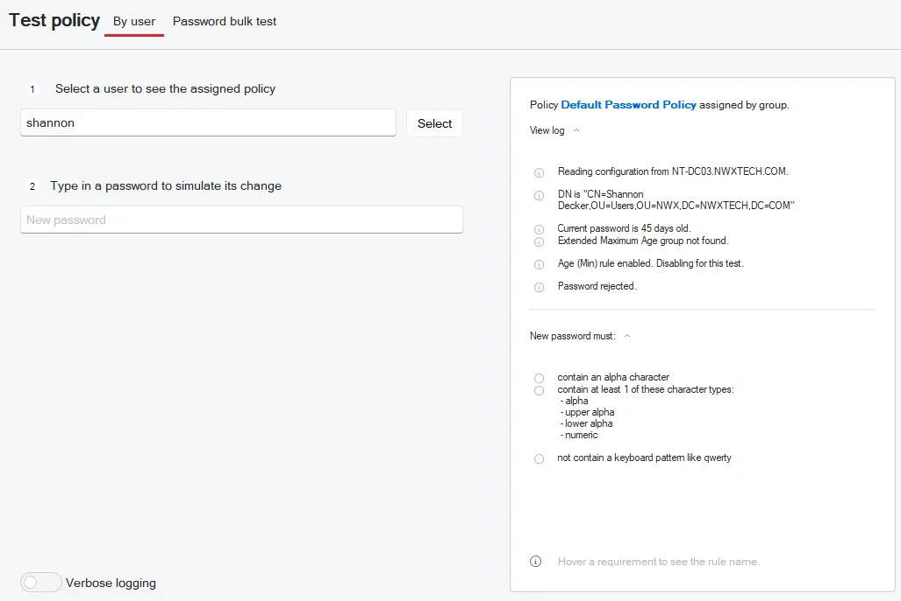

# Assign Policies to Users & Groups

Password Policy Enforcer uses policy assignments to decide which policy to enforce for each user. Domain policies can be assigned to users, groups, and containers (Organizational Units). Local policies can only be assigned to users. See the [Domain and Local Policies](domain_and_local_policies.md) topic for additional information.

__Step 1 –__ Open the Configuration Console:

Click __Start__ > __Netwrix Password Policy Enforcer__ > __PPE Configuration__  
or   
Double click the __PPE Configuration__ desktop shortcut.

__Step 2 –__ Click on a policy name to open the policy configuration page.

__Step 3 –__ Open the __Users & Groups__ tab.

When a domain policy is assigned to a user or group, Password Policy Enforcer stores the user or group SID in the configuration. The assignment remains valid even if the user or group is renamed. When a local policy is assigned to a user, Password Policy Enforcer stores the username in the configuration. The assignment is invalidated if the user is renamed.

When a policy is assigned to a group, Password Policy Enforcer enforces the policy for all members of the group as well as any nested groups. For example, if the Helpdesk group is a member of the Info Tech group, then any policy assigned to the Info Tech group also applies to the members of the Helpdesk group. If this behavior is not desired, then you can assign a different policy to the Helpdesk group.

When a policy is assigned to a container, Password Policy Enforcer enforces the policy for all users in the container as well as any child containers. For example, if the Helpdesk and Managers OUs are children of the Info Tech OU, then any policy assigned to the Info Tech OU also applies to the two child OUs. If this behavior is not desired, then you can assign a different policy to a child OU.

__NOTE:__ Different assignment types can be used for a single policy. For example, you may assign users to a policy by both OU and group at the same time.

As you assign users and groups to the policy, they are displayed on the page.

To remove a policy assignment:

__Step 1 –__ Select the user, group or container. For example, __Administrators__ under __Groups__.

__Step 2 –__ Click the trash can icon in the appropriate header. For example, __Groups__.

## Policy Assignment Conflicts

A policy assignment conflict occurs when more than one policy is assigned to a user. Password Policy Enforcer can resolve these conflicts and choose one policy for each user.

Password Policy Enforcer first tries to resolve a policy assignment conflict by examining the assignment type. Assignments by user take precedence over assignments by group, which in turn take precedence over assignments by container. For example, if Policy A is assigned to a user by group, and Policy B is assigned to the same user by container, then Password Policy Enforcer enforces Policy A because assignments by group take precedence over assignments by container.

If all the policies are assigned to the user by container, then Password Policy Enforcer enforces the policy that is assigned to the nearest parent container. For example, if Policy A is assigned to the Users OU, and Policy B is assigned to the Users\Students OU, then Password Policy Enforcer enforces Policy B for all users in the Users\Students and Users\Students\Science OUs because it is the policy assigned to the nearest parent container.

If a policy assignment conflict still exists, then Password Policy Enforcer checks the priority of each remaining policy, and enforces the policy with the highest priority. See the [Policy Selection Flowchart](manage_policies.md#policy-selection-flowchart) topic for a diagrammatic representation of this algorithm.

Click __Test Policy__ and expand the __View log__ to see which policy Password Policy Enforcer enforces for a particular user.

