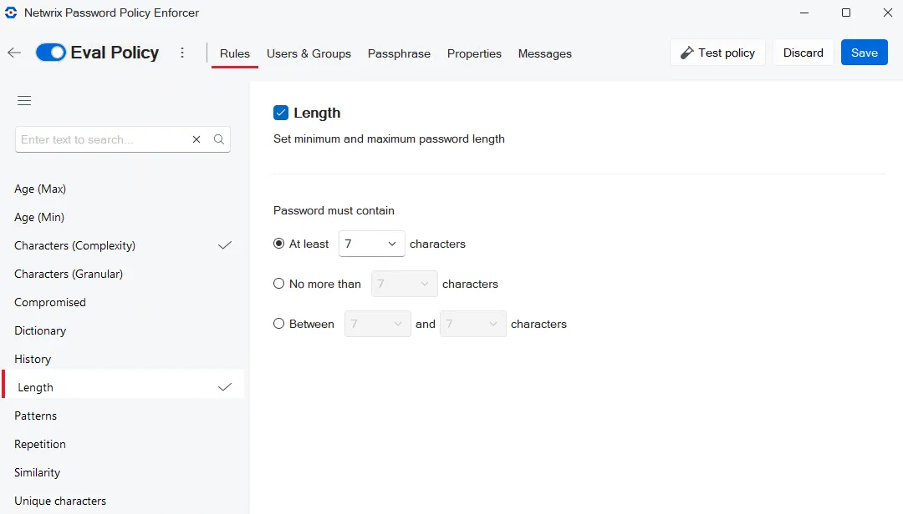
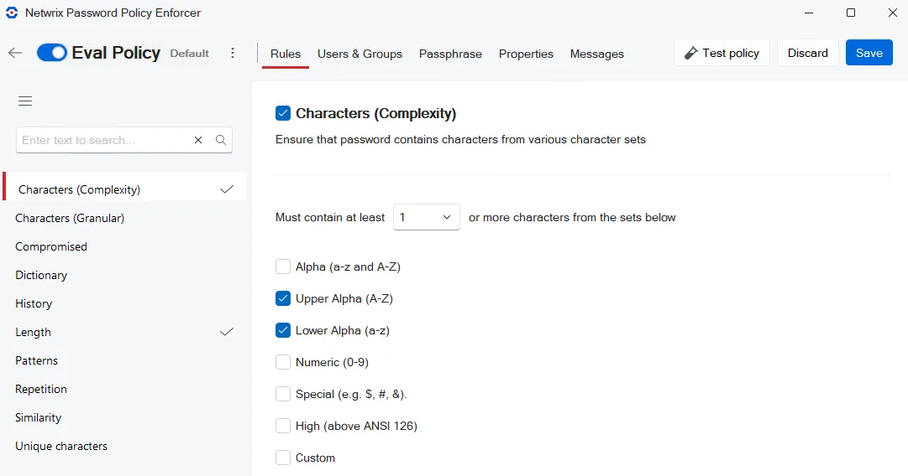
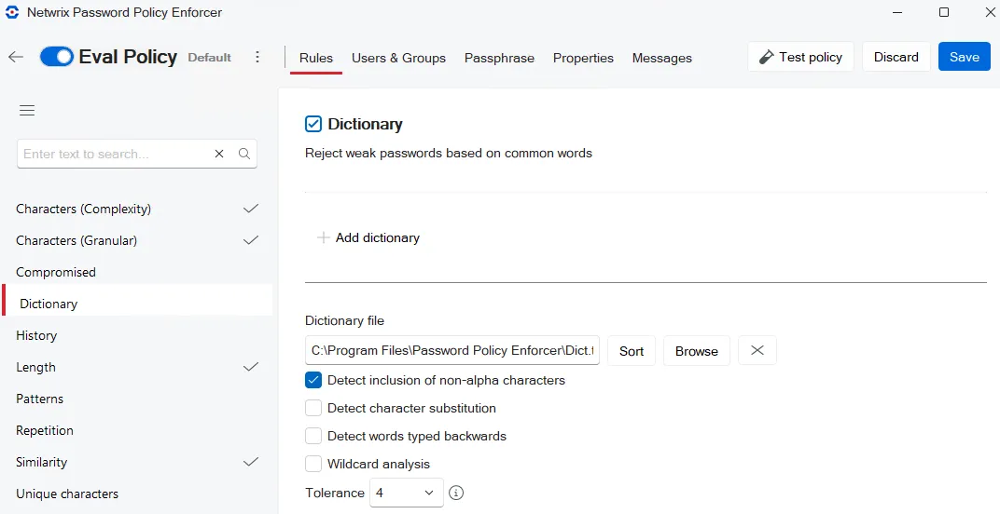

# Configure Policy Rules

The policy you just created does not enforce any password requirements yet. You can now configure
the policy to enforce these rules:

- Password must contain at least seven characters.
- Password must contain at least one lowercase alpha character.
- Password must contain at least one uppercase character.
- Password must not be similar to the user's logon name.
- Password must not exist in a dictionary of common passwords.

When you create a policy, the policy settings are opened. You can open the settings for a policy at
any time by clicking the policy name on the Configuration Console dashboard.

Requirement: Password must contain at least seven characters.

This condition is set with the **Length** rule.

**Step 1 –** Select **Length**.

**Step 2 –** Click the **Length** checkbox to enable the rule.

**Step 3 –** Select **7** for the **At least...** value. Depending on the template, this might be
the default.

Requirement: Password must contain at least one lowercase alpha character.

This condition is set with the **Characters (Complexity)** rule.

**Step 1 –** Select **Characters (Complexity)**.

**Step 2 –** Click the **Characters (Complexity)** checkbox to enable the rule.

**Step 3 –** Select **1** as the **Must contain at least...** value.

**Step 4 –** Select **Lower Alpha (a-z)**.

**Step 5 –** Select **Upper Alpha (A-Z)** for the next requirement while you are here.

Password must contain at least one uppercase character.

This condition is set with the **Characters (Granular)** rule.

**Step 1 –** Select **Characters (Granular)**.

**Step 2 –** Click the **Characters (Granular)** checkbox to enable the rule.

**Step 3 –** Select **1** as the **Must contain at least...** value.

**Step 4 –** Select **Upper Alpha (A-Z)** **Contain** **1** or more characters.

**Step 5 –** Select **Lower Alpha (a-z)** **Contain** **1** or more characters.

Requirement: Password must not be similar to the user's logon name.

This condition is set with the **Similarity** rule.

**Step 1 –** Select **Similarity**.

**Step 2 –** Click the **Similarity** checkbox to enable the rule.

**Step 3 –** Select **User logon name**.

Requirement: Password must not exist in a dictionary of common passwords.

This condition is set with the **Dictionary** rule.

**Step 1 –** Select **Dictionary**.

**Step 2 –** Click the **Dictionary** checkbox to enable the rule.

**Step 3 –** Click **Browse**.

**Step 4 –** Navigate to **\Program Files\Password Policy Enforcer** folder and select**Dict.txt**.

When you have added all the rules, click **Save** to save your new policy.
