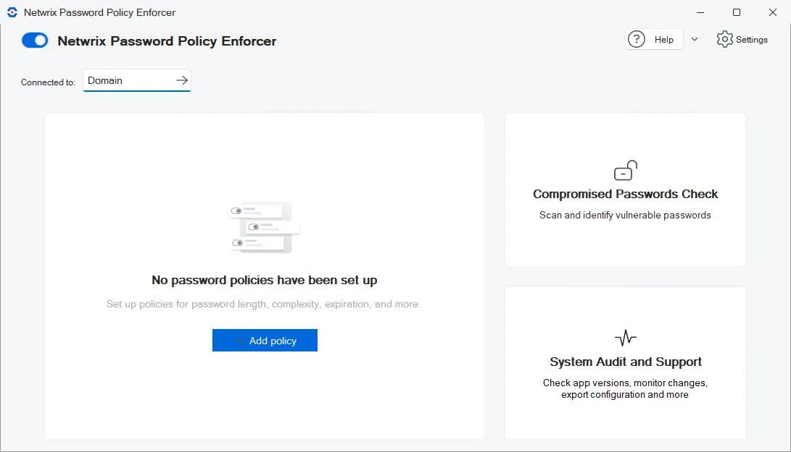
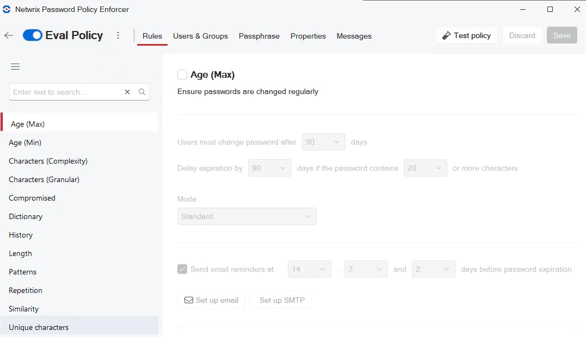

# Create a Password Policy

There are no password policies defined when Password Policy Enforcer is first installed. You can now
create your first Password Policy Enforcer password policy. Password Policy Enforcer accepts all
passwords in this state, so users only need to comply with the Windows password policy rules (if
enabled).

**Step 1 –** Open the Configuration Console:

Click **Start** > **Netwrix Password Policy Enforcer** > **PPE Configuration**  
or  
Double click the **PPE Configuration** desktop shortcut.

The Configuration Console dashboard shows **No password policies have been set up** when you are
getting started with Password Policy Enforcer.

**Step 2 –** Click **Add policy**.

**Step 3 –** Enter a unique policy name. Maximum is 32 characters. **Eval Policy** is used for this
example.

**Step 4 –** Select a Policy template or **None** if you are creating your own. For a list of
policies see [Policy Templates ](policy_templates.md).

**Step 5 –** Click **Create policy**.

Your policy is created. The policy settings are opened, showing the first item on the **Rules** tab.

**Step 6 –** Click the context menu (beside the policy name and select **Make default**.

