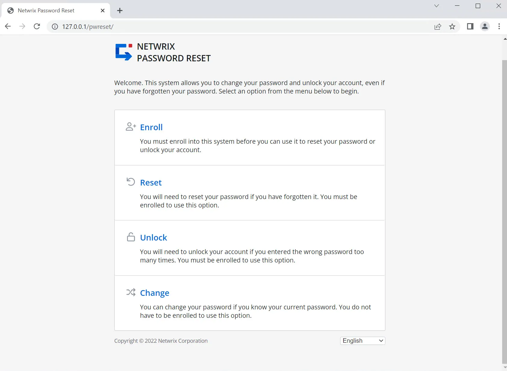
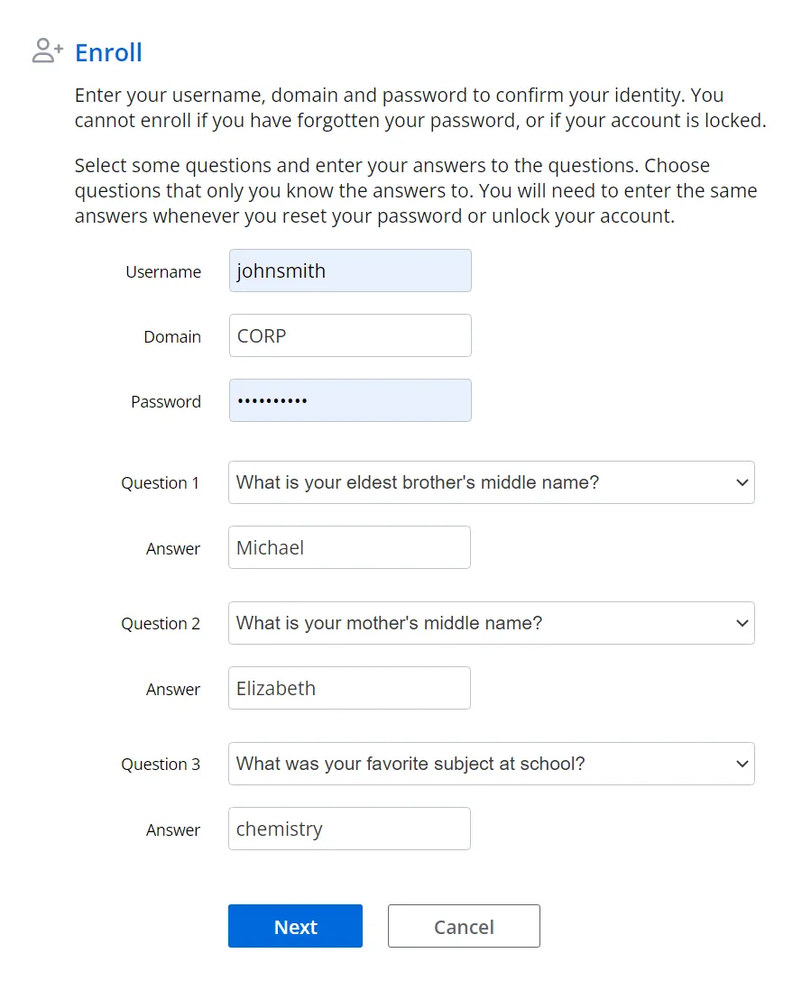

# Using Password Reset

Using Password Reset

# Using Password Reset

Password Reset is a web application. Open a web browser on the server and go to
[http://127.0.0.1/pwreset/ ](http://127.0.0.1/pwreset/)to see Password Reset's menu. You can also
access Password Reset from another computer by replacing 127.0.0.1 in the URL with the IP address or
hostname of the evaluation server.

You should install an SSL certificate on the web server when using Password Reset on a production
network with real passwords. See the
[Securing Password Reset](../administration/securing_password_reset.md) topic for additional
information.

## Enrolling into Password Reset

You must enroll into Password Reset before you can use it to reset your password or unlock your
account. You can enroll manually by providing some information about yourself, or Password Reset can
enroll you automatically and send a verification code to confirm your identity.

Follow the steps below to manually enroll into Password Reset.

**Step 1 –** Click the **Enroll** item in the menu.

**Step 2 –** Enter a **Username**, **Domain**, and **Password** in the respective fields.

**Step 3 –** Select a question from each of the Question dropdown lists, and enter a corresponding
in Answer text boxes.

**Step 4 –** Click **Next**.

Windows increments the bad password count in Active Directory every time you try to enroll with an
incorrect password. This may trigger a lockout if the Windows account lockout policy is enabled.

## Resetting a Password

Use the Reset feature when you have forgotten your password. Resetting a password also unlocks the
account if it is locked.

Follow the steps below to reset a password.

**Step 1 –** Click the **Reset** item in the menu.

**Step 2 –** Enter a **Username** and **Domain** in the respective fields, then click **Next**.

**Step 3 –** Enter an **Answer** to the first question in the corresponding field, then click
**Next**. Repeat this step for each security question.

**Step 4 –** Enter the **New Password** into both text boxes, then click **Next**.

## Unlocking an Account

Use the Unlock feature when you know the password, but have entered it incorrectly too many times
and Windows has locked out your account.

Follow the steps below to unlock an account.

**Step 1 –** Click the **Unlock** item in the menu.

**Step 2 –** Enter a **Username** and **Domain** in the respective fields, then click **Next**.

**Step 3 –** Enter an **Answer** to the first question in the corresponding field, then click
**Next**. Repeat this step for each security question.

## Changing a Password

Use the Change feature when you know the password and would like to change it.

Follow the steps below to change a password.

**Step 1 –** Click the **Change** item in the menu.

**Step 2 –** Enter a **Username** and **Domain** in the respective fields, then click **Next**.

**Step 3 –** Enter the **Old Password**, **New Password**, and **Confirm Password** in the
respective field. Click **Next**.

Password Reset's user interface is built with customizable templates. You can easily modify the user
interface by editing the templates. Even the error messages are defined in the templates, so you can
edit those too. See the
[Editing the HTML Templates](../administration/editing_the_html_templates.md) topic of the
Administrator's Guide for additional information.
