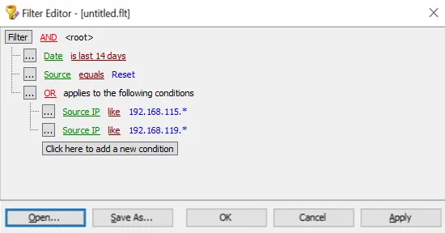

# Filter Editor

Filter Editor

# Filter Editor

Use the Filter Editor to create complex filters, filters for hidden columns, or to save and open
regularly used filters. Press **CTRL** + **F** to open the Filter Editor, or click the **Filter
Editor** button in the lower right corner of the Data Console.

A filter may contain several conditions. Conditions start with a column name, followed by an
operator, and sometimes a value. Column names are shown in green, operators in maroon, and values in
blue.

A filter also contains a root node and optionally one or more groups. These are used to include
Boolean operators in the filter. Boolean operators are shown in red. Grouped conditions are
indented.

The filter in the image above contains the root node, one group, and four conditions. It will show
all reset requests in the last fourteen days originating from IP addresses starting with 192.168.115
or 192.168.119.

Click the **Click here to add a new condition** button to add a new condition to the filter. Click
the ellipsis button on the left of each line to add or remove conditions and groups. Click column
names, operators, and values to edit them. Most can be selected from a list. Values can also contain
the ? and \* wildcard characters.

Click **Save As...** to save a filter to a file, or **Open...** to use a saved filter. Click **OK**
to close the Filter Editor and apply the filter.

Some columns are hidden in the Data Console. You can use the Filter Editor to create filters for
these columns. For example, the filter in the image below shows all users with an NPR v1 enrollment
record.

