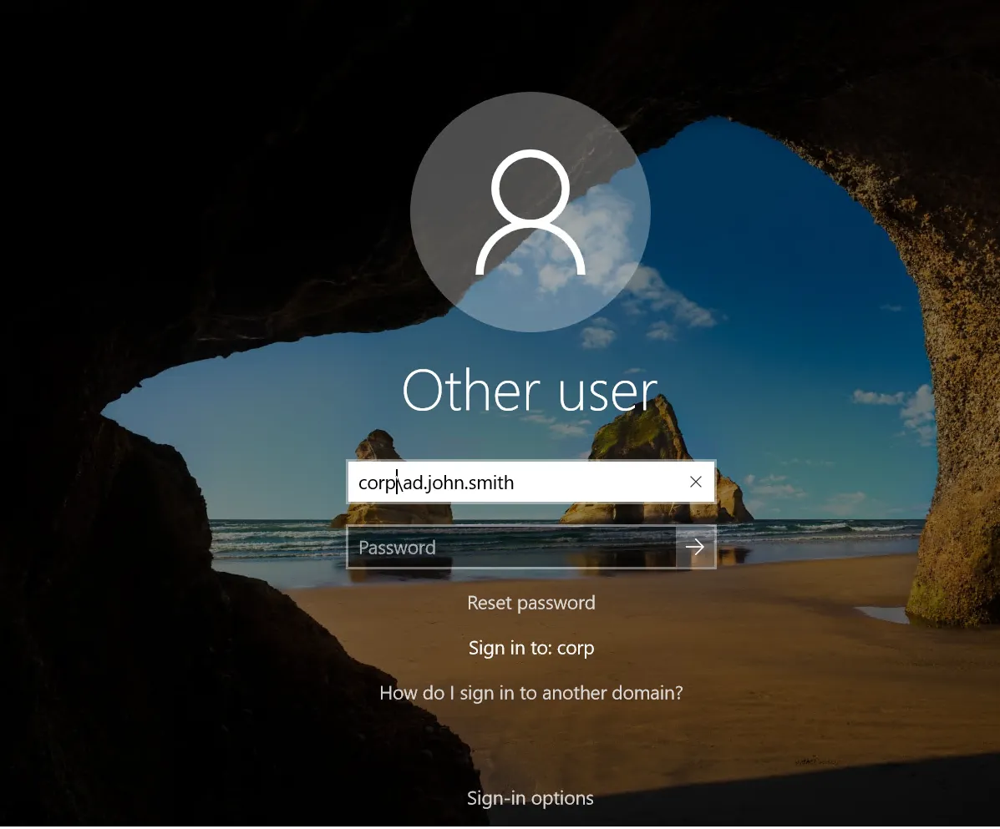
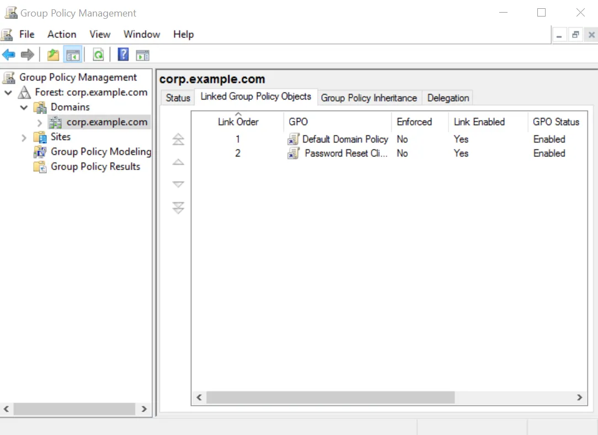
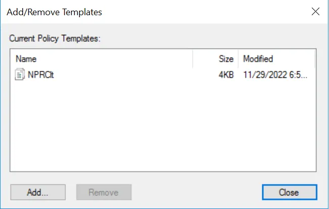
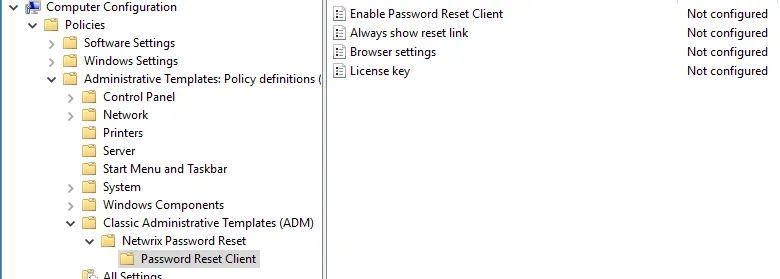
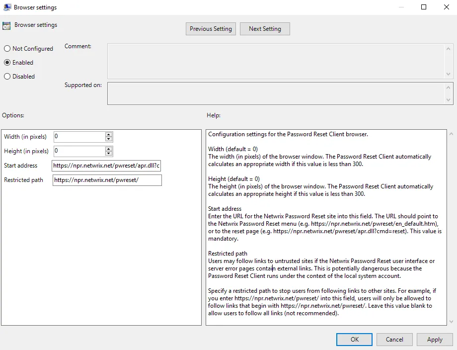
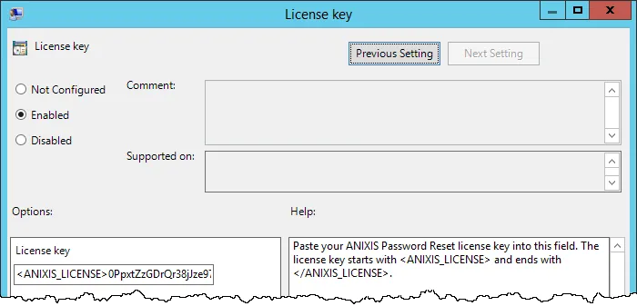

# Password Reset Client

Password Reset Client

# Password Reset Client

The Password Reset Client allows users to securely reset their password or unlock their account from the Windows Logon and Unlock Computer screens. Users click __Reset Password__ to access the Password Reset system.



__NOTE:__ The Password Reset Client does not modify any Windows system files.

## Installing the PRC

The Password Reset Client is designed to run on Windows XP to Windows 10, and Server 2003 to Server 2019. The PRC is compatible with Remote Desktop Services on these operating systems. Support for Windows XP and Server 2003 is depreciated because the PRC uses Internet Explorer for page rendering, and Internet Explorer 8 has very limited support for HTML5. Send an e-mail to [support@netwrix.com ](mailto:support@netwrix.com)if you need to use the Password Reset Client with these older operating systems.

### System Requirements

- Windows Vista, 7, 8, 8.1, or 10.  
  Windows Server 2008, 2008 R2, 2012, 2012 R2, 2016, or 2019.  
  Windows XP, Server 2003, or 2003 R2 (depreciated).
- 1 Megabyte free disk space.
- 128 Kilobytes free RAM (per session if using Remote Desktop Services).

You can install the PRC manually if you only have a few computers, but it is easier to perform an automated installation if you have many computers. Follow the instructions below to perform an automated installation with Group Policy.

### Create a Distribution Point

A distribution point can either be a UNC path to a server share, or a DFS (Distributed File System) path. Organizations with large, multi-site networks should use DFS as it offers fault tolerance and load sharing. To create a PRC distribution point:

__Step 1 –__ Log on to a server as an administrator.

__Step 2 –__ Create a shared network folder to distribute the files from.

__Step 3 –__ Give the Domain Computers security group read access to the share, and limit write access to authorized personnel only.

__Step 4 –__ Copy NPRClt330.msi into the distribution point folder.

__NOTE:__ NPRClt330.msi is in the Client folder below the Netwrix Server's installation folder. (```\Program Files\Netwrix Password Reset\``` by default).

__Step 5 –__ Give the Domain Computers security group read access to the NPRClt330.msi file in the distribution point.

### Create a Group Policy Object

__Step 1 –__ Start the Group Policy Management Console (gpmc.msc).

__Step 2 –__ Expand the forest and domain items in the left pane.

__Step 3 –__ Right-click the domain root node in the left pane, and then click __Create a GPO in this domain, and Link it here...__

__Step 4 –__ Enter __Password Reset Client__, then press __ENTER__.



### Edit the Group Policy Object

__Step 1 –__ __Right-__Click the __Password Reset Client GPO__, then click the Edit__...__ button.

__Step 2 –__ Expand the __Computer Configuration__, __Policies__, and __Software Settings__ items in the left pane.

__Step 3 –__ __Right-Click__ the __Software installation__ item, and then select __New__ > __Package__.

__Step 4 –__ Enter the full UNC path to NPRClt330.msi in the Open dialog box.

__NOTE:__ You must enter a UNC path so that other computers can access this file over the network. For example, \\file server\distributionpointshare\NPRClt330.msi

__Step 5 –__ Click __Open__.

__Step 6 –__ Select the __Assigned deployment__ method, then click __OK__.

__Step 7 –__ Close the Group Policy Management Editor.

### Complete the Installation

Restart each computer to complete the installation. Windows installs the Password Reset Client during startup. The computer may restart itself automatically to complete the installation.

__NOTE:__ Computers with Fast Logon Optimization enabled may not install the Password Reset Client during the first restart. These computers perform a background refresh of Group Policy, and will install the client on the first restart after the refresh. See the Microsoft Description of the [Windows Fast Logon Optimization feature](https://support.microsoft.com/en-us/topic/description-of-the-windows-fast-logon-optimization-feature-9ca41d24-0210-edd8-08b0-21b772c534b7) article for additional information on the Fast Logon Optimization feature.

## Configuring the PRC

You must install an Active Directory administrative template to configure the Password Reset Client. The administrative template only has to be installed once.

Install PRC Administrative Template

Follow the steps below to install the PRC administrative template.

__Step 1 –__ Use the Group Policy Management Console (gpmc.msc) to display the GPOs linked at the domain level.

__Step 2 –__ __Right-click__ the __Password Reset Client__ GPO, and then __click__ the __Edit...__button.

__Step 3 –__ Expand the __Computer Configuration__ item.

__Step 4 –__ Expand the __Policies__ item if it is visible.

__Step 5 –__ __Right-click__ the __Administrative Templates__ item, and then click __Add/Remove Templates...__

__Step 6 –__ Click __Add...__ and then browse to the Client folder below the Password Reset Server's installation folder. (```\Program Files\Netwrix Password Reset\``` by default).

__Step 7 –__ Select __NPRClt.adm__, and then click __Open__.



__Step 8 –__ Click __Close__.

Configure the PRC

Follow the steps below to configure the Password Reset Client.

__Step 1 –__ Use the Group Policy Management Console (gpmc.msc) to display the GPOs linked at the domain level.

__Step 2 –__ __Right-click__ the __Password Reset Client__ GPO, then click the __Edit...__ button.

__Step 3 –__ Expand the __Computer Configuration, Policies__ (if it exists), __Administrative Templates__, __Classic Administrative Templates (ADM)__, __Netwrix Password Reset__, and __Password Reset Client__ items.



__Step 4 –__ Double-click the __Browser settings__ item in the right pane of the Group Policy Management Editor.



__Step 5 –__ Select the __Enabled__option.

__Step 6 –__ Enter the desired __Width__ and __Height__ of the PRC browser window.

__NOTE:__ Set the Width and Height to 0 to have the PRC calculate an appropriate size.

__Step 7 –__ Enter the __Start address__ (URL) of the Password Reset system. The URL should point to the Password Reset menu or reset page.

__NOTE:__ The Start address should follow this format:  
```HTTPS://(your domain or IP address)/pwrest/en_default.htm```  
This format helps ensure that the URL points to the correct location on your Password Reset server.

__Step 8 –__ Enter a __Restricted path__ (URL) to stop users from following links to other sites from the Password Reset Client browser.

__NOTE:__ The Restricted path should follow this format:   
```HTTPS://(your domain or IP address)/pwrest/```  
This will help prevent users from navigating to untrusted sites within the Password Reset Client.

__Step 9 –__ Click __OK__.

__Step 10 –__ Close the Group Policy Management Editor.

The new PRC configuration is applied to all computers in the domain. This does not happen immediately, as Windows takes some time to apply the changes to Group Policy. You can force an immediate refresh of Group Policy on the local computer with the following command: gpupdate /target:computer

The Password Reset Client only opens URLs with .dll, .htm, and .html extensions. URLs without a filename are not opened. The PRC also blocks some page content, including audio and video files, ActiveX controls and Java applets. Send an e-mail to [support@netwrix.com ](mailto:support@netwrix.com)if you need to change the default filename and content restrictions.

__CAUTION:__ Users may follow links to untrusted sites if the Password Reset user interface or server error pages contain external links. This is a security risk because the Password Reset Client runs under the context of the local system account. Specify a restricted path to stop users from following links to other sites from the Password Reset Client. The start address and restricted path should both begin with https://

__NOTE:__ The __Enable Password Reset Client__, __Always show reset link__, and __Dialog attachment delay__ are automatically set by the Password Reset Client, and are normally left in their default (Not configured) state.  
The administrative template contains detailed information about all the PRC configuration settings. This information is shown on the __Help__ box. The __Help__ box is shown after you double-click one of the configuration settings in the left pane.

## Licensing the PRC

Follow the steps below to add a license key to the PRC configuration.

__Step 1 –__ Open the __Configuration Console__ and install your license key.

__Step 2 –__ Start the __Registry Editor__ (regedit.exe).

__Step 3 –__ Expand the __HKEY_LOCAL_MACHINE__, __SOFTWARE__, __ANIXIS__, __ANIXIS Password Reset__, and __3.0__ registry keys.

__NOTE:__ The LicenseKey registry value should be located on the Password Reset Server. This is the machine where you have installed the Password Reset server component, not the client machines.

__Step 4 –__ Double-click the __LicenseKey__ value, and then copy the entire license key to the clipboard.

__Step 5 –__ Use the Group Policy Management Console (gpmc.msc) to display the GPOs linked at the domain level.

__Step 6 –__ Right-click the __Password Reset Client__ GPO, then click the __Edit...__ button.

__Step 7 –__ Expand the __Computer Configuration__, __Policies__ (if it exists), __Administrative Templates__, __Classic Administrative Templates (ADM)__, __Netwrix Password Reset__, and __Password Reset Client__ items.

__Step 8 –__ Double-click the __License key__ item in the Left pane of the Group Policy Management Editor.

__Step 9 –__ Select the __Enabled__ option.

__Step 10 –__ Click inside the __License key__ text box, then paste the license key.



__Step 11 –__ Click __OK__.

__Step 12 –__ Close the Group Policy Management Editor.

The license key is applied to all computers in the domain. This does not happen immediately, as Windows takes some time to apply the changes to Group Policy. You can force an immediate refresh of Group Policy on the local computer with the following command:

```gpupdate /target:computer```


