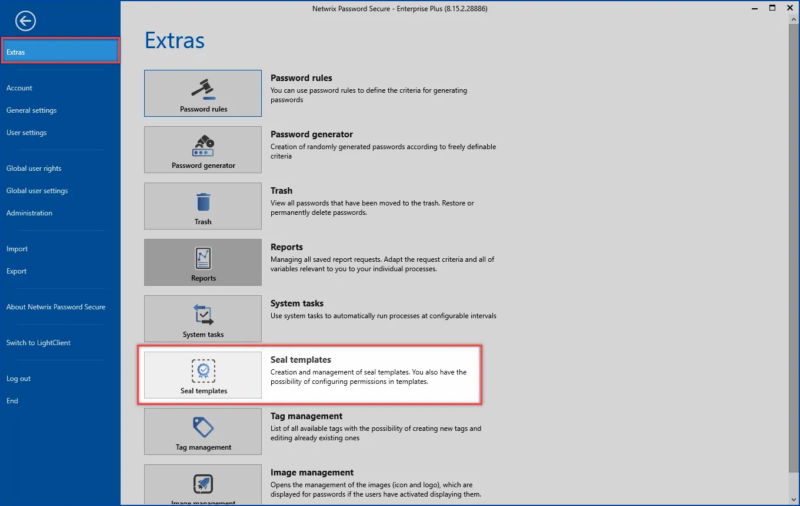
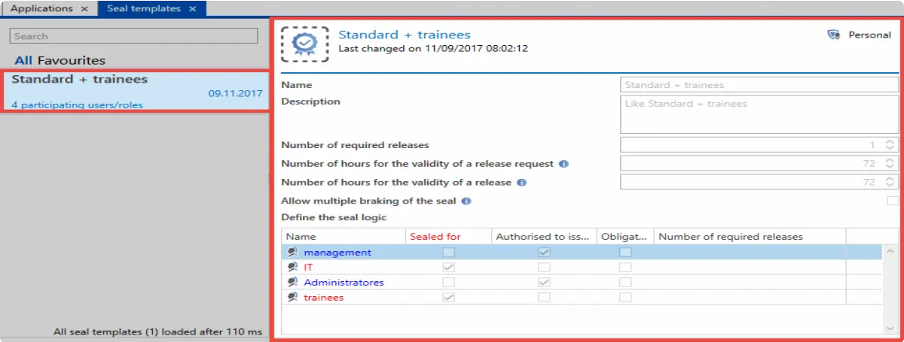

# Seal templates

## What are the seal templates?

The configuration of
[Seals](../../../permissionconcept/predefining_rights/protective_mechanisms/seals/seals.md) must be
well-thought-out and error-free. It is absolutely essential to save the once-invested effort in the
form of seal templates. The automation of ever-recurring tasks will, in this context, extremely
speed up the timing of the work. Once defined, templates can be attached to data records in a few
simple steps. The adaptation of already created stencils is presented in the seal templates as clear
and very fast.

NOTE: A separate tab opens in the active module in order to edit the default templates

## Creating templates

**CAUTION:** The right Can manage seal templates is required

When creating seals, the seal can be saved as a template using the wizard. All templates saved in
this way are listed in the overview of the seal templates. Furthermore, it is possible to edit
existing templates directly or create new ones via the button in the ribbon. This is done in the
same way as the seal assistant.

Once templates have been added, they can be immediately used for the creation of new seals.
