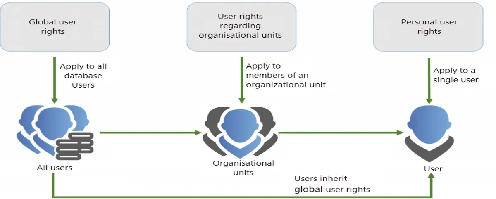
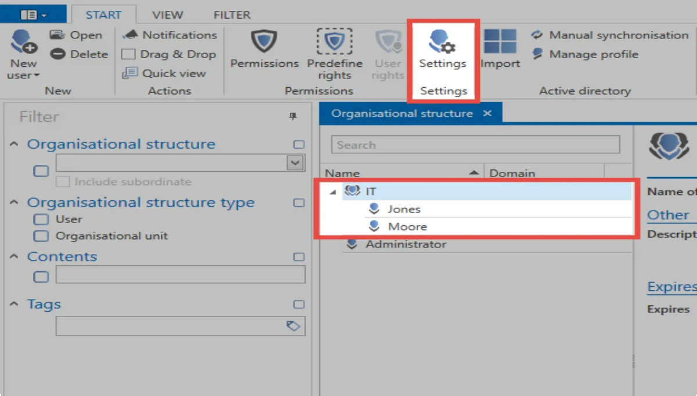
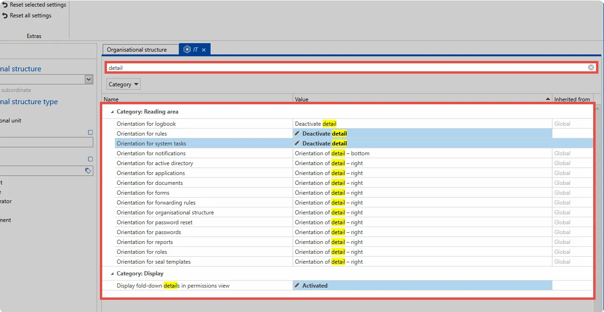
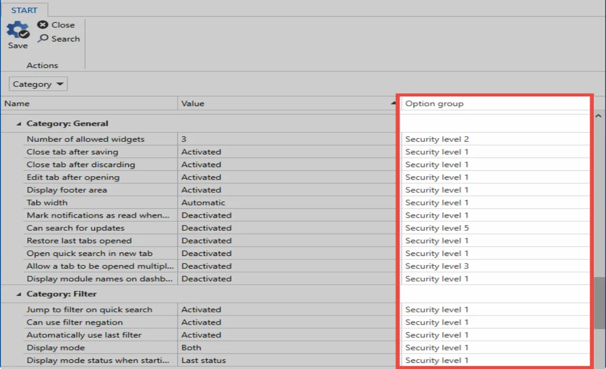

# User settings

## What are user settings?

There are many functions within Netwrix Password Secure that can be adapted to the needs of users.
It is also possible to define various parameters for optical representations. This can be inherited
both at \* user level \*, \* global \* and \* organisational units \*. In addition, there is a
security level concept, which categorizes the users into five layers. The administration of settings
can thus be linked to the presence of the required security level.

## Managing user settings

You can configure user settings similarly to [User rights](../user_rights/user_rights.md). Here too,
there are a total of three possibilities with which a user can define his settings or be configured
from another location. For the sake of easy manageability, it is again a good idea to configure the
users not individually, but to provide several equal users with settings.

The focus is always on the user, also when it comes to user rights. It can obtain its settings in
one of the following three ways:

1. Personal settings only apply to a specific user. These are always configured via the
   organisational structure module.
2. Settings for organisational structures apply to all members of a role, and are specified in the
   organisational structure module
3. Global settings apply to all users of a database without exception. You can configure them in the
   client settings.

**CAUTION:** In addition to personal and global settings (as opposed to authorizations), settings
are not assigned via roles, but via organisational units!

### Inheritance of user settings

If you leave the personal settings on the outside, there are two ways to inherit settings:

1. Global inheritance
2. Inheritance on the basis of membership in organisational units (OU)

Global settings are configured as usual in the [Main menu](../main_menu_fc.md). The organisational
units are inherited via the
[Organisational structure](../../clientmodule/organisationalstructures/organisational_structure.md).
All users who are assigned to an organisational unit inherit all user settings for this OU. In the
present case, the users “Jones” and “Moore” inherit all settings from the “IT” organisational unit:

The “Settings” button in the ribbon allows you to see the settings for both organisational units and
users. The many setting options can be restricted by the known
[Search](../../operation_and_setup/search/search.md) mechanisms.

The diagram shows the settings for the user “Jones”. The search has been filtered by the term
“Detail”. The column **“Inherited from”** shows that some settings have been inherited globally, or
by the organisational unit “IT”. The top two options have no value in the column. This is because
this parameter has been defined at user level.

NOTE: The inheritance for individual settings can be deactivated in the ribbon!

## Security levels

Option groups were created in the global settings to ensure that users can control only those
settings for which they hold permissions. Categorising security levels from 1 to 5 allows you to
combine similar options and thus make them available to the users.

The [User rights](../user_rights/user_rights.md) define who has the required permissions to change
which security levels. As with all rights, this is achieved either through global inheritance, the
role, or as a right granted directly to the user.
