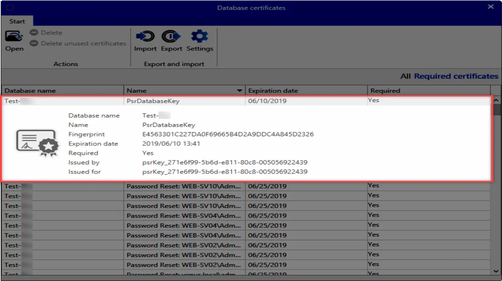

# Database certificates

## What is a database certificate?

A unique certificate is created for each database. This has the name **psrDatabaseKey**:

The database certificate **does not encrypt the database.** Rather, it is used for the encrypted
transfer of passwords from the client to the server in the following cases:

- Creation of a WebViewer via a task
- Creation of an AD profile protected by a master key
- Login of users imported from AD in Master Key mode

NOTE: The database certificate cannot be replaced by your own certificate.

NOTE: The expiry date for the database certificate is not checked. The certificate thus does not
need to be renewed.

**CAUTION:** If the database is being moved to another server, it is essential that the certificate
is also transferred!

#### Exporting and importing the certificate

The section [Certificates](certificates.md) explains how to back up the certificate and link it
again.
