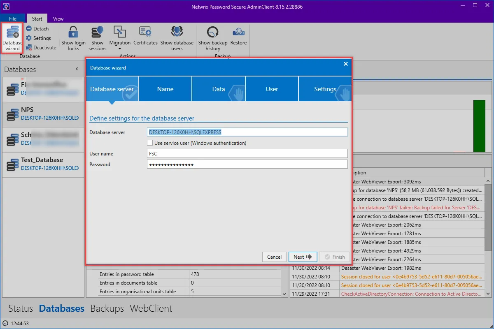
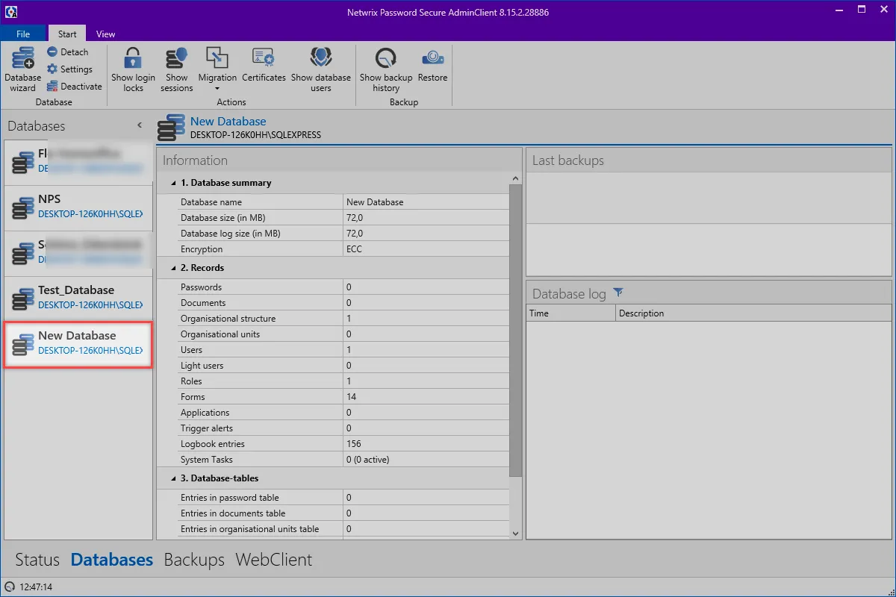

# Creating databases

[https://www.youtube.com/embed/md7_VEdVuWM?rel=0](https://www.youtube.com/embed/md7_VEdVuWM?rel=0)[https://www.youtube.com/embed/md7_VEdVuWM?rel=0](https://www.youtube.com/embed/md7_VEdVuWM?rel=0)

## What are databases?

Databases contain all information on users, records, documents, etc. The changes to objects in
Netwrix Password Secure will also become part of the MSSQL database. Naturally, the regular creation
of backups to secure this data should always have the highest priority. The **MSSQL** relational
database management system is used in Netwrix Password Secure version 9.

## Creating databases

The creation of databases is supported by the database wizard, which is started directly from the
ribbon. The individual tabs of the wizard are explained below:

Database server

The first tab can be used to manually select the database server. By default, the value defined in
the Advanced settings is preset. A user can also be entered or the service user can be selected
instead.

Name

Enter the name of the new database here. Alternatively, you may select an existing database. A
meaningful name makes it easier to differentiate between databases, especially when using multiple
databases.

Data

This setting can be used to define whether a template should be used. The template will provide the
database with ready-made forms and dashboard settings that make it easier to get started. The user
can select from English and German templates. However, it is also possible to proceed without a
template – you will then start with a completely empty database. If you have a backup from Password
Safe version 7, this can be migrated.

User

This setting is used to define the first user to be created – normally this is the administrator. If
a migration is active, the user can be deleted after migration.

#### Finishing the database wizard

Once a database has been created successfully, , provided it has been selected. If no data migration
has been selected, the new database is created directly, and will be displayed in the database
overview.

