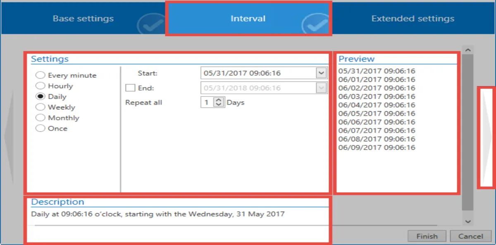
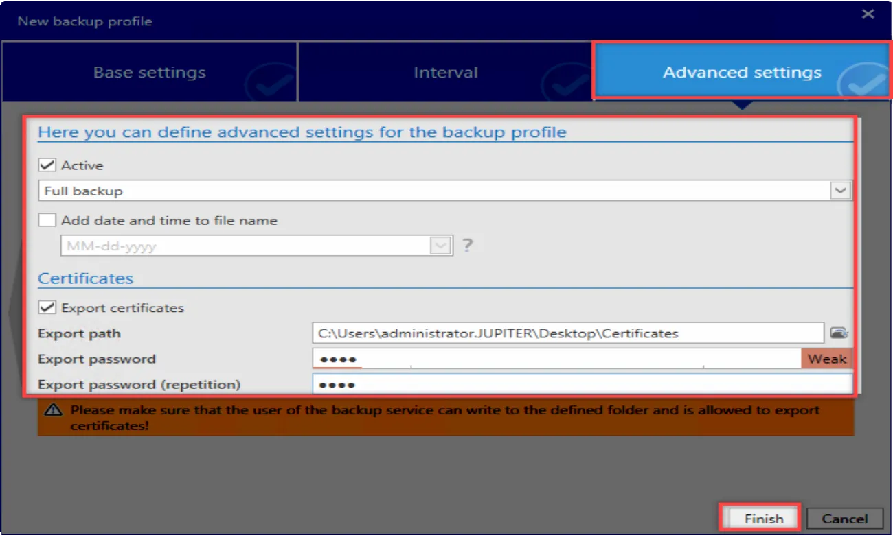

# Backup management

#### Introduction

Regular backups of the data should always be part of every security concept. If you wish to create
backups directly on the SQL server, you should also include the Netwrix Password Secure databases.
If no central backups are carried out at the SQL level, you can create backup profiles using the
Server Manager. The backups themselves will then be generated on the SQL Server.

#### Difference between an incremental and full backup

A complete backup always saves all data in a database. An incremental backup also creates a complete
image of the database as the first step. In future, only the changes since the backup created at the
beginning will be saved. This saves both time and memory capacity.

#### Backup concept

It is recommended that an incremental backup is run every hour. In addition, a full backup should be
created once a week.

#### Managing the backup schedule

Creating a backup schedule

You can create a new schedule via the ribbon. This is facilitated by a wizard. All the information
entered under [Backup settings](../backup_settings.md) will be used by default.

A profile name is entered first. The desired databases are also selected. You also need to specify
the directory for the backups.

NOTE: It must be a directory on the SQL server.

Now set the time interval for creating the backups. A preview on the right will show when the
backups will be created in future. An end date can be optionally entered.

In the advanced settings, you can configure whether the backup should be activated directly. It is
also possible to specify whether to create incremental backups. If the date and time are added to
the file name, a new backup is created with each run. If this is not done, the last backup is always
overwritten. The service user can be used to create the backup or a service user can be specified
with a corresponding name and password.

In addition, you can enter here whether the required certificates should be saved using a backup
task. Further information can be found in the section
[Certificates](../../../certificates/certificates.md).

Backup run

The backups are executed by the SQL server in the background. If an error occurs, this is indicated
in “orange” in the backup list. Information about any errors issued by the SQL server is displayed
under all backups. A backup will be automatically deactivated if it does not run 5x in a row. This
will be marked in the list in red. The schedule cannot be reactivated directly. You will need to
open it and amend it.

Other backup actions

A selected schedule can be deleted via the ribbon. The wizard for a schedule can be called up by
double-clicking on it to make any changes. In addition, a backup can be started directly via the
ribbon at any time. The backup service must be running for this purpose. You can also display this
in the history.

#### Restoring data from a backup

Restoring data from backups is performed using the database module. Data can only be restored to
existing databases. Firstly, select the required database. You can now select Insert in the ribbon.

If necessary, firstly enter login data for the user that logs in to the SQL server – although the
service user is generally used here. Now select the backup file. All the backups contained in the
file will then be displayed. Now simply click on Restore to restore the backup to the existing
database.

