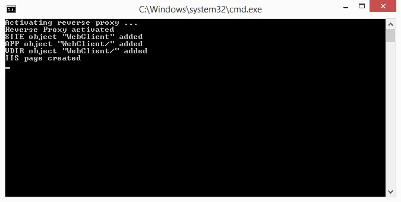
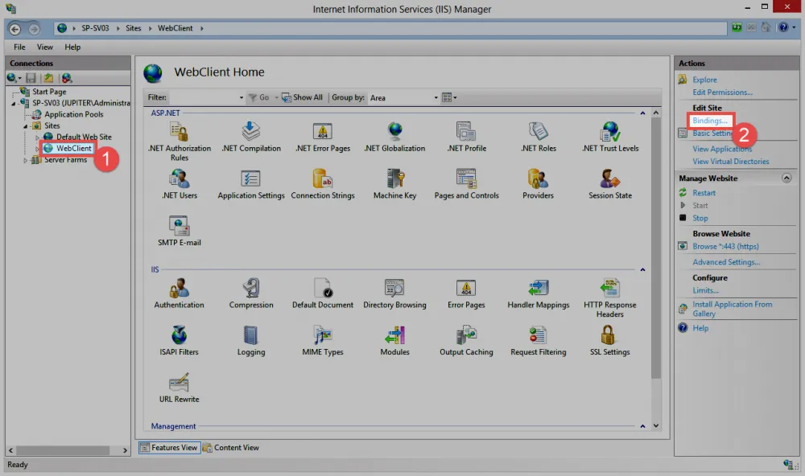
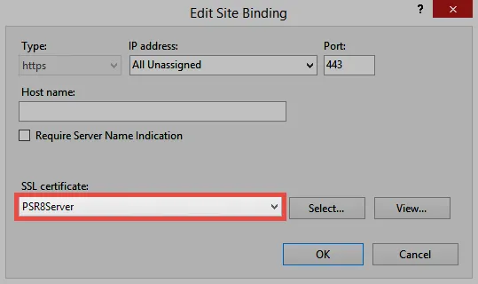

# Microsoft IIS

If the Web Application is being operated on a Microsoft IIS web server, there are two methods for
integrating it into the system:

## Create as its own website

For this option, a website with the name "Web Application" will be directly created on the IIS by
config.bat. The Web Application will be operated here from the standard directory
C:\inetpub\wwwroot.

## Integrate in existing website

requires there to be an existing website. Therefore, a website needs to be firstly created on the
IIS web sever. The name of the website then needs to be entered in the Server Manager. It is also
necessary to enter the folder from which the Web Application should be operated under "website
directory". The format here is "/Web Application"

Once all of the settings have been entered, the Web Application can be created via the corresponding
button in the ribbon. When the ZIP archive containing the Web Application has been created, it is
copied to the previously defined directory (C:\inetpub\wwwroot as standard) and unzipped there to
create a new directory.

## Config.bat

The file config.bat can be found in the newly created Web Application directory and now needs to be
executed when logged on as the administrator. This will integrate the Web Application into the IIS
web server.

NOTE: If the system requirements have not been met, you will be informed that the URL Rewrite and/or
Application Request Routing modules need to be installed. In this case, follow the instructions on
the wizard that will then immediately open. In addition, it is necessary to install the WebSocket
Protokoll. Afterwards, config.bat needs to be executed again.

If the website has been correctly created, this will be correspondingly indicated by the
notification IIS page created.

**CAUTION:** Following a successful installation, it is imperative that config.bat is deleted! The
config.bat file should also not be used for an "update"

## Certificate

The certificate then needs to be saved. Select the newly created website on the IIS web server. The
bindings can now be opened on the far right.

Select the https entry and open it for editing. The SSL certificate is then selected here.

In addition, the Netwrix Password Secure certificate needs to be exported from the Netwrix Password
Secure Server and imported onto the ISS under local computer > trusted root certificate location ->
certificates. Further information can be found in the section "Certificates"
