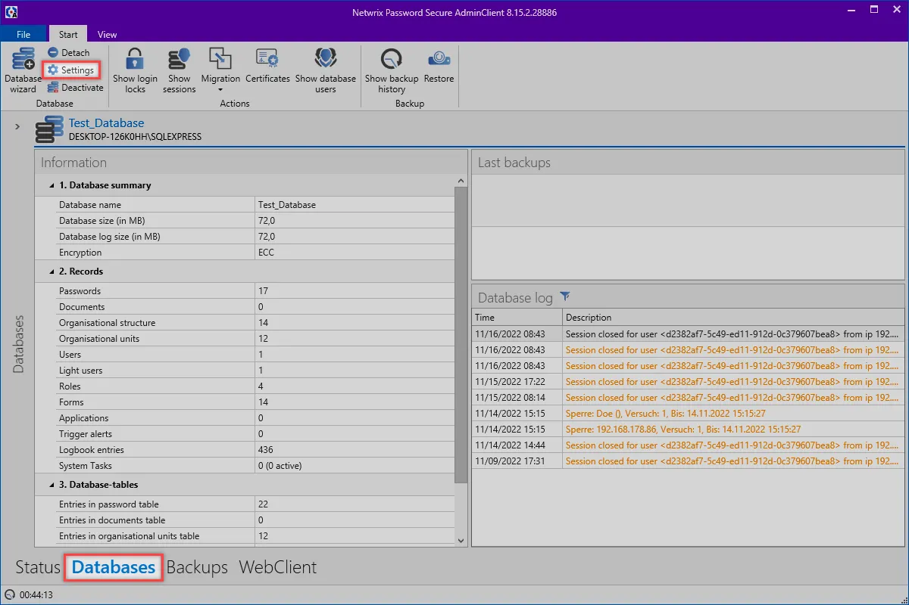
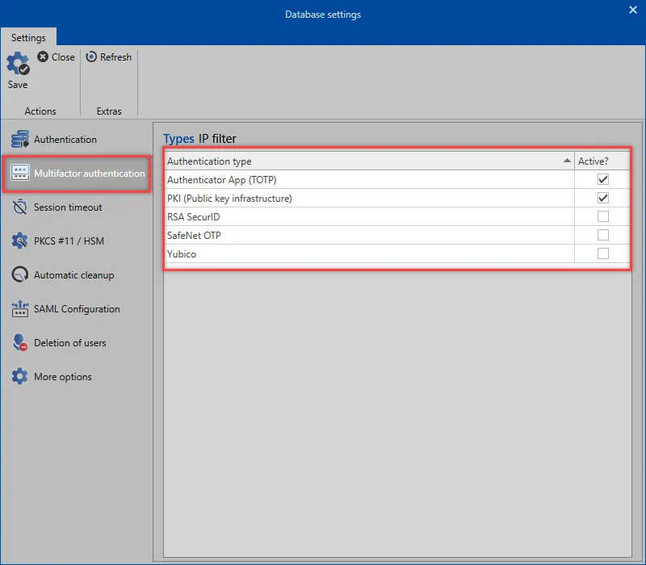

# Multifactor authentication

## What is multifactor authentication?

By means of multifactor authentication, you can save the login – in addition to the password – with a further factor. Setting up a multifactor authentication can be done by either the administrator or the user.

## Requirements

To use multifactor authentication on a database, it must firstly have been activated on the Server Manager. In the database module, open the settings for the selected database via the ribbon.

It is possible to separately define in the settings whether it is permitted to use each interface on the database.

### Other settings

In the user settings, it is also possible to define the "Length of validity of a multifactor authentication token" in minutes.

NOTE: In order for a user (administrator) to be able to __configure__ multifactor authentication for other users, the user must have the rights __read__, __write__, __delete__ and __authorize__. It is important that these rights exist before Multifactor Authentication is set up.

## Configuration of multifactor authentication

In the [Organisational structure](../organisational_structure.md) module, you select the user and the interface "Multifactor authentication" in the ribbon.

The desired type of authentication is selected and given a title. This name is also displayed to the user when logging in. The subsequent process differs depending on the desired authentication type.

### Google authenticator

The prerequisite for this is that the relevant app has been started on a smartphone. After the name has been assigned for the authentication, you generate a new secret via the corresponding button. A QR code is displayed, which must be scanned using the Google Authenticator app on a smartphone.

Once the Google Authenticator app has detected the QR code, it will return a 6-digit PIN. You must then enter it in the appropriate field. Finally, click on __Create__ in the ribbon.

## RSA SecurID Token

To set up multifactor authentication using RSA SecurID, simply enter the RSA user name and click __Create__ directly in the ribbon.

NOTE: The prerequisite for the use of RSA SecurID token is that the access data has been stored in the Database settings on the Server Manager.

## Public key infrastructure

For PKI setup, the __Select__ button is used to open the menu for selecting the desired certificate. All eligible certificates are displayed.

Now just select the desired certificate from the list to confirm the process.

## Yubico One Time Password

The configuration of multifactor authentication using Yubico One Time Password is described in[Multifactor Authentication](../../../../server_manager/managing_databases/database_settings/multifactor_authentication_ac.md).

## Delete Multifactor Authentication (MFA)

The multifactor authentication can be deleted by the user himself or by another user with sufficient authorization. The rights __Read__, __Write__, __Authorize__ and __Delete__ are required for another user to perform the deletion.

In order to delete a file, you should go to the main menu. Under __Account__ you will find the item __Multifactor Authentication__. An alternative way is to enter the management of multifactor authentication via the organisational structure. To do so, select the corresponding user and click on the __Multifactor Authentication__ ribbon.

In the administration of the multi-factor authentication you will then find in the ribbon the possibility to delete the stored MFA.
