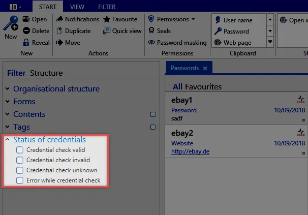

# Heartbeat

## What is the heartbeat?

The heartbeat checks whether passwords in Netwrix Password Secure match the login data on the relevant systems. This process ensures that the passwords do not differ from one another.

## Requirements

The heartbeat is only available for passwords that are linked to a properly functioning Password Reset.

### Supported script types

The passwords for the following script types can be tested:

- Windows user
- MSSQL user
- Active Directory users
- Linux user

Further information can be found in the section Scripts.

## Testing using heartbeat

The testing process using the heartbeat can be executed via various methods.

## Testing via Password Reset

The heartbeat is always carried out before the first resetting process using a Password Reset. After the script has run, the testing process is carried out again. Further information on this process can also be found in the section [Rollback](../rollback/rollback.md).

### Manual testing

The heartbeat can be executed in the ribbon for the password module by clicking on __Check login data__. The currently marked password is always tested.

### Automatic testing via the password settings

It is also possible to configure the heartbeat to run cyclically. It can be configured either via the [User settings](../../../mainmenu/user_settings/user_settings.md) or directly in the [Password settings](../../passwords/password_settings.md).

## Results of the tests

The results of the test can be viewed in the __passwords module__.

The date when it was last executed can be seen at the top of the [Reading pane](../../../operation_and_setup/readingpane/reading_pane.md). The success of the testing process is indicated alongside using a coloured icon. Further information can be displayed by moving the mouse over the icon.

The icon has three different versions. These have the following meanings:

The last test was successful. The password is correct
The test could not be performed. For example, the password could not be reached.
The last test was completed. However, the password is different to the one on the target system.

## Filtering the results

The filter can be configured using the filter group __Status of the login data__ so that the tested records can be selected.

