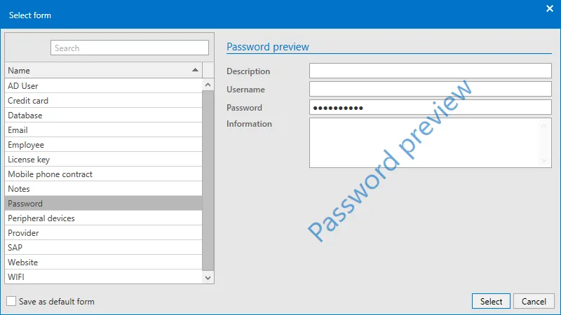
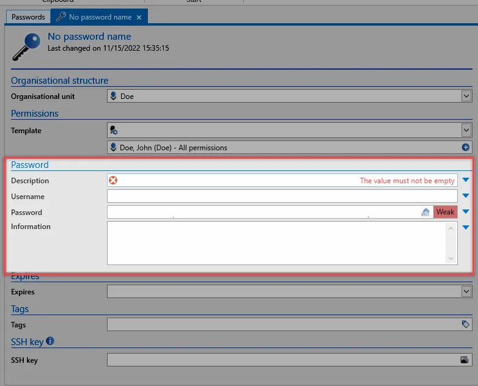
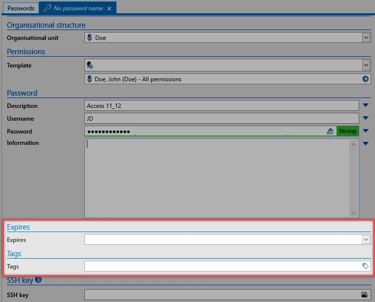
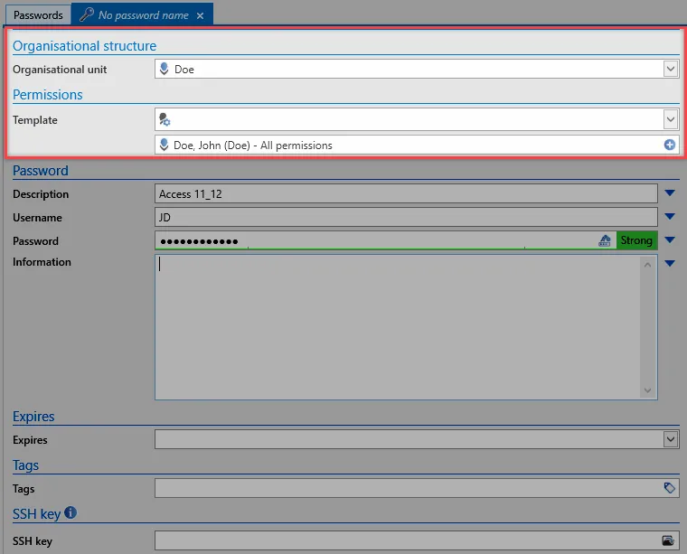

# Creating new passwords

## What does creating new passwords/records mean?

Saving a record/password stores information in the MSSQL database. This process is started in the Passwords module for the client. It is accessed either via the icon in the ribbon, using the keyboard shortcut "CTRL + N" or via the context menu that is accessed using the right mouse button in list view. The next step is to select a suitable form that will open in a modal window.

## Requirements

The following 2 user rights are required:

- Can add new passwords
- Display password module

## Selecting a form

When creating a new record, it is possible to select from all the forms for which the logged-in user has the required permissions. To make the selection process as easy as possible, a preview of the form fields included in the form is shown on the right hand side.

In this example, you can see that the "Password" form marked on the left contains three form fields "Name", "User name" and "Password". Forms thus act as __templates__ according to which their information is saved. (Management of the forms including issuing permissions and editing existing forms is covered in a separate section)

## Entering data

The window for creating a new record always open in a separate tab. As can be seen below, the corresponding form fields for the previously selected form can now be filled. Password fields deserve special mention here because they can be handled differently based on password rules. The record can be saved via the ribbon when all fields have been filled.

## Validity and tags

Irrespective of the selected form, it is always possible to define the validity and tags for a record. Both values are optional.

- The __validity__ defines an end date until which the record is valid. This information can be evaluated e.g. in the logbook or in reports. It is thus possible to create a list of all expired passwords for a user or an authorized entity. However, it is not possible to limit the usability of expired passwords for security reasons.
- __Tags__ are freely definable properties of records that can be used as search criteria. This also allows thematically linked information to be grouped together.

## Setting permissions for new records

In principle, there are various approaches for setting permissions for newly created records. All of them have already been described in the Authorization concept section. It is important to note here that __manual setting of permissions is only possible after saving__ a record. Automatic permissions are set before the record is saved. In this context, the selection of the organisational structure and the permissions for a record are important aspects.

- __Manual setting of permissions__: If you want to manually set permissions for the record, select the organisational structure in which the record should be saved. After saving the record, the permissions can be manually amended via the permissions tab in the ribbon. If you only want to create a personal record for which no other user will receive permissions, simply select your own organisational structure and conclude the process with "save" via the ribbon.

NOTE: If any kind of automatic permissions have been activated for the selected OU, this will always be prioritized.

__CAUTION:__ 
Even when creating private records, inheritance of permissions based on the logged-in user can also be activated as an option. This option is described in a separate section.

NOTE: The user right Allow sharing of personal passwords can be used to define that personal passwords cannot be released to other users.

__Automatic setting of permissions__: Automatic setting of permissions is carried out before the record is saved. Irrespective of whether predefined rights or rights inheritance is being used, the configuration is always carried out in the organisational structure or permissions area. Saving the record thus completes the process for creating the password including the issuing of permissions.
