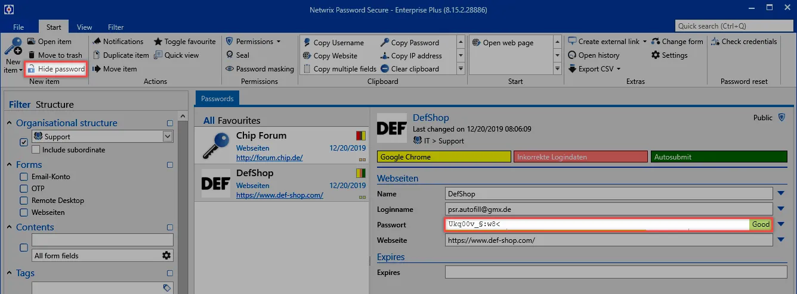
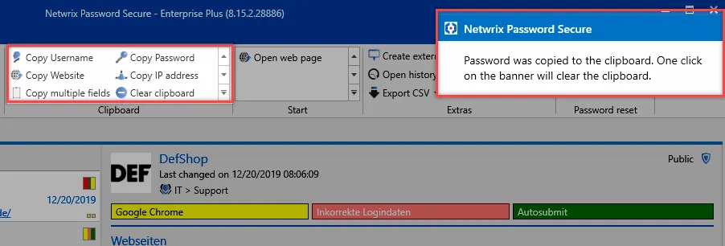
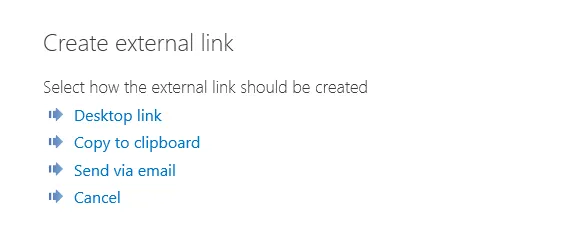

# Passwords

## What are passwords?

In Netwrix Password Secure v8, the data record with the passwords represents the central data object. The Passwords module provides administrators and users with central access to the passwords for the purpose of handling this sensitive data that requires protection. Search filters in combination with color-highlighted tags enable very focussed work. Various approaches can be used to help apply the desired permissions to objects. Furthermore, the ergonomic structure of the module helps all users to use Netwrix Password Secure in an efficient and targeted manner.

## Prerequisite

The following user right is required for adding new passwords:

- __Can add new passwords__

## Module-specific ribbon functions

The ribbon offers access to all possible actions relevant to the situation at all times. Especially within the "Passwords" module, the ribbon plays a key role due to the numerous module-specific functions. General information on the subject of the ribbon is available in the relevant section. The module-specific ribbon functions will be explained below.

### New

- __New password__: New passwords can be added via this icon in the ribbon, via the context menu that is accessed using the right mouse button and via the shortcut (Ctrl + N). The next step is to select a suitable form.
- __Open__: Opens the object marked in list view and provides further information about the record in the reading pane.
- __Delete__: Deletes the object marked in list view. A log file entry is created (see logbook).
- __Reveal__: The function __Reveal__ can be used for all records that have a password field. The passwords in the reading pane will be revealed. In the example, the passwords have been revealed and can be hidden again with the __Hide__ button.

### Actions

- __Notifications__: Defining notifications enables a constant flow of information about any type of interaction. The issuing of notifications is carried out in the module designed for this purpose.
- __Duplicate__: Duplicating creates an exact copy of the record in a new tab.
- __Move__: Moves the record marked in list view to another organisational structure.
- __Toggle__ __Favorite__: The selected record is marked as a favorite. It is possible to switch between all records and favorites at any time.
- __Quick view__: A modal window opens for the selected record for 15 seconds and displays all available information __including the value of the password__.
- Notifications: A list of all configured notifications

### Permissions

- __Permissions__: The drop-down menu can be used to set both password permissions and also form field permissions. This method only allows the manual setting of permissions for data (see

  authorization concept)
- __Password masking__: Masking passwords that need to be protected from unauthorized users is an important feature of the security concept in Netwrix Password Secure.
- __Seal__: The multi-eye principle in Netwrix Password Secure is covered in its own section. Seals.

### Clipboard

The clipboard is a key element in the ribbon. This only exists in the "Passwords" module. __Clicking on the desired form field for a record in the ribbon__ will copy it to the clipboard.

The message in the style of the "Balloon Tips" in Windows shows that the password has now been saved in the clipboard for 300 seconds. (Note: the time until the clipboard is cleared is 60 seconds by default. In the present case, this has been adjusted via the user settings.)

### Start

Conveniently working with passwords is only possible via the efficient usage of automated accesses via RDP, SSH, general Windows applications or websites. This makes it possible to dispense with (unsecure) entries via "copy & paste".

- __Open web page__: If an URL is saved in the record, this menu option can be used to directly open it.
- __Applications__: If applications have been linked to records, they can be directly opened via the "start menu".

### Extras

- __Create external link__: This option creates an external link for the record marked in list view. A number of different options can be selected:

__CAUTION:__ If several sessions are opened on a client, an external link is always called in the first session.

- __History__: This icon opens the history for those records selected in list view in a new tab. Due to the comprehensive recording of historical versions of passwords, it is now possible to compare several versions with one another.
- __Print__: This option can be used to open the print function.
- __Export__: It is possible to export all the selected records and also the data defined by the filter to a .csv file.
- __Change form__: It is possible to change the form used for individual records. "Mapping" of the previous form fields can be directly carried out in the process.
- __Settings__: The password settings are described in a separate section.

NOTE: The password module is based on the module of the same name in the Web Application. Both modules have a different scope and design. However, they are almost identical to use.
