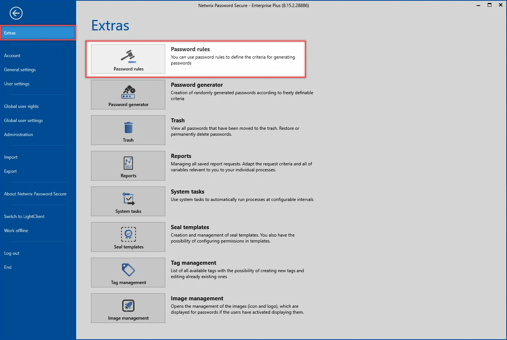
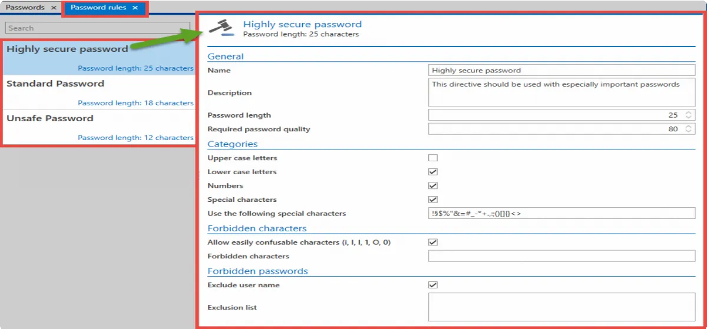

# Password rules

## What are password rules?

It is generally recommended that passwords should consist of at least 12 different characters, be
complex and be automatically created. Rules set guidelines that can be made binding for users –
meaning that the use of passwords with a certain level of complexity is enforced. Existing rules can
also be reused in other areas.

## Relevant right

The following option is required to manage password rules.

User right

- Can manage password rules

## Managing password rules

If “Password rules” is selected under Main menu/Extras, the available password rules will appear in
a separate tab in the currently active module.

In this screenshot, a total of 3 password rules are shown. As the rule “Very secure password” has
been selected in [List view](../../../operation_and_setup/listview/list_view.md), the
[Reading pane](../../../operation_and_setup/readingpane/reading_pane.md) on the right displays the
configuration for this rule:

- **General:** The Password length of 25 is the minimum number of characters that a password needs
  to contain according to this rule. The required Password quality is an internal measure of
  security, which is calculated for this rule. This value always lies between 1 (very unsecure) and
  100 (maximum security).
- **Categories:** A password can consist of a total of four categories. It is possible to define
  which of these categories to use and also how many of them to use.
- **Forbidden characters**: It is also possible to exclude some special characters. These characters
  need to be entered in the list without separators.
- **Forbidden passwords:** Some passwords and the user name can also be added to the list of
  forbidden passwords
- **Preview rules:** When new rules are created, an example password is generated that conforms to
  the configured rules. This is only the case for passwords with a minimum length of 3 characters!

## Using password rules

Once password rules have been defined, they can be productively used in two different ways:

- Use within the [Password generator](../password_generator/password_generator.md)
- Default for the password field in a form:

When a password field is defined in a form, one of the defined password rules can be set as the
default. This means that the default will always be used when a new password is created. In this
way, it is possible to ensure that the required level of complexity is maintained for certain
passwords.

If one of these password rules is defined for a form, it is only possible to define a new random
value for the password if a new password is created. The icon on the right hand side of the password
field is used for this purpose.

## Defining standard rules for user passwords

If Master Key mode is not being used, users can change their passwords in Netwrix Password Secure.
The administrator can define the password strength required for these passwords by using standard
password rules.

## Visibility

The password rules themselves are not subject to any permissions. All defined rules are therefore
available to all users. The rules are managed from the Main menu.

NOTE: Users can only manage the rules if they have the appropriate user right
