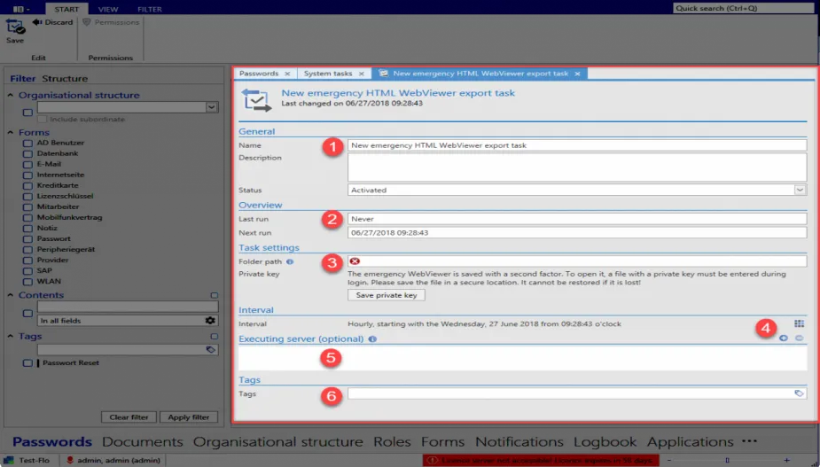
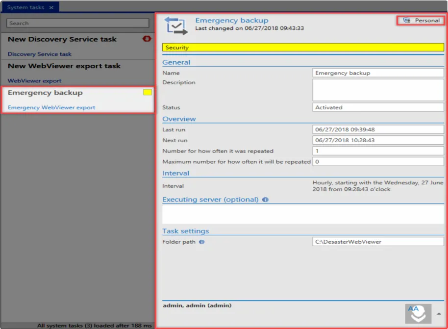
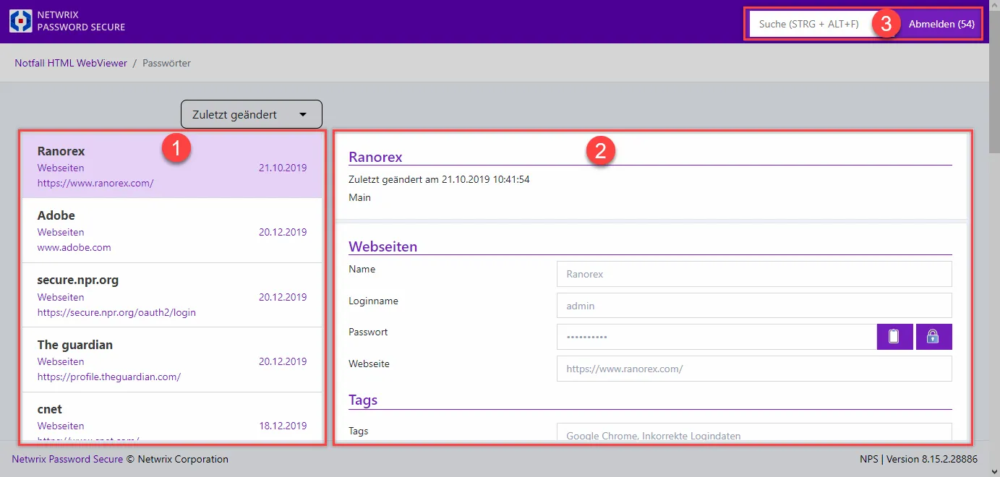

# EmergencyWebViewer

## What is an Emergency WebViewer export?

Safeguarding data is essential and this should be carried out using
[Backup management](../../../../../server_manager/main_menu/backup_settings/backup_management/backup_management.md).
However, a backup is not sufficient in some cases e.g. if a backup cannot be directly restored due
to a hardware problem. In these cases, **Netwrix Password Secure** offers the backup feature
**Emergency WebViewer Export**.

The **Emergency WebViewer Export** is based on an encrypted **HTML file** which can be decrypted
using a corresponding **key**. Both files are required to view the passwords in a browser and form
the core system of the backup mechanism.

## Creation of the file and key

The **Emergency WebViewer Export** is created in Netwrix Password Secure as a
**[System tasks](../system_tasks.md)** and this task can be used to guarantee a regular backup of
the records (passwords) by entering an interval. When setting up the system task, the user thus
defines the cycle at which the **Emergency WebViewer.html file** is created on the Server Manager.
The existing file is overwritten in each case by the latest version at the defined interval. The
associated key is only created once at the beginning and needs to be saved. The current version of
the **HTML file** can only be decrypted using this **key**.

**CAUTION:** The key (PrivateKey.prvkey) and the file (Emergency WebViewer.html) must be saved onto
a secure medium (USB stick, HDD, CD/DVD, …) and kept in a secure location!

## Data security

• Naturally, the HTML WebViewer file is encrypted

• The export of the file is protected using a corresponding
[User rights](../../../user_rights/user_rights.md)

• The file can only be encrypted using the **PrivateKey.prvkey** file

**CAUTION:** The export right for the passwords is not required for the Emergency WebViewer Export!

## Required rights

The user requires the following right to create a **Emergency WebViewer Export system task:**

## Emergency WebViewer.html and PrivateKey.prvkey

The **Emergency WebViewer Export** creates two associated files.

1. The file **Emergency WebViewer.html** is created on the computer executing the task
2. The associated key **PrivateKey.prvkey** is created on the client.

## Calling up the Emergency WebViewer Export

The Emergency WebViewer Export is set up as a **system task**. It can be called up in the main menu
under **Extras -> System Tasks**.

## Creating a Emergency WebViewer Export file

Clicking on New opens a new window and the **Emergency WebViewer Export** can be selected. The
**configuration page** is then displayed.

It is not possible to use the **Emergency WebViewer Export** with an **Active Directory user.**

## Configuration page for the Emergency WebViewer Export task

A new tab is displayed: **New emergency HTML WebViewer export task** This now needs to be configured
in accordance with the requirements.

1. **General**
    Name: Enter a unique name Description: Enter additional information  
    Status: Execution: \*Activated\*/Deactivated
2. **Overview**
    Last run: Information display Next run: Information display
3. **Task settings**
    Folder path: Enter from the perspective of the server  
    Private key: needs to be saved
4. **Interval**
    Setting for when the system task is executed
5. **Executing server (optional)**
    Address (IP) of the additional server
6. **Tags**
    Freely definable characteristics of records

**CAUTION:** The private key for the Emergency WebViewer must be saved before the system task can be
saved!

## Displaying the Emergency WebViewer Export tasks

Once the configuration has been completed, the **system task** is displayed in the current module in
the

**System Tasks** tab. The user has the option of checking the data here

## Using the Emergency WebViewer.html file

After the **system task** has been successfully executed, **two files** will have been created for
the password backup.

1. Emergency WebViewer.html
2. PrivateKey.prvkey

**CAUTION:** The file Emergency WebViewer.html is saved on the server executing the task. The

**CAUTION:** key PrivateKey.prvkey needs to be securely saved by the user!\*

The **Emergency WebViewer Export** is used in the same way as the **WebViewer export**. The
**passwords** are displayed in a current browser. The passwords are accessed in the **Emergency
WebViewer Export** with the **user password** and the **key** saved for the user. The search
function is used to select the **key (PrivateKey.prvkey)** and also to check its **validity**. If
all data has been correctly entered, it is then possible to log in.

NOTE: The current user needs to log in using their password. If an incorrect password is entered,
access is temporarily blocked.

Login data

- Database: Predefined
- User: Predefined
- Password: User password (must be entered by the user)
- Key: PrivateKey.prvkey

## Overview

After successfully logging in, the **overview page** for the **Emergency WebViewer Export** is
displayed. This contains information about the saved **passwords** just like with the WebViewer
export. The passwords are now available to the user.

Overview: Emergency HTML WebViewer / passwords

The following data is displayed in the overview:

Overview data:

1. Display of the currently available records
2. Detailed information on the selected record
3. Search, logout, timeout until logout
4. Copy password to clipboard
5. Reveal password

## Security note

The existing **passwords** are now available to the user for further processing. The HTML page is
closed by clicking on **Logout**.

If the user is **inactive** for **60 seconds**, he is automatically **logged out** and the **login**
is displayed with additional information.

NOTE: You have been logged out due to inactivity

The user can log in again using the **password** and **key** as described above. After successfully
logging in, the **Emergency WebViewer Export overview** is displayed again.
