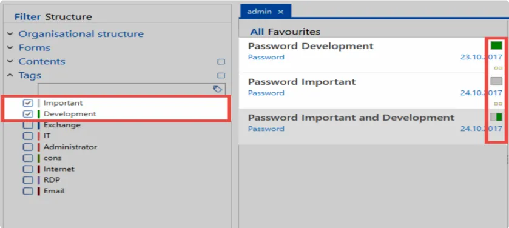
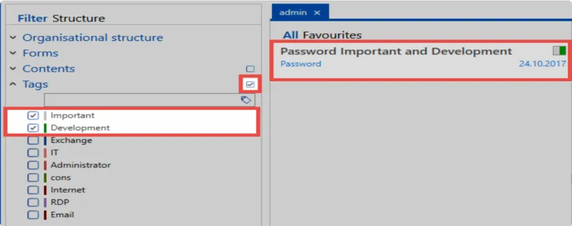
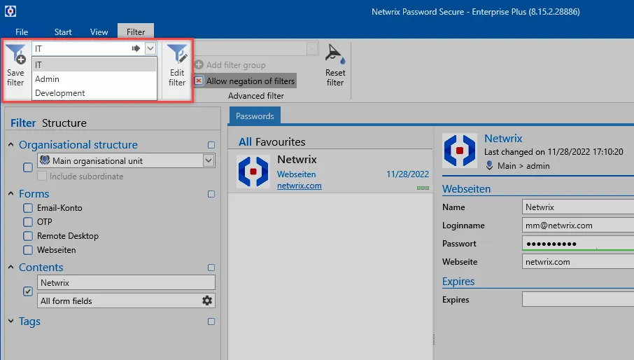
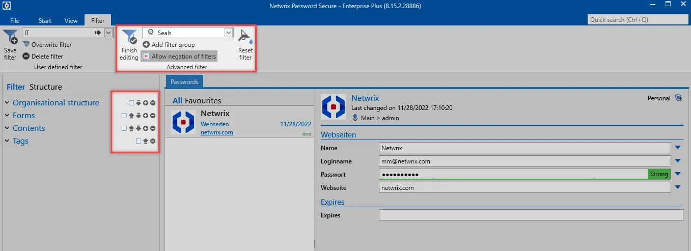
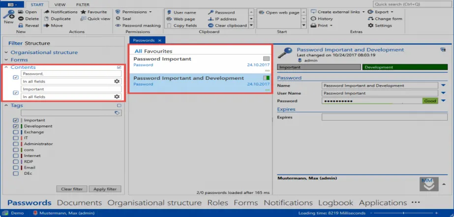

# Advanced filter settings

## Linking filters

The two options for linking the filter criteria are very easy to explain using the example of
[Tags](../../tags/tags.md). The following options are available:

1. Logical “Or operator”

By default, the filter is active in this mode. In the following example, the user wants to find all
records with at least one of the tags ”**Important**” or ”**Development**”. This also means that
records can either have one of the tags, or both.

Due to the colour coding of the tags in the records, it can be seen that the first two records have
one of the tags, while the third one has both tags. However, all three are included in the results.
**At least one filter criterion must be met.**

**2. Logical “And operator”**

This mode is activated directly by the checkbox in the filter. Each filter criterion has its own
checkbox.

**In contrast to the “OR link”, the “AND link” must fulfil both criteria**. Accordingly, only those
records that have both the tag **”Important”** and the tag ”Development” are listed in the results
for this example.

## Filter tab in the ribbon

The filter management can also be found in the [Ribbon](../../ribbon/ribbon.md). Here, it is
possible e.g. to expand the currently configured filter criteria, save the filter, or simply clear
all currently applied filters.

#### Saving, editing, and deleting filters

In many cases, it is recommended to store defined filters. In this way, it is possible to make
efficient use of filter results from previous searches. The button **“Save filter”** directly
prompts you to assign a meaningful name to this filter. The filter is saved according to the
criteria currently configured in the filter. This filter is now listed in the selection menu and can
now be selected. Note that a selected filter selection is immediately applied to the filter but is
not automatically executed. The filter must be used for this purpose. Both the button in the ribbon,
so also the counterpart in the filter, lead to the same result here.

Deleting and overwriting existing filters is identical in the procedure. The filter, which has been
marked in the selection field, is always deleted. If an existing filter is to be overwritten, the
name of the filter is retained and is overwritten with the filter criteria currently configured in
the filter.

—————————

#### **Advanced filter**

In the “Extended filter” category you can adjust the filter as desired, eg by adding or removing
filter groups. Clicking on **”Edit filter”** activates the processing mode. You can terminate it
with **”Finish editing”.**

New filter groups can now be added via the selection field. For this purpose, the desired filter
type is selected (in the example, the filter group is the seal). The process is completed by
**”adding a filter group”.** Newly added filter groups are always placed at the very bottom of the
filter.

In **Edit mode**, the filter view changes, in addition to the possible actions in the ribbon. Use
the arrow buttons to adjust the order of the filter groups. The icons “Plus” and “Minus” can be used
to create additional instances of existing filter groups or to remove existing ones. In the
following example, a content filter was added and all other filter groups removed.

In this example, only the content filter is used – in two instances! \* The “And” link will now
display all records that contain both the word “password” and the phrase “important”. \*

#### Negation of filters

It is often important to be able to negate the filter.

Activation

In the “Extended filter” category you have the possibility to activate the negation:

It is thus possible to refine very precisely filter results even further. This becomes more and more
important when there are a large number of records in the database and the resulting amount of data
is still unmanageable despite the fact that filters has been appropriately defined.

Negations are defined directly in the checkbox of an element within a filter group. Without
negations, you can only search e.g. for a tag. Negations make the following queries possible:

”Deliver all records that have the tag “Development” but are not tagged with “Important”!

**CAUTION:** In order to effectively use negations, it is important that “and links” are always
enabled. Otherwise operations with negations cannot be modelled mathematically.
