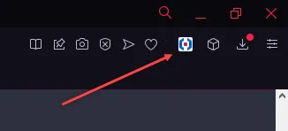
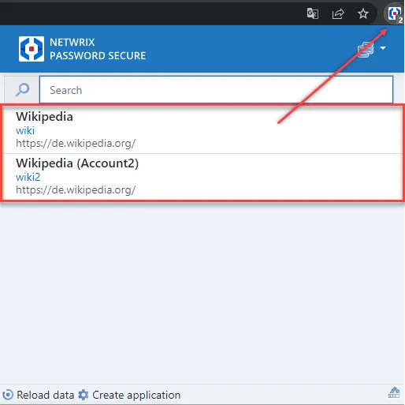
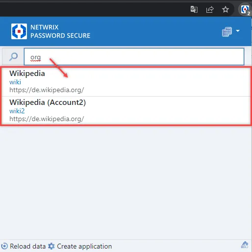
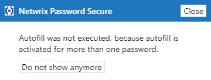

# Browser Add-ons

Passwords can also be used in the browser using the browser add-on. You can search for passwords in
the add-on, transfer them to the clipboard or enter them in the input mask of the website
automatically. The automatic login may require applications.

In order to provide the data, the add-on needs a connection to the database. This can be set up
directly in server mode.

Currently, add-ons are available for the following browsers:

- Microsoft Edge
- Google Chrome
- Mozilla Firefox
- Safari

## Installation

Please find more information about the installation on: Installation Browser Add-ons

## Connection via server mode

If the installation of the browser extension has been carried out, the user can now open the desired
browser. A window appears in which the security of the connection is confirmed. Pairing is performed
with a simple click. A new icon will also be displayed in the desired browser from this point
onwards:

If the icon is displayed as shown, it means that although the add-on has been installed.

## Database profiles

The server mode must know which database profile it is connected to. There are two ways of setting
up a database profile:

First, the database profile can be created manually. Therefore, he following information is
required: IP address, Web Application URL and database name. Please note that /api is appended to
the end of the IP address.

It is also possible that the database profile is filled out automatically. For this, you need to log
on to a database via Web Application. By clicking on the add-on in the Web Application, its profile
can be taken over. Now all necessary information such as profile name, IP address, Web Application
and database name are transferred.

## The server mode benefits

The server mode offers the following advantages:

- No terminal service is required in terminal server operation

**CAUTION:** Please note that SSO applications only work via Autofill Add-on. If you are in server
mode and the Autofill Add-on has not been started, SSO applications do not work!

After successful connection, the number of data records available for the current Internet page is
displayed on the icon.

## Settings

All settings that relate to the add-on are made centrally on the client. The user settings system
can be used to enter them globally per organisational unit or per user. The following options have a
direct impact on the add-ons and can be found in the SSO category:

- Browser add-ons: Automatically send login masks ensures that the login is automatically completed
  after the access data has been entered. It is thus not necessary to click the relevant button
  manually
- About browser add-ons: Automatically fill login masks ensures that access data is entered without
  the need for any confirmation when a website is recognised.

The default browser option also has an impact on the add-ons. This setting defines the browser in
which the websites are opened from the client.

NOTE: It is important to note that the login mask for records with password masking will be ”sent
automatically\*, even if the setting Browser add-ons: Automatically send login masks has been
deactivated.

## Working with add-ons

NOTE: A record can only be used for entering data if it has a form field of type "URL".

The subscript number mentioned in the previous section is only available with active logins and
therefore already says a lot about the “Number of possible entries”. For example, if the number “2”
is shown, you can directly select the account you want to log in with.

Previously, the prerequisite was that you had to navigate manually to the precise website via the
browser that you actually wanted to use. This navigation can now also be handled by Netwrix Password
Secure – as described in the following section.

## Search and navigation

It is currently assumed that the user has to navigate manually to the website on which they want to
automatically enter login data. This way of working is possible but is not convenient enough. The
add-on can be used in a similar way to bookmarks. The search field can be used to search for the
record in the database. The prerequisite is again that the record contains a URL.

The screenshot shows that the URL and the name of the record (Wikipedia) are searched. The results
for the search are displayed and can be selected using the arrow buttons or the mouse. The selected
website will be opened in a separate tab.

## Several passwords for one website

If a user opens a page and multiple passwords with the autofill function are possible for this
website, no entries will be made unlike in older versions. Instead, the following message appears in
a pop-up:

However, if the autofill function is only activated for one password but multiple passwords are
possible, the password with the autofill function is entered. If the user clicks on a record in the
pop-up, this record is entered as normal (as was the case previously).
