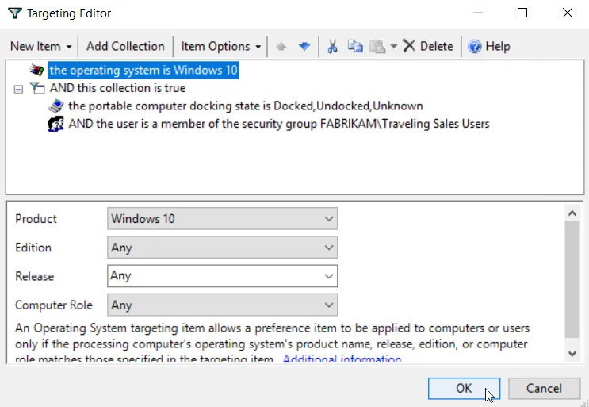

# Using Item-Level Targeting with Collections and Policies

Item-Level Targeting is used in Microsoft Group Policy Preferences and other areas of Endpoint
Policy Managerchange the scope of individual preference items , so they apply only to selected users
or computers. In this example, we want the collection named **Control Panel Settings for East Sales
Users** to apply only to the East Sales Users. To do this, right-click the collection and then
select **Change Item Level Targeting**, as seen below.

The **Edit Item Level Targeting** menu item brings up the **Targeting Editor**. You can select any
combination of characteristics you want to test for. The interface is similar to that used in Group
Policy Preferences' Item-Level Targeting.

You can apply one or more targeting items to a policy, which enables targeting items to be joined
logically. You can also add targeting collections, which group together targeting items in much the
same way parentheses are used in an equation. In this way, you can create a complex determination
about where a policy will be applied. Collections may be set to **And**,**Or**, **Is**, or **Is
Not**. In this example, the Pak would only apply to Windows 10 machines when the machine is portable
and the user is in the FABRIKAM\Traveling Sales Users group.

Below are some real-world examples of how you can use Item-Level Targeting.

- Software prerequisites — If you want to configure an application's settings, first make sure the
  application is installed on the user's computer before configuring it. You can use File Match or
  Registry Match targeting items (or both) to verify a specific version of a file or a registry
  entry is present. For an example of this, look in the Uninstall registry key.
- Mobile computers — If you want to deploy settings exclusively for users on mobile PCs, then filter
  the rule to apply only to mobile PCs by using the **Portable Computer** targeting item
- Operating system version — You can specify different settings for applications based on the
  operating system version. To do this, create one rule for each operating system. Then, filter each
  rule using the **Operating System** targeting item.
- Group membership — You can link the Group Policy Object (GPO) to the whole domain or
  organizational unit (OU), but only members within a specific group can pick up and process the
  rule settings
- IP range — You can specify different settings for various IP ranges, like different settings for
  the home office and each field office

After you are done editing, close the editor. In the GP Management editor, you see that the
collection's icon has changed to orange, which shows that it now has Item-Level Targeting on the
whole collection. In other words, none of the items in the collection will apply unless the
Item-Level Targeting on the collection evaluates to **True**.

You can also see that Item-Level Targeting is set on the collection when you click a higher node,
where you'll see the name of the collection and a column designating if Item-Level Targeting is on
(**Yes**) or off (**No**).

You may also right-click any policy directive and select **Edit Item Level Targeting**.

This enables you to be even more granular with the settings. For instance, you can specify whether
or not you want Item-Level Targeting applied to the following settings:

- Only apply **Control Panel Settings for East Sales Users** to the East Sales User Group
- Only apply the **Prevent Changing theme** policy setting (within the collection) to users on
  laptops

If you put Item-Level Targeting on a specific policy setting, you can see the icon's color change to
orange, and the field **Item Level Targeting** will change to **Yes**.

**NOTE:** Click the **Item-Level Targeting** button within any policy setting to open that policy's
Item-Level Targeting editor.
