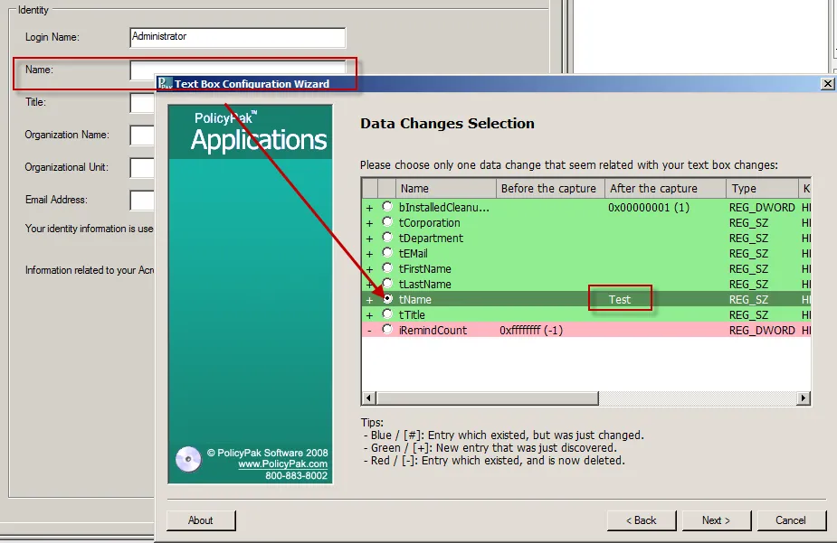
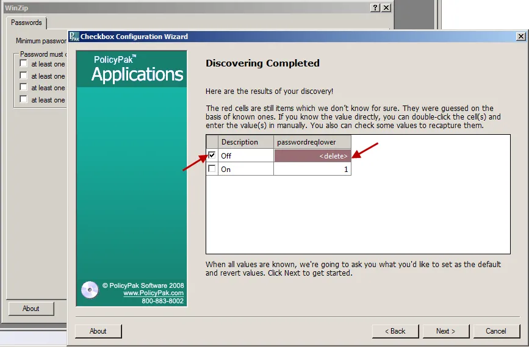
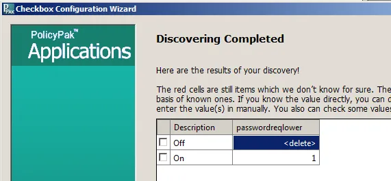
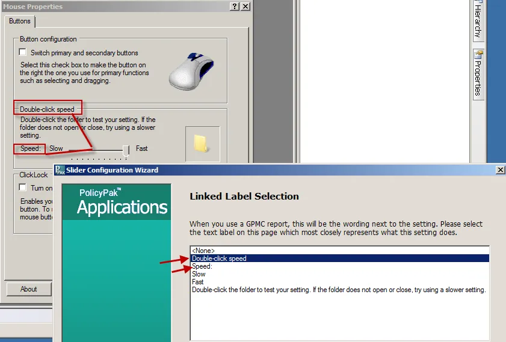

# Additional Configuration Wizard Information

The Configuration Wizard is mostly self-explanatory; however, there are two items which require a
little bit of explanation. In the next sections, we'll talk about what happens when the
Configuration Wizard detects multiple values and what is meant by a labeled link.

## Multiple Detected Changes

_Remember,_ the Configuration Wizard may find values that are new, changed, or deleted during any
given capture. In the example in Figure 121, the "Name" text box field was configured by the wizard.
A value of "Test" was entered into the application.

Figure 121. A change to the Name textbox field.

Here, the wizard detected multiple changes. The key to the changes is as follows:

- Data that is newly discovered is shown in green (or a "+" in the first column).
- Data that existed but was discovered to be changed is shown in blue (or a "#" in the first
  column).
- Data that existed but was discovered to be deleted is shown in red (or a "–" in the first column).

Some elements allow you to make multiple selections (seen in the previous example) and other
elements force you to decide which change was the most likely candidate.

**NOTE:** Sometimes when an application is first run and anything is changed, it writes a lot of
initial data. To counteract this effect, open your application, check a checkbox, and click "OK" to
set it. All that initial data will be set. Then revert the checkbox and click "OK." Next, start to
use the Configuration Wizard to learn about your settings.

The Configuration Wizard might also occasionally ask you to re-try an item. This can happen often
when an application starts out with no settings, then creates a setting, instead of changing one. In
Figure 122, we can see that checking on the setting was changing "passwordreqlower" to 1.

Figure 122. Re-trying a specific item with the Configuration Wizard.

The Configuration Wizard will check the settings that are unknown and guess what the value should
be, placing it into the appropriate checkbox. You have two choices here:

- Manually enter in the values in the cells that are highlighted in red. This is not usually
  recommended, but is available for advanced AppSet creators who are sure of their application's
  values.
- Continue onward with the Configuration Wizard and it will ask you to re-try a specific state (in
  this case, unchecking a checkbox) to see how the application behaves. Once the value is definitely
  known, the red color is removed from the value. No checkmarks are present to re-discover any
  specific values. An example is shown in Figure 123.

Figure 123. Neither checkbox is selected after re-trying a specific state.

## Linked Label Selection

Some items in the Configuration Wizard will ask you about linked label selection (also known as
label links). During the Configuration Wizard process, some elements, like text boxes, spinboxes,
sliders, and other elements need know what they are setting. In Figure 124, you can see an example
of setting a text box label link. The word that is most similar to the name of the element itself is
its label. It might look like just some text on the form, but inside Endpoint Policy Manager
DesignStudio, it has a type called "Label." In short, when asked to select the linked label, it's
best to pick the word or phrase that makes the most sense for what you are currently configuring. In
this first example, since we're configuring the text box called "Name," it seems logical to select
the word "Name" on the Linked Label Selection page.

Figure 124. Selecting the linked label for an element.

In the second example in Figure 125, we're configuring a slider and need to choose the linked label.
In this case, it could be argued that either "Speed:" or "Double-click speed" would make good linked
label selections, because either one describes what the slider does. "Double-click speed" is likely
a slightly better choice here for clarity.

Figure 125. Choosing a linked label.
