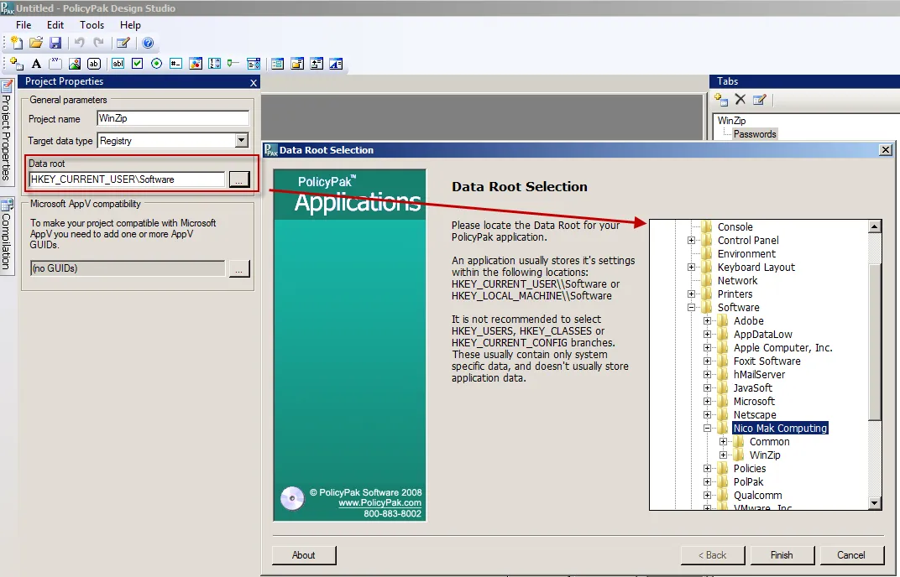
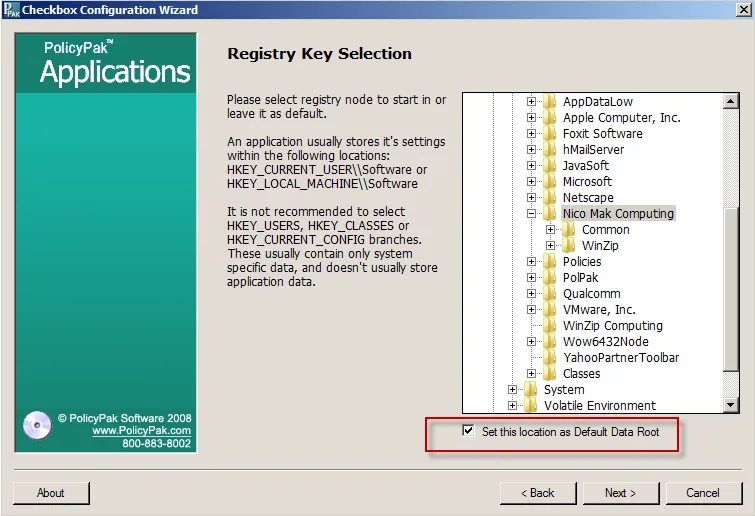

# Default Data Roots

The Configuration Wizard can only see your application's changes when both of the following are
true:

- You have told the Configuration Wizard where your application's data resides.
- Your application successfully writes data with a change to the system.

To be specific, the Configuration Wizard doesn't look for all changed files and all changed registry
entries. It's only looking where you tell it to look. At the start of every project, you are asked
where the application's data is stored, and you set that as your default data root. We set up the
data root in the previous section, "Setting Up Application Configuration Data." Recall that your
data root can be a registry key (as shown in Figure 108) or a specific file, like an INI or XML file
(Figure 109).

Figure 108. Data root selection with registry key.

Figure 109. Data root selection with an INI file.

This can be done at the start of any new project or later on in a project by selecting the Project
Properties tab and changing the data root, as shown in Figure 110.

Figure 110. Changing the data root.

There is also another way to change the data root, which is inside the Configuration Wizard itself.
While configuring items, if you realize that you need to make a change, it's easy to set a location
for the data root, as shown in Figure 111.

Figure 111. Changing the location of the data root.

**NOTE:** This adjusts all existing elements such that their paths are now relative to this new
location.

The ideal situation is to get as close to where most of the changes are in your application. For
registry-based applications, this is usually the key which represents the vendor or the application.
For file-based applications, this is usually root of the file itself.

**NOTE:** While using the Configuration Wizard, it's possible to specify a section of the file,
instead of the whole file to look for specific changes. This is only necessary in very large data
files. In most cases, simply select the top most entry within a file and the Configuration Wizard
will look for all changes that happen within that file.
