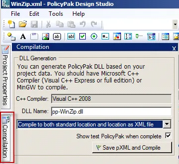

# Compilation

The Compilation tab enables you to set your project's DLL name, as shown in Figure 55. It also enables you to save your current work and compile your AppSet to be used in Group Policy, as shown in Figure 56.



Figure 55. Setting the DLL name.


Figure 56. Compiling the AppSet.

In Figure 55, you can see that you can do the following:

- Compile to standard location (default): This will compile to what is set in ```Tools | Options```. Usually, this is the Endpoint Policy Manager local store or

  ```c:\program files (x86)\PolicyPak\Extensions```.
- Compile to same location as XML file: This will not copy to the local store, and instead will only compile directly where the existing AppSet is located.
- Compile to both standard location and location as XML file: This will compile and save in the local store and also make a copy where the AppSet XML file is located (overwriting any previous DLL).

You can also see a test preview of your AppSet after compiling. This can be useful if you want to tweak, test, and re-tweak your application without having to launch the Group Policy editor.
