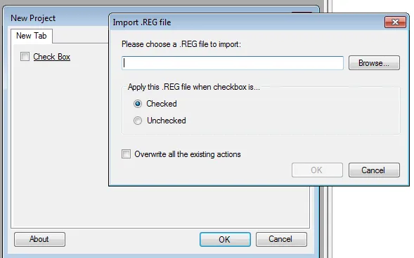

# Using the .reg Importer Utility

**NOTE:** For an overview of this section, see this video:
[Use the DesignStudio to import existing registry keys](../../video/applicationsettings/designstudio/importregistry.md).

There might be times when you already have a` .reg` file (registry export) and want to use it within
Netwrix Endpoint Policy Manager (formerly PolicyPak) Application Settings Manager. By using Endpoint
Policy Manager Application Settings Manager instead of creating an ADM or` ADMX` file, you get all
the benefits of the Endpoint Policy Manager Application Settings Manager engine, like delivering
anywhere and being able to revert when the setting no longer applies.

The `.reg` importer utility is only available to use with checkboxes. When you select any checkbox,
a special icon will appear, as shown in Figure 162.

Figure 162. The .reg importer utility.

Using the utility, you can import existing .reg files and specify which state (checked or unchecked)
matches which .reg file (see Figure 163).

Figure 163. The .reg importer utility interface.

For a full end-to-end example on this mini-utility, please watch the video here:
[Use the DesignStudio to import existing registry keys](../../video/applicationsettings/designstudio/importregistry.md).
