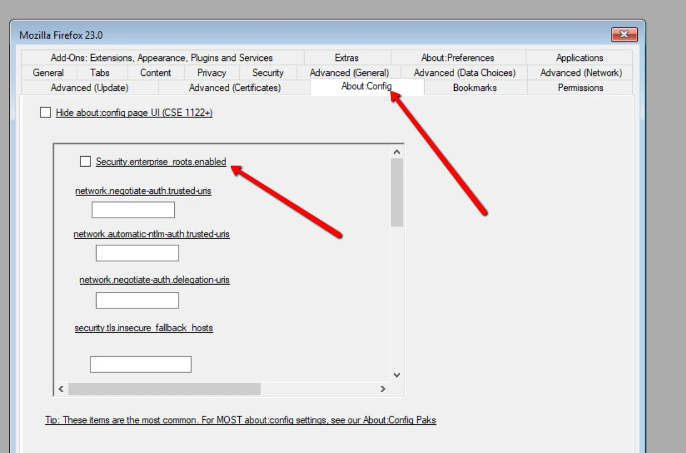

# Can I use Security.enterprise_roots.enabled as an alternate method for FF + Certificates?

Yes. You can use Netwrix Endpoint Policy Manager (formerly PolicyPak) to deliver Security.enterprise_roots.enabled. But there are some downsides…

1. First, you are beholden to Windows' certificates which might be okay, but also could be a challenge in REVOKING those certificates. This is why Firefox HAS a separate store in the first place. The stores are unrelated. When you use Security.enterprise_roots.enabled you are marrying FF to use Windows' store.
2. When you use Security.enterprise_roots.enabled you cannot see the certificate inside Firefox. So this could make it hard to KNOW you got the cert there if you are sitting at the user's computer.

That being said, there are two ways to enable

```
Security.enterprise_roots.enabled
```

## Way #1:

 Inside the main Firefox Pak itself



## Way #2:

Using the Firefox About:Config Pak J thru Z.  
It is the last entry in the S: category

.webp)

Note that if you're looking for general advice in how to get started with Windows certificates and browsers support, you can [find that here](https://www.techrepublic.com/article/how-to-add-a-trusted-certificate-authority-certificate-to-chrome-and-firefox/).
