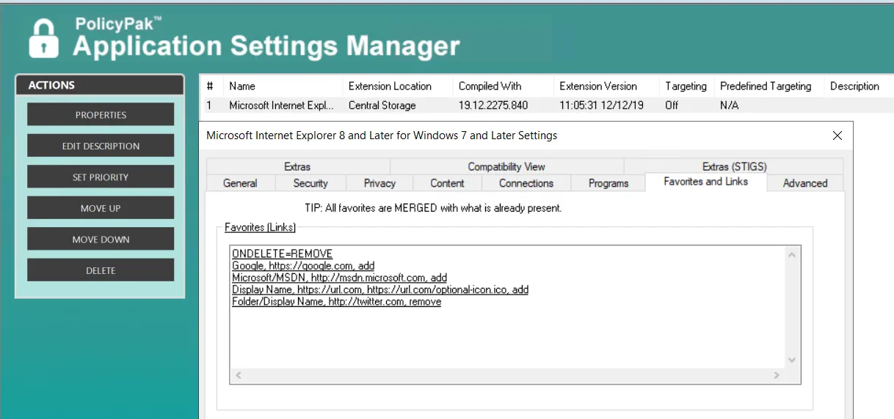
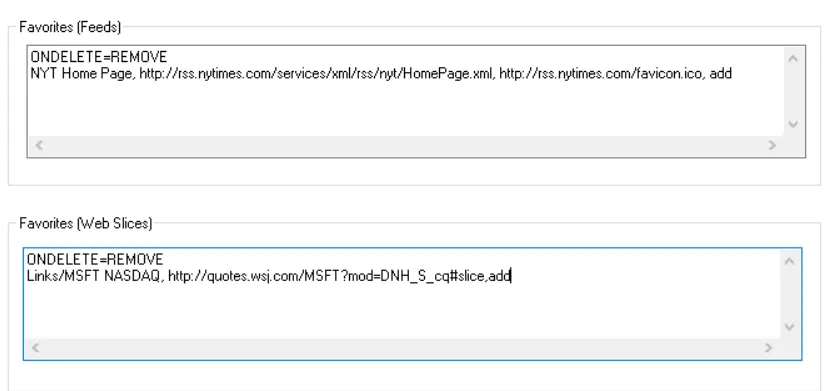

# Favorites and Links

Video: For a quick overview of how to manage Favorites in IE using Endpoint Policy Manager
Application Settings Manager, see the following video:
[http://www.policypak.com/video/policypak-managing-favorites-in-ie.html](http://www.policypak.com/video/policypak-managing-favorites-in-ie.html).

There are three sections within the Endpoint Policy Manager Favorites and Links tab:

- Favorites (Links)
- Favorites (Feeds)
- Favorites (Web Slices)

Each section honors a special parameter called `ONDELETE=REMOVE`. If set, it will automatically
remove the entries delivered by Endpoint Policy Manager Application Settings Manager when the AppSet
entry no longer applies, but it will leave the entries the user has put in place.

## Favorites: Links

Internet Explorer can save favorites for users as shown in Figure 22.

Figure 22. IE Favorites.

The Favorites (Links) section within the AppSet enables you to do the following:

- Deliver a favorite (shortcut)
- Create a folder (then put a shortcut in that folder)
- Remove a shortcut from a folder
- Add items to the Favorites bar

All favorites are merged with what the user already has. To use this section, specify a favorite in
the following formats (see Figure 23).

- To add the page [www.webpage.com](http://www.webpage.com) to the root of the favorites folder:

Displayname, http://www.webpage.com, add

- To add the page [www.webpage.com](http://www.webpage.com) to a new folder (or existing folder)
  named Folder1:

`Displayname, Folder1/http://www.webpage.com, add`

- To remove [www.webpage.com](http://www.webpage.com) from Folder 1 (note that each part must match
  in order to remove it):

`Displayname, Folder1/http://www.webpage.com, remove`

Figure 23. Configuring IE Favorites.

## Favorites: Feeds and Web Slices

You can manage and deliver IE Feeds. A screenshot of the Feeds tab from IE is shown in Figure 24.

Figure 24. IE Feeds.

Using the IE AppSet, you can add or remove a feed using the format shown in Figure 25. To do this,
specify a friendlyname, the URL of the XML feed, and an optional icon file. Then specify to add or
remove.

Figure 25. Configuring IE Feeds with Endpoint Policy Manager.

To add items to the Favorites bar, use the following format to add lines to the Favorites (Web
Slices) section, as seen in Figure 26. The results are shown on the right side of the figure.

`ONDELETE=REMOVE`

`Links/MSFT NASDAQ, http://quotes.wsj.com/MSFT ?mod=DNH_S_cq#slice,add`

Figure 26. Adding items to the Favorites bar.
