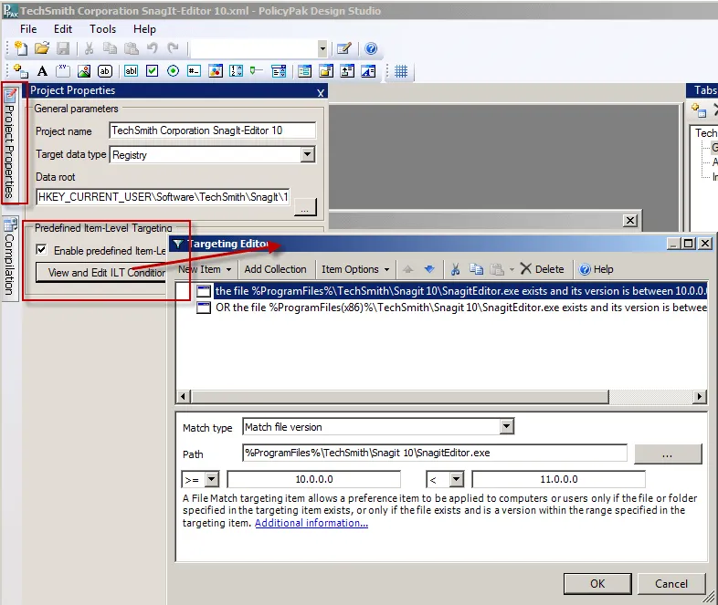

# Other: What is "Internal (pre-Defined)" Item Level Targeting?

Many (not all) of our Paks have Internal [Item Level Targeting](https://www.policypak.com/pp-blog/item-level-targeting) (aka pre-defined filters.)

The goal is to only apply settings from a Pak WHEN the actual application is really on the machine.

You can see if a Pak HAS pre-defined filters in several ways.

Way 1: Check the readme file for the Pak. We do a pretty good job documenting if a Pak has Internal Filters.

For instance, in the Techsmith Snag it 11 Pak's Readme file, you'll see a note which says:

Internal Item Level Targeting set as follows:

When %ProgramFiles%TechSmithSnagit 11SnagitEditor.exe FILE VERSION is between 11.0.0.0 and 99.0.0.0 OR the file %ProgramFiles(x86)%TechSmithSnagit 11SnagitEditor.exe FILE VERSION is between 11.0.0.0 and 99.0.0.0. (Tip: If you want to understand WHY some Internal Filters are set to 99, see another FAQ in this section.)

Way 2: Use the DesignStudio to open up a Pak and look. You can see an example of where Internal Item Level Targeting is within the DesignStudio in this example:

Way 3: When you use MMC 603 or later, and make a Pak entry into a GPO, you'll see the column labeled "Predefined Targeting." If it says On or Off, then the Pak itself has Pre-defined Targeting. If the Column shows N/A, the Pak doesn't. You can see two entries without Internal ILT, and one entry that does in this example:

