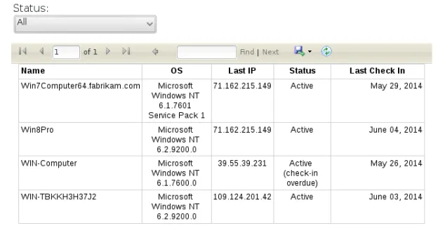
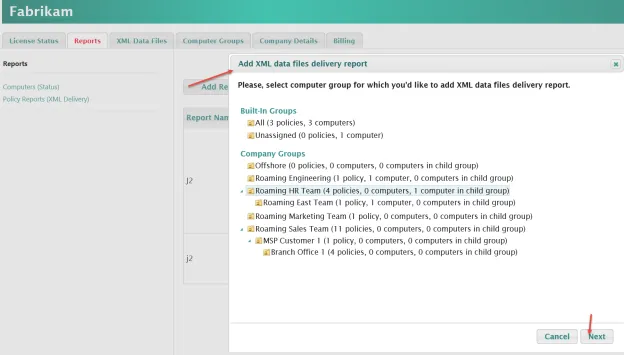
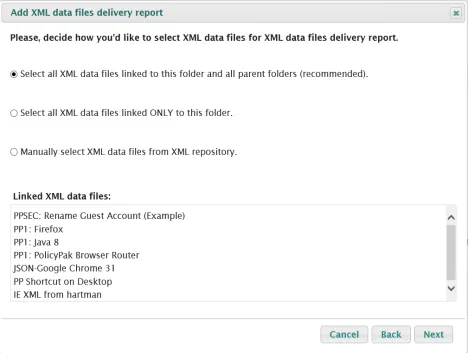
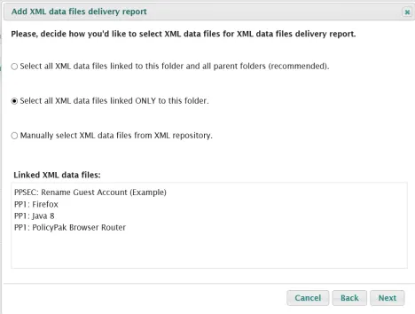
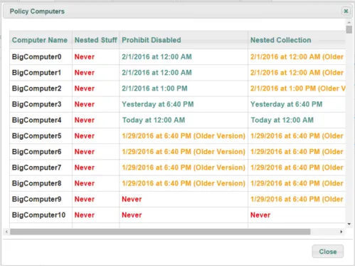

# Reports

There are two reports under the __Reports__ tab: __Computers (Status)__ and __Policy Reports (XML Delivery)__. These reports are discussed in the following sections.

## Computers (Status) Report

The __Computers (Status) Report__ has several sub-reports, where you can focus in on computers with a specific status, as shown below. This report shows a table of results with data on computers currently connected to Endpoint Policy Manager Cloud. The following data is available: computer name, installed OS, IP address, and computer status for Cloud.

The status selector on the upper left of the table allows you to filter the results.

Currently you can sort by thefollowin g criteria: __Acquired__ (active), __Waiting List__, __Revoked__, and __Revoked by Endpoint Policy Manager Software__. The table can be exported and saved in MS Excel or Word format by clicking the __Save__ button and selecting Excel or Word.

## Policy Reports (XML Delivery) Report

Video: For an overview of this section, check out this video: [Endpoint Policy Manager Cloud Reporting Demo](../../video/cloud/reports.md)

Policy Reports (XML Delivery) Report is a very powerful feature. This report enables you to know which computers received which XML files. To see this report, select __Add Report__, then pick a computer group.

Next, select the scope you would like to examine. The recommended selection is __Select all XML data files linked to this folder and all parent folders (recommended)__.

You could also select the option __Select all XML data files linked ONLY to this folder__, which could select fewer XML data files.

You can also select __Manually select XML data files from XML repository__ and specify specific XML files to test for.

Once you have created your report, it is saved for future use but not yet run. When you run your report, it will have the following organization:

- All the computers in the group are shown in the first column.
- All the XML files are in all other columns.

The intersection between computer and XML file demonstrates the date and time the computer got the most recent XML file (in green), the date and time the computer got an old version of the XML file (in yellow), and if the XML file was not received at all (in red).

This allows you to precisely knows which XML policy files were embraced by what machine and when.
