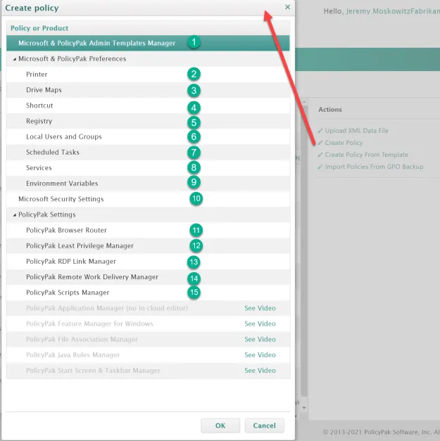
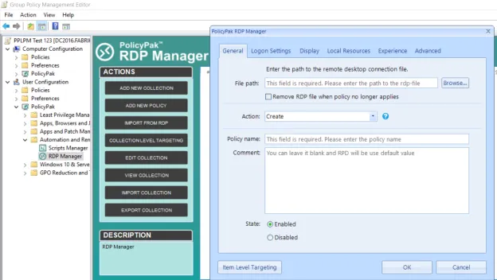
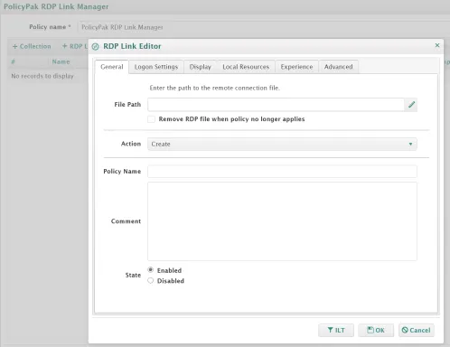
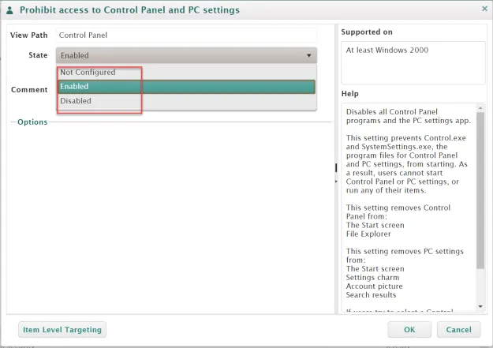

# Create Policy

You can use the Endpoint Policy Manager Cloud in-cloud editors to create many types of policies (XML
data files), with more types becoming available all the time.

**CAUTION:** You must be licensed for the policy type for it to take effect. If you are not licensed
for the policy type, the editor will enable you to create the policy but you will be unable to link
it to any groups.

For the items which do not have in-cloud editors, you must use the steps described in the
**[Upload XML Data File](upload.md)** section. In this case, you must create the policy on-prem
first, then export and upload it manually.

The goal is to make the in-cloud editors as user-friendly as possible and closely resembling the
on-prem editors. below you have the RDP Manager on-prem editor.

Below is an example of the in-cloud editor of the same policy type.

We cannot detail all the editors here, but we will explore one more important one, the Microsoft
Admin Templates editor. To use this editor, select it from the top-level list, then select **+
Policy**. You will see pre-installed ADMX templates for Chrome, Edge, Office (32-bit and 64-bit),
Endpoint Policy Manager, and Windows 10. Endpoint Policy Manager keeps these up to date for you.

Video: To see how to use in-cloud ADMX settings maintained by Endpoint Policy Manager, watch this
video:
[Endpoint Policy ManagerCloud: Use in-cloud ADMX settings maintained by Endpoint Policy Manager for Windows, Office, Chrome and more](../../../video/cloud/admxsettings.md).

However, you may also upload your own ADMX templates for your own applications. To learn how to do
that, see the "File Box" section later in this guide.

Using the Admin Templates editor is a lot like using the familiar on-prem Group Policy editor. Once
you find the setting you want, just select it.

Next, specify the state and any other available options.

Additionally, to learn how to use the in-cloud Microsoft Security Settings editors, we recommend
this video:
[Endpoint Policy Manager Cloud and Security Settings (More examples)](../../../video/cloud/securitysettings.md).

One sub-editor type for Microsoft Security Settings is the Restricted Groups Editor. You can learn
how to use this editor in this video:
[Endpoint Policy Manager Cloud: Restricted Groups Editor](../../../video/cloud/restricted_groups_editor.md).

To learn how to use the in-cloud Microsoft Group Policy Preferences editors, we recommend this
video:
[Endpoint Policy Manager Cloud + GPPrefs (More examples)](../../../video/cloud/preferences.md).
