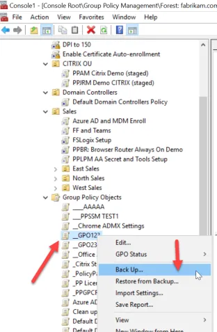
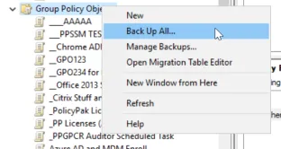
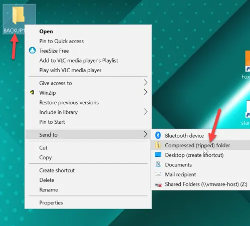
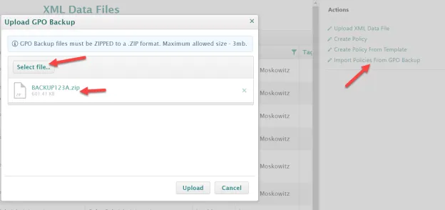
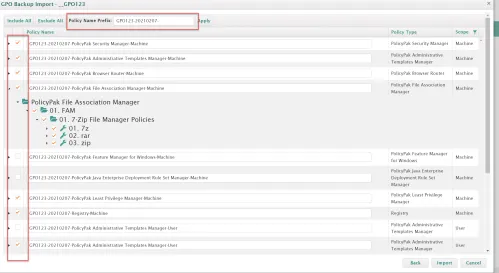
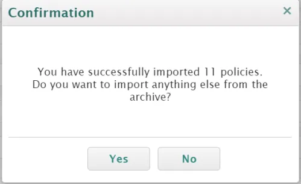
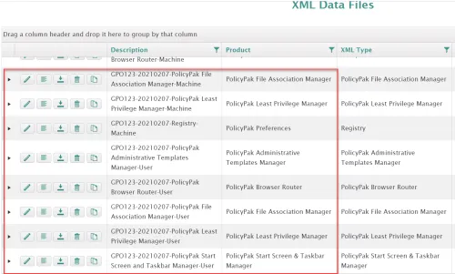

# Import Policies from GPO Backup

Video: For a video overview on this section, see:
[How to import GPOs to Endpoint Policy Manager Cloud](../../../video/cloud/import.md).

You might have the need to take existing on-prem Group Policy Objects (GPOs) and import their
contents into Endpoint Policy Manager Cloud. With the **Import Policies from GPO Backup** action,
this can be performed very quickly by following these steps:

**Step 1 –** Create a GPO backup. A GPO backup can be either a specific, single GPO backed up, or
multiple GPOs backed up at once Either way the maximum file size must be less than 3 MB.

**Step 2 –** Back up the GPOs as a compressed (zipped) file to a folder of your choice. .

**Step 3 –** To start the import process, select **Import Policies from GPO Backup**, then click
**Select file** and open the ZIP file. Finally, click **Upload** to continue.

**Step 4 –** When the upload process is completed, you get the number of GPOs and the number of
policies you can create from them.

**Step 5 –** You will see a list of each GPOs, which you can then expand to see a report about each
policy within the GPO and to see what each policy's type is.

**Step 6 –** You need to select the checkbox next to the GPOs you want to process (not shown) to
continue. When you do, you are presented with a list of all the policies you could import, and their
types. Then deselect the ones you wish to avoid importing. Every GPO is imported with a name prefix
based on the date, but this can be changed.

**Step 7 –** Next, click **Import** to continue. The number of items selected will be imported and
confirmed. If you want to cycle through the process with the same uploaded ZIP and import more
settings, you can click **Yes**. Otherwise, click **No**.

When the process is completed you can see each selected policy to import with its own name and
appearing in the XML Data Files section like any other policy you create.

