# How do I transition from Endpoint Policy Managerusing Group Policy or SCCM method to Endpoint Policy Manager Cloud

Transitioning from Endpoint Policy Manager using Group Policy or SCCM method to Endpoint Policy Manager Cloud is very straightforward.

_Remember,_ Once Endpoint Policy Manager settings are created, they are transferable to XML, which can be used with any method: Group Policy, Intune, SCCM, or Endpoint Policy Manager Cloud.

This topic assumes you will have policies in the Group Policy editor and want to transfer them to Endpoint Policy Manager Cloud. The actual current delivery method you are starting from doesn’t matter. You can start from Group Policy, SCCM, or an MDM service like Intune and transfer over to Endpoint Policy Manager Cloud.

Here is an overview of the steps involved in transitioning an existing investment in Endpoint Policy Manager with Group Policy or SCCM method over to Endpoint Policy Manager Cloud:

__Step 1 –__ Pre-testing that Endpoint Policy Manager Cloud is working at all with the built-in policies.

__Step 2 –__ Exporting existing Endpoint Policy Manager settings within Group Policy to XML and importing them into Endpoint Policy Manager Cloud.

__Step 3 –__ Optional: Backup and Restore entire GPO to Endpoint Policy Manager cloud.

__Step 4 –__ Use In-Cloud Editors to create and update rules.

__Step 5 –__ Using Endpoint Policy Manager Cloud to create company groups and/or use Endpoint Policy Manager Cloud to Azure connector.

__Step 6 –__ Linking Endpoint Policy Manager Cloud XML to Endpoint Policy Manager Cloud Company Groups or Azure Groups.

__Step 7 –__ Deploying the Endpoint Policy Manager Cloud Client and/or CSE to endpoints.

__Step 8 –__ Removing existing Group Policy, SCCM or Intune based Endpoint Policy Manager setting settings from machines

__Step 9 –__ Report using Endpoint Policy Manager Cloud to verify expected settings are achieved.

__Step 10 –__ Keeping Endpoint Policy Manager Cloud computers up to date with client software using Endpoint Policy Manager Cloud Groups.

## Pre-testing that Endpoint Policy Manager Cloud is working at all with the built-in policies.

Start by verifying that your Endpoint Policy Manager Cloud account is generally working. See the [Endpoint Policy Manager Cloud: QuickStart](../video/cloud/quickstart.md) topic for additional information.

You will be verifying that your Endpoint Policy Manager Cloud account is licensed, operational and working as expected.

## Exporting existing Endpoint Policy Manager settings within Group Policy to XML and importing them into Endpoint Policy Manager Cloud.

Continue to export your existing invested Endpoint Policy Manager settings into XML format.

You can export one setting at a time like this:

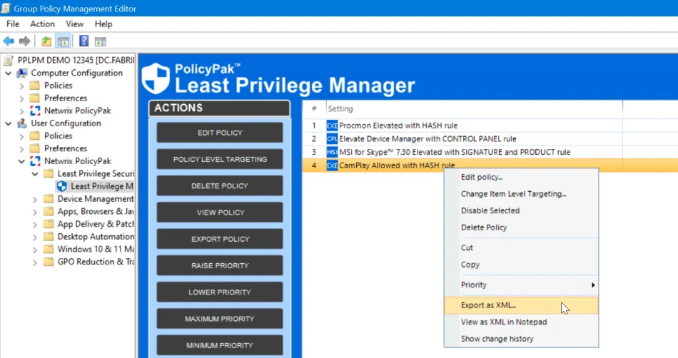

You can export a Collection like this:

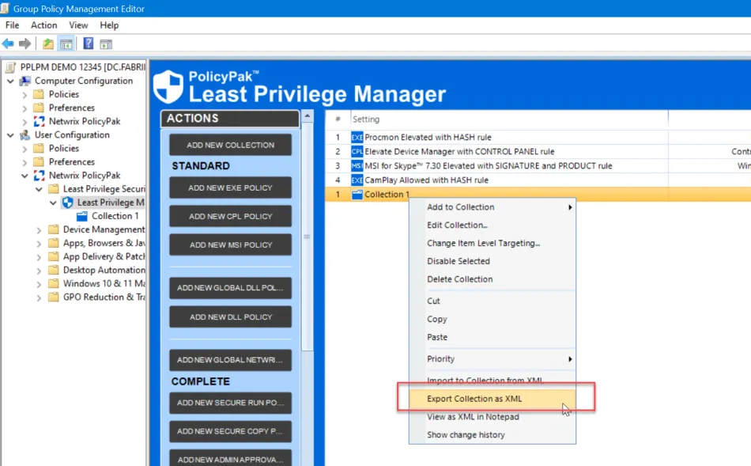

Or you can export a whole category like this:

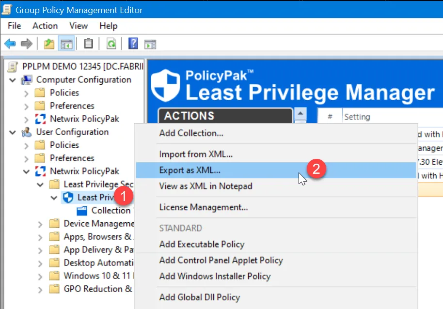

You can also export settings en-mass across multiple GPOs using the Endpoint Policy Manager Exporter Utility. The steps to do that are here [Deploying Endpoint Policy Managerdirectives without Group Policy (Endpoint Policy Manager Exporter Utility)](../video/methods/exporterutility.md)

Then you can upload them straight into Endpoint Policy Manager cloud using the Upload and link a new XML here. Or you can go to the XML Settings tab (not shown) and also upload them there for later use.

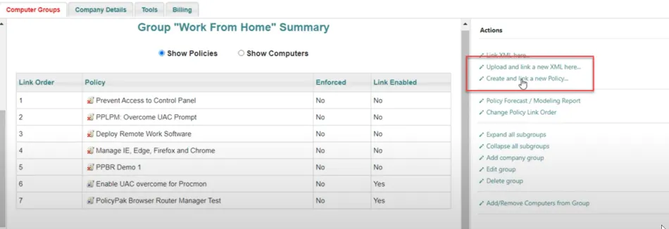

You may also view the XML in notepad and copy/paste the XML straight into Endpoint Policy Manager cloud using the same setting, Upload and link a new XML here as seen around the 5 minute and 20 second mark continuing onward.

See the [Endpoint Policy ManagerCloud: How to deploy Endpoint Policy Manager specific settings (using in-cloud editors and exporting from on-prem)](../video/cloud/deploy/policypaksettings.md) topic for additional information.

## Optional: Backup and Restore entire GPO to Endpoint Policy Manager cloud

You might also have a GPO with a lot of settings, which contain Microsoft and/or Endpoint Policy Manager settings. You can transfer the whole contents of that GPO with a GPO Backup and Endpoint Policy Manager Cloud Import.

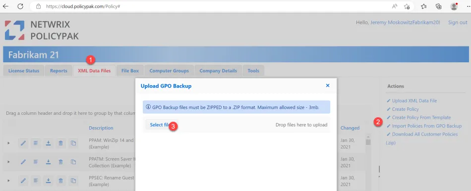

The result will be a de-constructed GPO with all relevant parts as XML, available to re-link later to Company or Azure groups.

See the [How to import GPOs to Endpoint Policy Manager Cloud](../video/cloud/import.md) topic for additional information.

## Use In-Cloud Editors to create and update rules (for most policies)

Now that all your rules are lifted and shifted from GPO Editor to XML to Cloud, you can use the in-cloud editors to perform most new policy types and edit existing policies.

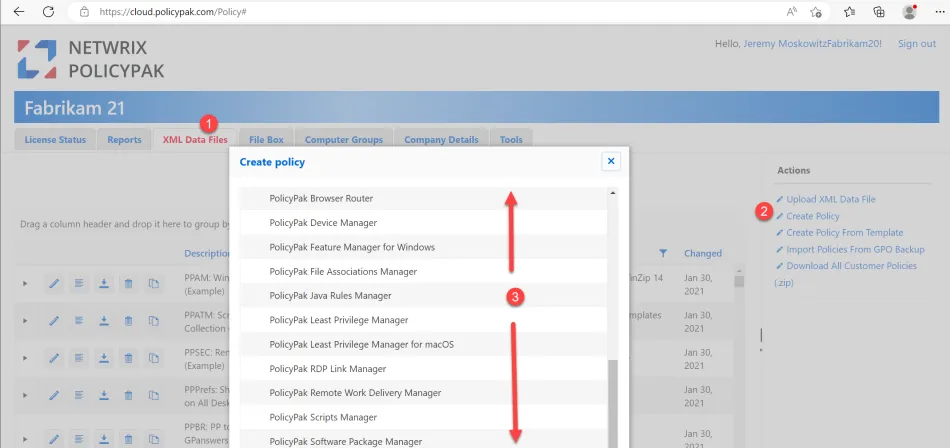

Here’s an example of how to use the Endpoint Policy Manager Cloud in-cloud editors to create and edit Endpoint Policy Manager Least Privilege Manager items.

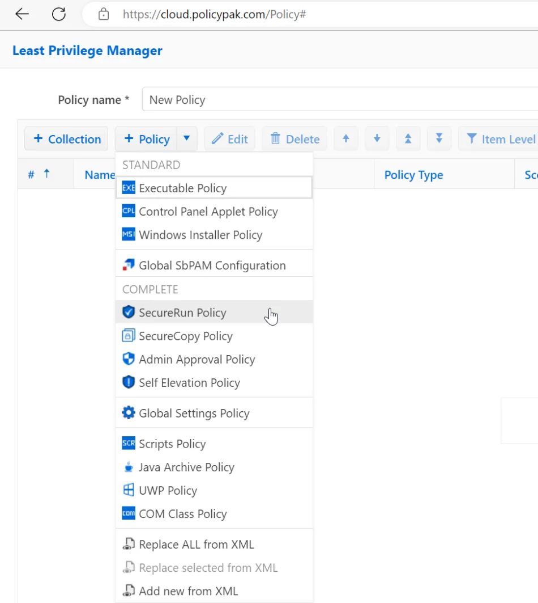

See the [Use Endpoint Policy Manager Cloud to deploy PP Least Privilege Manager rules](../video/leastprivilege/cloudrules.md) topic for additional information.

You are advised to maintain a Windows based MMC editing station for testing because not every editing function may be available in the Endpoint Policy Manager Cloud editors. Most items are, but a few are not. Details about Endpoint Policy Manager Cloud and Test Lab Best Practices are here: Getting Started with Cloud > [Knowledge Base](overview/knowledgebase.md).

## Using Endpoint Policy Manager Cloud to create company groups and/or use the Endpoint Policy Manager Cloud to Azure connector

Now you can craft your Company Group assignment and then adding computers to it.

See the [Working with Groups](interface/computergroups/workingwith.md) topic for additional information.

An example of crafting your own Company groups, linking existing XMLs, creating new policies and Adding/Removing computers from these Company Groups can be seen here.

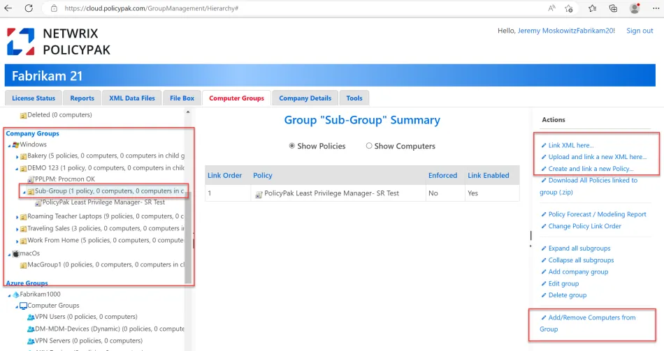

Another option is the ability to mate your Endpoint Policy Manager Cloud instance with your Azure Instance and use Azure Groups as well. You can establish a connection between Endpoint Policy Manager Cloud and Azure using these steps:

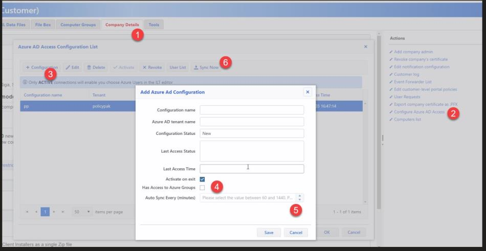

Then Azure groups will appear at the same level as Company Groups and you can link XML to those Azure groups.


Provided the Endpoint Policy Manager Cloud Client is on the machine (one of the next steps), the computer will pick up the policies in either the Computer Group or Azure Group. (```PPCLOUD /sync``` will show these details.)


## Linking Endpoint Policy Manager Cloud XML to Endpoint Policy Manager Cloud Company Groups or Azure Groups

Because your XML policies are now uploaded to Endpoint Policy Manager Cloud, you are ready to link them over to the Company Group or Azure Group of your choice. Remember that Endpoint Policy Manager Cloud acts nearly the same as on-prem GPO with the following attributes:

- Groups are like OUs, though a computer may be in two Endpoint Policy Manager Cloud Groups (where in on-prem AD it may only be in one.)
- Block Inheritance is available
- Enforced is available
- Precedence is available

See the [Working with Groups](interface/computergroups/workingwith.md) topic for additional information.

## Deploying the Endpoint Policy Manager Cloud Client and/or CSE to endpoints

Now you’re ready to deliver the Endpoint Policy Manager Cloud client to your machines, which will join the machines to Endpoint Policy Manager Cloud.

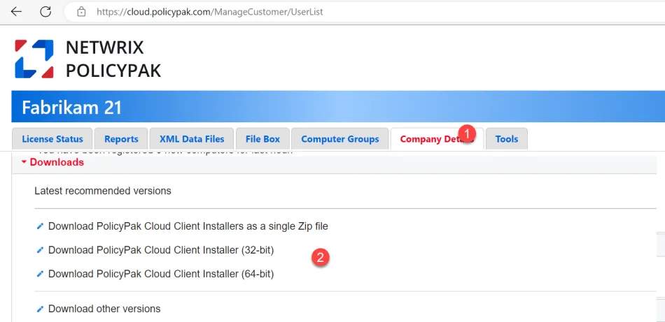

__NOTE:__ If the machines already have the Endpoint Policy Manager CSE installed, there is no need to uninstall the Endpoint Policy Manager CSE. It is permitted to pre-install the CSE on the machine before the Endpoint Policy Manager Cloud client and could actually save you a lot of time during Endpoint Policy Manager Cloud client rollout.

There are a myriad of ways to install the Endpoint Policy Manager Cloud client, since it is just an MSI. When the Cloud Client is installed it will automatically install the Endpoint Policy Manager CSE if it is not present on the machine like what’s seen here.


__NOTE:__ The machine may also upgrade to a later CSE if a Endpoint Policy Manager Cloud group dictates a later CSE; but the CSE will never downgrade. (See the last section in this guide for more details.)

Additionally, you may wish to investigate the idea of having computers automatically join the Endpoint Policy Manager Cloud group of your choice with the Jointoken property. Two videos on that topic are:

- [Endpoint Policy Manager Cloud: Automatically Join Groups with JOINTOKEN](../video/cloud/jointoken.md)
- [Endpoint Policy Manager Cloud + MDM Services: Install Cloud Client + automatically join PPC Groups and get policy.](../video/cloud/mdm.md)

__NOTE:__ There are some other KB topicswith advanced scenarios on installing the Endpoint Policy Manager Cloud client for Azure Virtual Desktops, VDI and other scenarios. Please open a ticket at [Netwrix Support](https://www.netwrix.com/sign_in.html?rf=tickets.html#netwrix-support), if you have trouble locating those articles.

__NOTE:__  Here's some command line examples to help install the Endpoint Policy Manager Cloud client silently. See the [How do I deploy the Endpoint Policy Manager Cloud Client via command line silently?](../install/cloud/clientsilent.md) topic for additional information.

## Removing existing settings to machines (GPO and Non-GPO method)

Now you are ready to remove existing policy from machines. This will vary depending on the source method of deploying policy.

- For GPO, we recommend unlinking the GPO(s) which have Endpoint Policy Manager / now transferred settings. Then run ```GPupdate  /force```,  then   ```GPresult /h out1.html``` and ensure the settings you want are now absent from the Group Policy Results.
- For SCCM and MDM/Intune, perform an uninstall of the wrapped up XMLs / MSIs. You can also verify the XML settings are removed from your endpoint from the Users or Groups or Computer folder. See the [What is the processing order of all policies and how are conflicts resolved (and how can I see the final RsOP) of those policies (between GPO, Cloud, XML, etc)?](../troubleshooting/conflictresolved.md) topic for additional information.

## Report using Endpoint Policy Manager Cloud to verify expected settings are achieved

There are two ways to determine if your endpoint(s) got the policies you expected.

On the client

Method one is akin to GP update and you simply run ```PPCLOUD /sync``` (performs a SYNC then displays) or Endpoint Policy Manager Cloud /status (no sync, just displays), and you can see any specific machines' current state and policies.

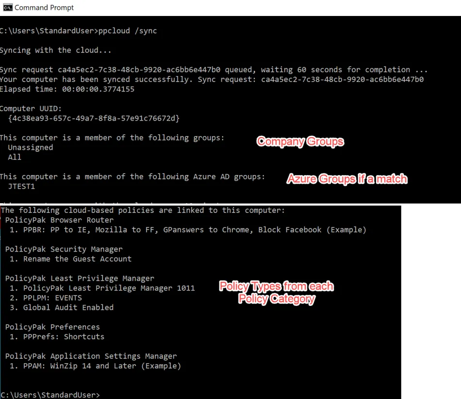

See the [Manually Syncing with PolicyPak Cloud](verify.md#manually-syncing-with-policypak-cloud) topic for additional information.[](https://helpcenter.netwrix.com/en-US/bundle/Endpoint Policy Manager_AppendixE/page/Manually_Syncing_with_Endpoint Policy Manager_Cloud.html)

On the server

Additionally, you may mass report upon machines using the Endpoint Policy Manager Cloud reporting mechanism.

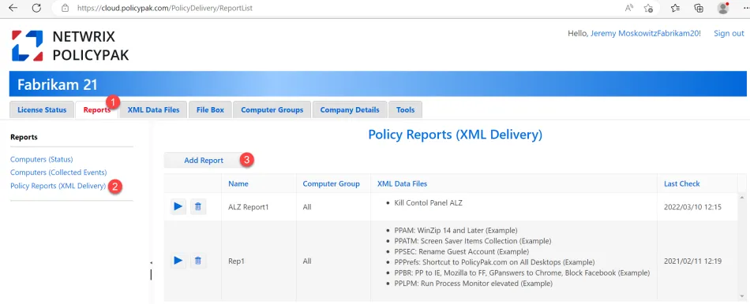

See the [Endpoint Policy Manager Cloud Reporting Demo](../video/cloud/reports.md) topic for additional information.

Either method will inform you if the settings you lifted and shifted to Endpoint Policy Manager Cloud are now on the endpoint.

## Keeping Endpoint Policy Manager Cloud Client and Endpoint Policy Manager CSE up to date

Finally, it is important to keep the Endpoint Policy Manager Cloud Client and the Endpoint Policy Manager CSE up to date. Endpoint Policy Manager Company Groups control the versions of the Endpoint Policy Manager Cloud Client and Endpoint Policy Manager CSE.

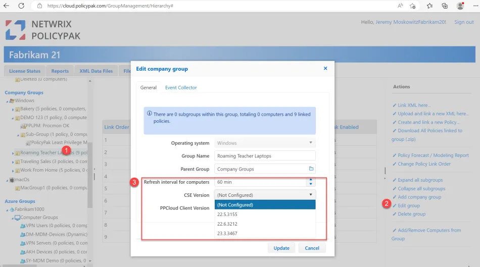

You should always do small scale testing of upgrades of the Endpoint Policy Manager CSE and Endpoint Policy Manager Cloud Client version to ensure safety before you roll it out to everyone via the All group.

See the [Using Rings to Test and Update the Endpoint Policy Manager Client-Side Extension and/or Cloud Client (And How to Stay Supported)](../install/rings.md) topic for additional information on the Microsoft Ring methodology, which aligns to Endpoint Policy Manager best practices.

See the [Endpoint Policy Manager Cloud Groups CSE and Cloud Client Small-Scale Testing and Updates](../video/cloud/groups.md) topic for additional information on how to perform small scale testing before large scale upgrades.
