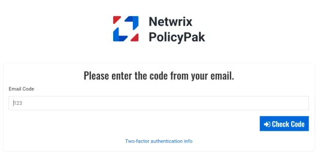
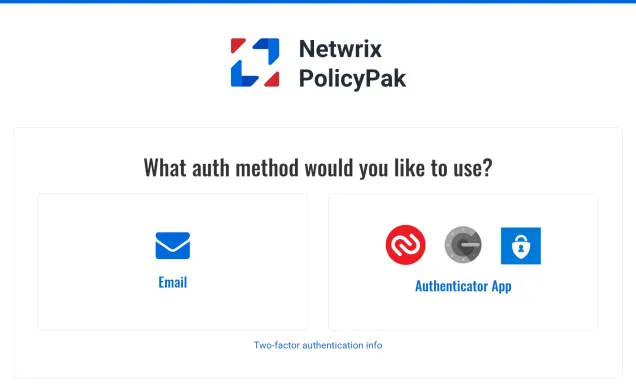
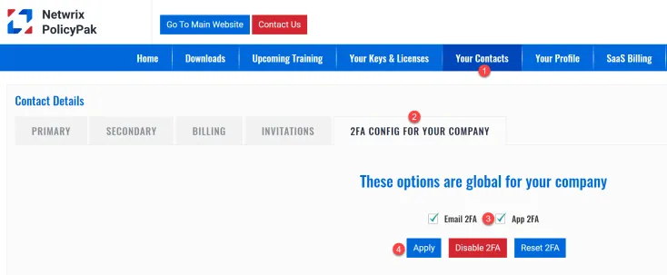
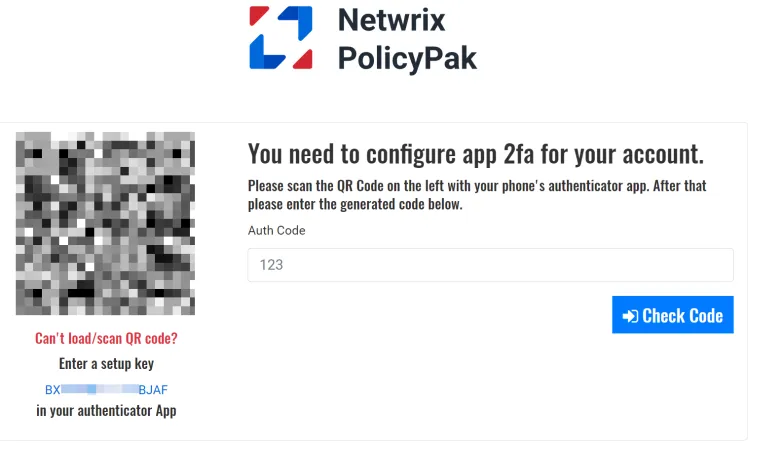
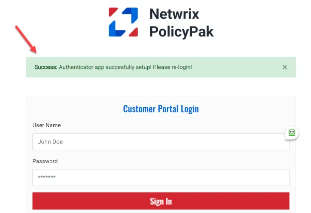
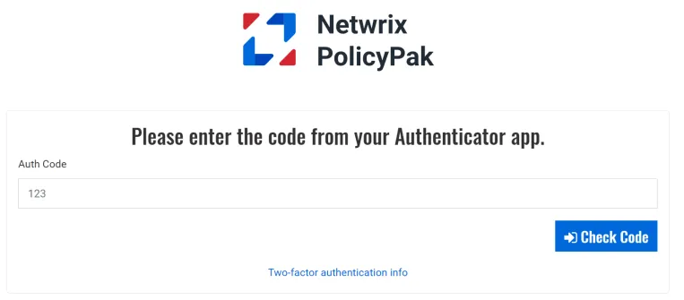
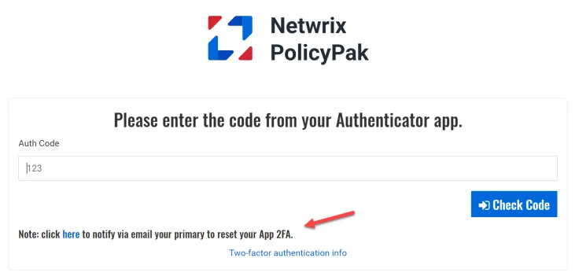
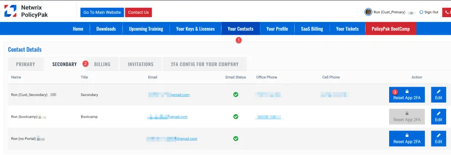
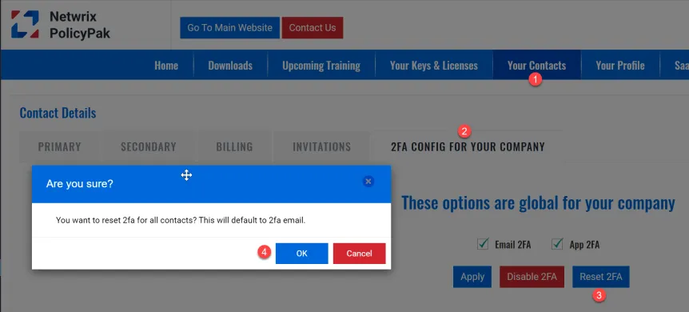
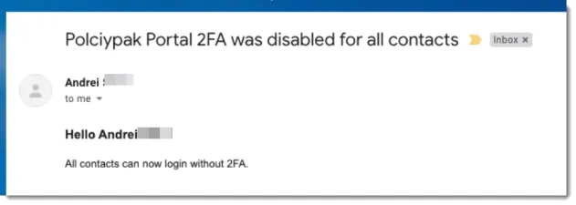

# Two-Factor Authentication in the Endpoint Policy Manager Portal

In order to safegard license keys and any other potentially sensitive company information,
two-factor authentication (2FA) is enabled for all customer accounts in the Netwrix Netwrix Endpoint
Policy Manager (formerly PolicyPak) Portal.

**NOTE:** If for some reason you do not want to use 2FA to secure access to your portal, you have
the option to open a ticket with support, who will assist you in completing that process.  However,
disabling Portal 2FA is strongly discouraged.  In addition, only the PRIMARY user account has access
to the 2FA control that is seen below.  This includes controlling which authentication method is
enabled, resetting 2FA settings, and requesting that it be disabled for every user on the account.

Here's what to expect the first time (as a Primary or Secondary user) you will be prompted for a
code which will be emailed to the address you used to log in with:

And the email to loo for:

**Step 1 –** It is recommended that the Primary user then enable **App** 2FA for the account.  This
will provide everyone with the ability to choose either email or an app (such as Authy or Google
Authenticator) to authenticate their login.

**Step 2 –** Here's how to do that.

**Step 3 –** Navigate to Your Contacts > 2FA Config For Your Company tabLocate the 2FA Config tab
under Your Contacts, then click **App 2FA** and click **Apply**.

**Step 4 –** You are prompted for another code to authorize App 2FA enablement.

**Step 5 –** Enter the code and click **Commit Changes** to complete the process.

**Step 6 –** A message appears in the lower right and App 2FA will be checked, indicating it is now
enabled for all users.

**Step 7 –** Once App 2FA is enabled, users who log in get the screen shown earlier, where they can
choose which method they want to authenticate with:  Email or app.  If they choose app and have not
yet setup their authenticator app, they will be prompted to do so.  Scan the code with the app and
supply the code shown in the app.  If for any reason the QR code is not displayed properly, most
apps allow the use of the alternate code that you will see displayed.

**Step 8 –** After supplying the code from the app they'll be returned to the logon screen where
they will see an acknowledgment if the Authenticator app setup was successful.

**Step 9 –** When they log in and choose the authentication app method, they will be prompted to
enter the code from their authenticator app.

## Resetting 2FA for an Individual Secondary

If an individual needs to have their App 2FA reset, they can request that when logging in. Clicking
the link send a notification to the Primary on the account.

The Primary can then log in to the Portal and perform the reset as shown below.  Navigate to
**Contacts**, select either **Secondary** or **Billing**, locate the individual and click **Reset
App 2FA**.

## Resetting 2FA for the Primary

If you are the Primary on the account and need to have App 2FA reset, you can do that on the same
page above by selecting the **Primary** tab and clicking **Reset App 2FA**.

## Resetting 2FA GLOBALLY

If you ever need to reset 2FA, you can do this by clicking **Reset 2FA**.

**NOTE:** This will reset the 2FA setting for all users. Everyone will need to re-setup their
authenticator app.

## Disable 2FA

Though we strongly advise against it, you can disable 2FA completely on your account.  Do this by
clicking **Disable 2FA** and confirming your request.  The request will be submitted on your behalf
and handled by the support team.  You will hear from them when the request is completed.

You will get a confirmation email anytime 2FA is disabled for your account.  Please note that this
is for the entire account so 2FA will be disabled for ALL users/contacts as indicated below.

Looking in your portal afterwards, you'll see that 2FA is entirely disabled, as neither box is
checked. You can re-enable it at any time by simply selecting the 2FA you want to enable and
clicking **Apply**.  Since no 2FA is active at this moment you won't be requested to supply a code
to re-enable it.  It will just be immediately enabled and everyone will once again be prompted to
supply a code received via email or from their app.

**NOTE:** In this particular scenario, if anyone had app 2FA previously configured (had scanned the
QR code) then that code will still work.
