# Admin Approval, Branding, Customization and Automatically Createing Rules

Admin Approval enables you to anticipate devices without rules and enable users to use your service desk to help authorize sanctioned devices - temporarily or permanently.

See the [Device Manager Admin Approval and Automatic Rules Creation](../../video/device/dmapprovalautorules.md) topic for additional information on Admin Approval & Branding and Customization.

This document refers to the person doing the approval as an Approver. This can be someone on your help desk, security team or yourself.

There are three parts to Admin Approval:

- The Endpoint Policy Manager Device Manager policies, which establish Admin Approval and its secret key
- Securing the secret key (if using Group Policy method)
- The Endpoint Policy Manager Device Privilege Manager Admin Approval Tool

Start out by creating an Admin Approval policy, as shown below.

__NOTE:__ You can only have one Admin Approval entry per collection and only one will ultimately apply.

Admin Approval has four tabs:

- General

  - Admin Approval State — __Enable__ or __Disable__ Admin approval
  - Secure Desktop — Endpoint Policy Manager Admin Approval Dialog will present itself by default on the Windows Secure Desktop. You can change this behavior here.
  - Warning message — When a device is schedule to be used for a period of time, this amount of minutes is when the pop-up notification occurs to the end-user

- Secret Key

  - Key — Here is where you can create a secret key by choosing either __Derive from Password__ or __Generate Random__. Then, click __Copy__, and, for now, paste the secret key into Notepad.

- Email

  - Use of Email — __Enabled__ or __Disabled__. When Enabled you can provide an email address. When Disabled you will only get short over the phone codes.
  - Send To — The email address you want the long request codes sent to
  - Always use email (only) — Turns off the short code method
  - Open the message in Notepad Instead — When using the Email method, instead of launching your desktop's mail app, like Outlook, instead open the request in Notepad. Users can then paste it into the mail program (Gmail.com) or application of their choice.

- Misc

  - Custom Message — Optional message to customers about what to do, who to call, what is permitted etc, to override the default Endpoint Policy Manager Device Manager behavior.

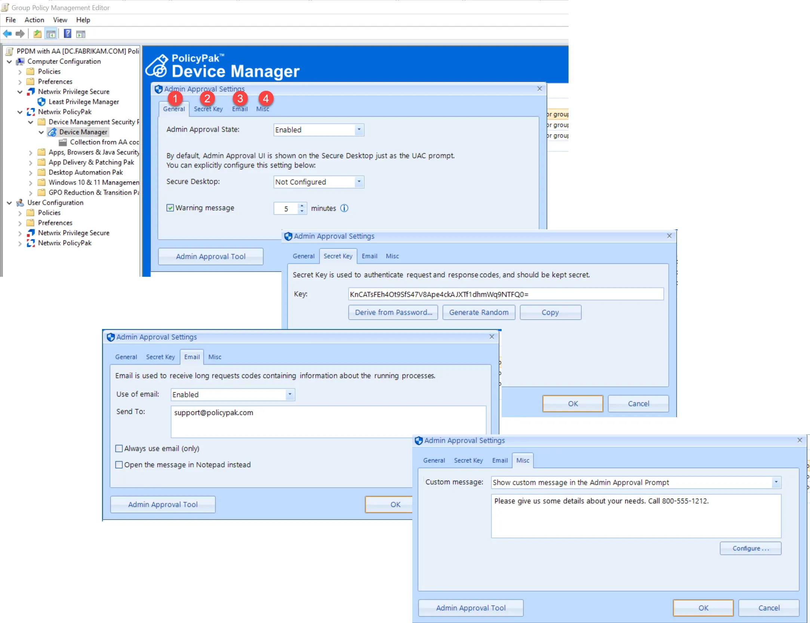

## Brand Dialog Using Global Settings (Optional)

You can brand your dialogs to your corporate standards. This is done in the Global Settings policy type you saw earlier.

Below you can see some example of what you may configure. You can even run a pre-test to see what the user will see before implementation.

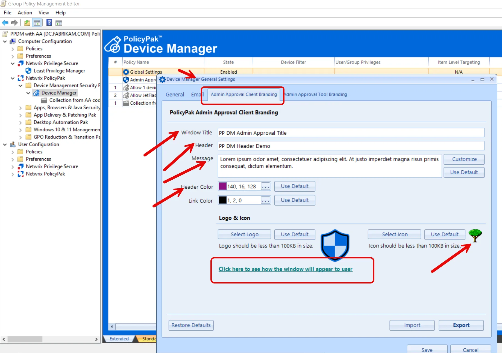

## Test Admin Approval

When unknown devices are encountered, the following dialog will appear. Users can use your details to call the service desk and/or send email requests.

Requests are then fielded by the Device Manager Admin Approval tool.

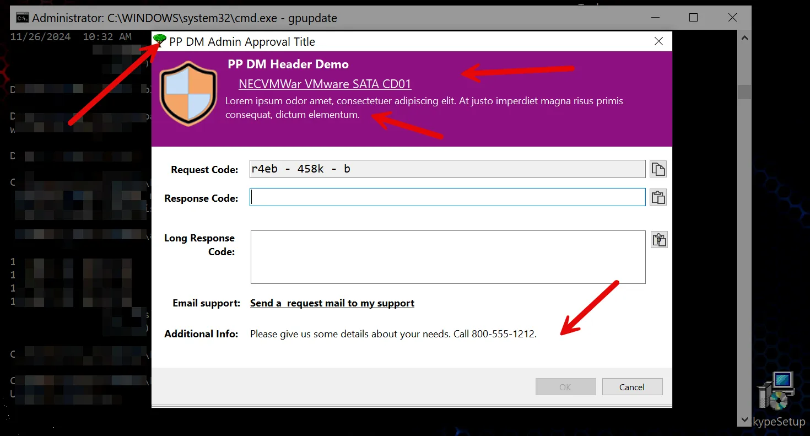

## Device Manager Admin Approval Tool

The Device Manager Admin Approval Tool is then used to field requests. This application is pre-installed whenever the Endpoint Policy Manager Admin Console MSI is installed. Its also available as a standalone portable application and found in the Endpoint Policy Manager Extras folder in the download.

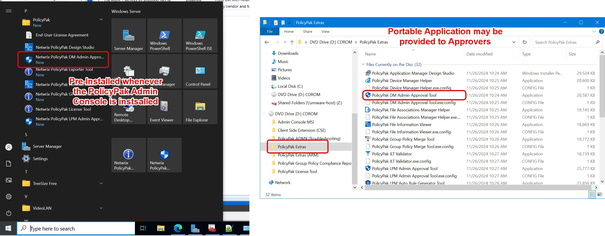

The first time set up for an Approver requires that the Secret Key found in the policy is placed into the tool. The Approver also has his own password to sign into the app to open it up.

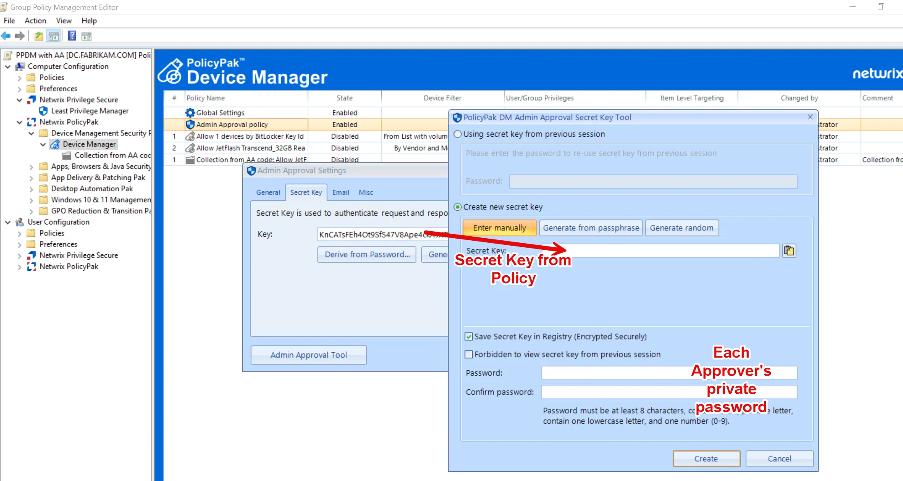

## Admin Approval Tool in Simple Mode

The Approver can field Simple (over the phone) requests or Email requests. In this example, a Request code is provided over the phone to an Approver.

An Approver can set:

- Permissions — Full access, Read, Read & Write, Read & Execute
- Timeframe — After this amount of time, device must be re-authorized. Permanent, 15 minutes, 1 hour, 2 hours, 4 hours, 8 hours.
- Uses — Once, 5 times, 10 times, Unlimited
- Expires — Amount of time the Response code is valid for Never (Default), 10 minutes, 1 hour, 12 hours

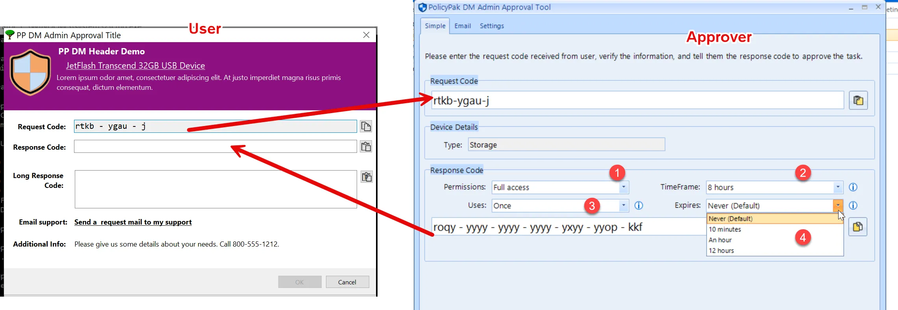

The Response code will change based upon the Approver inputs.

__NOTE:__ Anytime TimeFrame is set to __Permanent__, it overrides all Uses limits and generates a warning. For example: Uses set to __Once__ and TimeFrame set to __Permanent__.

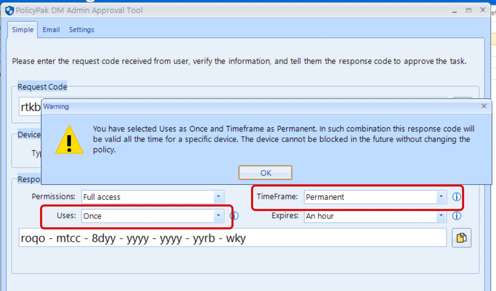

In this combination, Timeframe overrides Uses, meaning that whatever access you give the device is actually Permanent and not Once.

To get out of this problem if you get into it, you have two choices:

- Update the policy by disabling the Global Policy or turning off Device Manager.
- Or on a single machine you may erase the value for the device you granted Permanent access to. See the [What are the registry settings for Device Manager (and how do I reset Device Manager Admin Approval)?](../registry.md) topic for additional information.

## Admin Approval Using Email Method

You can use Admin Approval requests to go through your service desk as email requests. See the [Endpoint Policy Device Manager and End-User Emails to Support](../../video/device/enduser.md) topic for additional information.

The email method will attempt to use your registered mail application. Your email app must be registered with the .EML extension for this to work as expected.

## 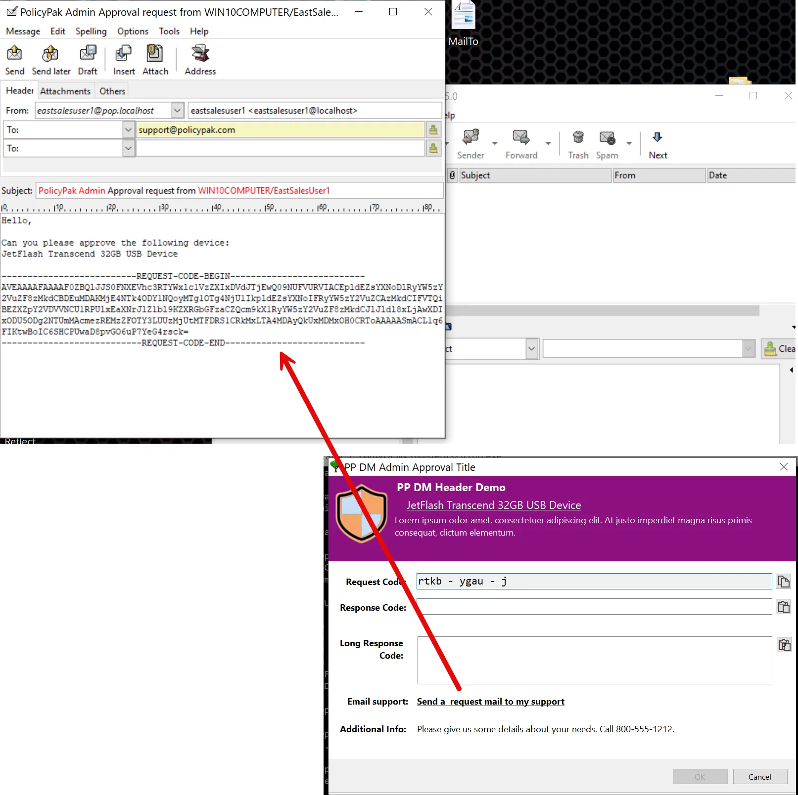

The Approver would then field this request, generate a Response code and send it back via email or copy paste.

The Email method has details about what the device actually is, versus the Simple method which cannot provide those details.

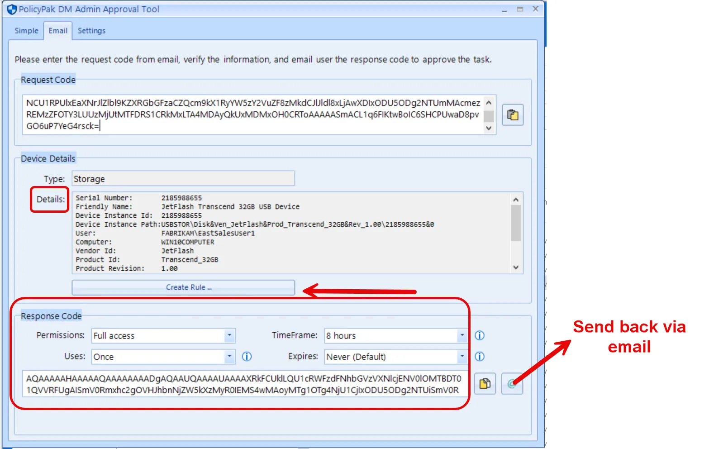

## Admin Approval Create Rule Button

The Create Rule button allows you to launch a Wizard which will help generate a rule you can then use permanently and deliver using Group Policy, MDM or Endpoint Policy Manager Cloud.

Because the Device Details are now known via the Email method, you can create a permanent rule similar to the Wizard we saw earlier.

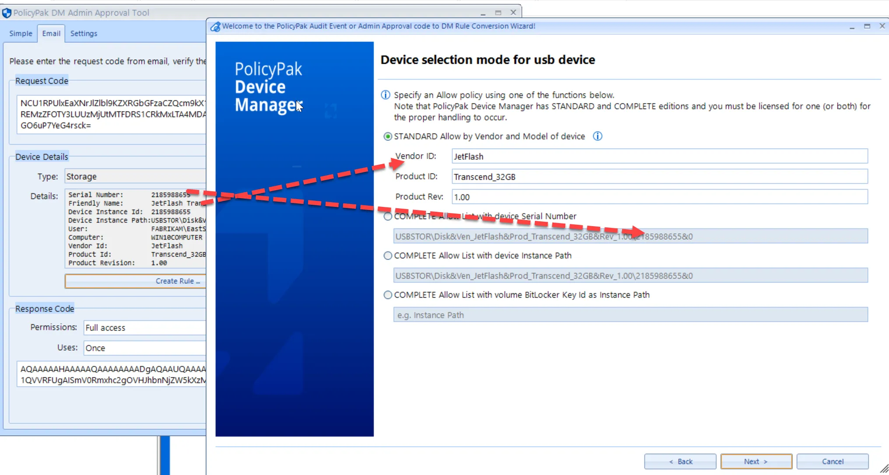

In the Wizard you can use the default settings or change the Members and Permissions.

Finally, save your XML and import it into the MMC editor as a policy or use with Endpoint Policy Manager Exporter or Endpoint Policy Manager Cloud.

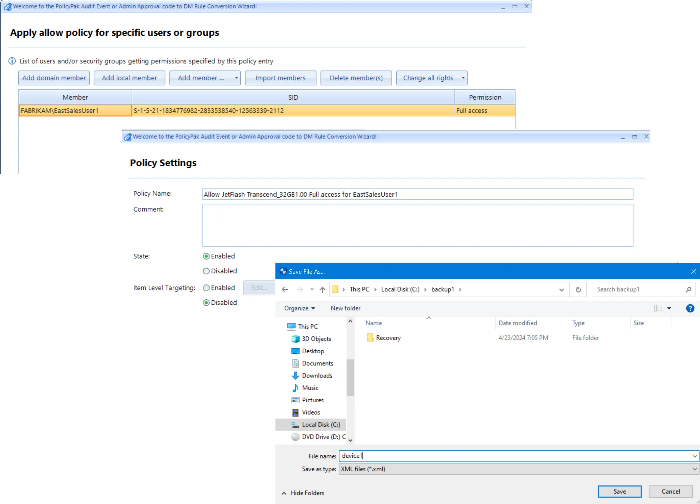

## Making a rule directly from an Email Request Code

If you'd like you can take a Email request code and immediately generate a rule inside the MMC console.

Copy the code and then select __New Policy from Audit Event or Admin Approval Code__.

Paste in the Request code and follow the Wizard to generate the rule which you need.

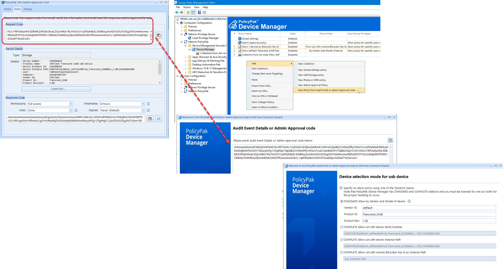

## Make a Rule Directly from an Event on the Endpoint

You can take Event IDs generated from Endpoint Policy Manager Device Manager, such as this and use it as the basis to start a rule.

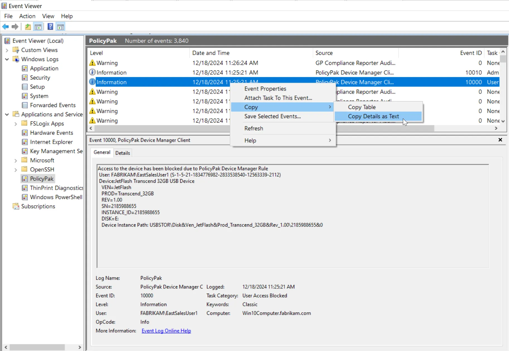

# 
