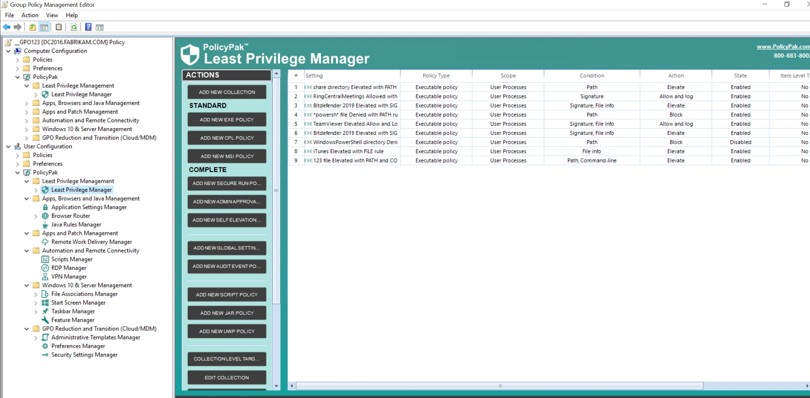
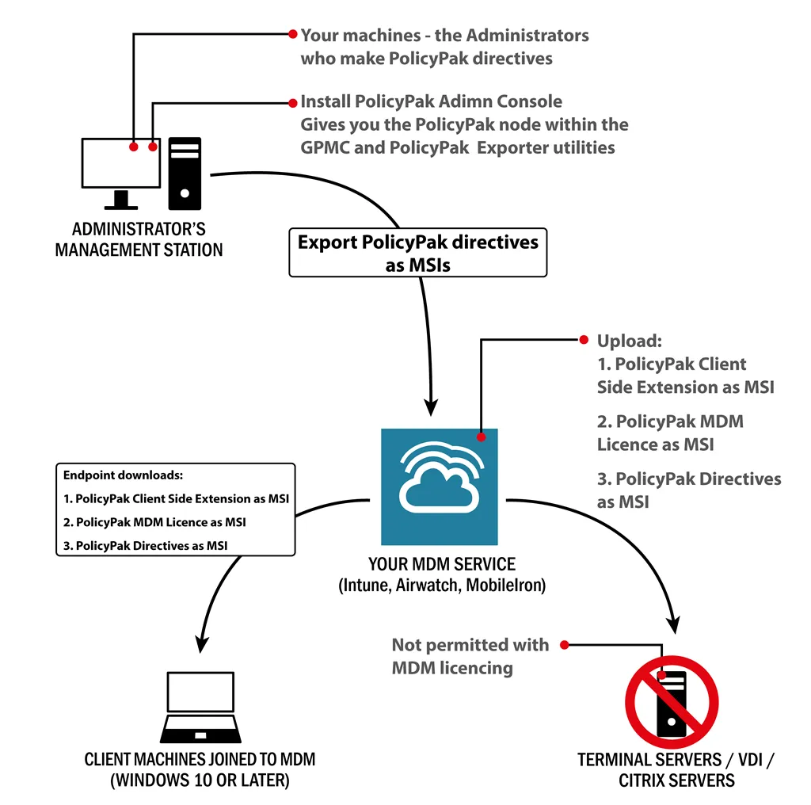
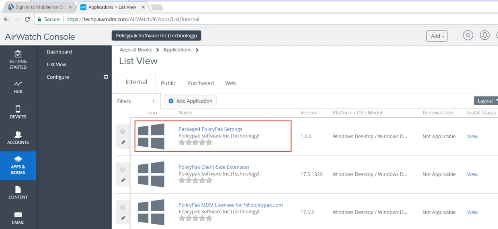
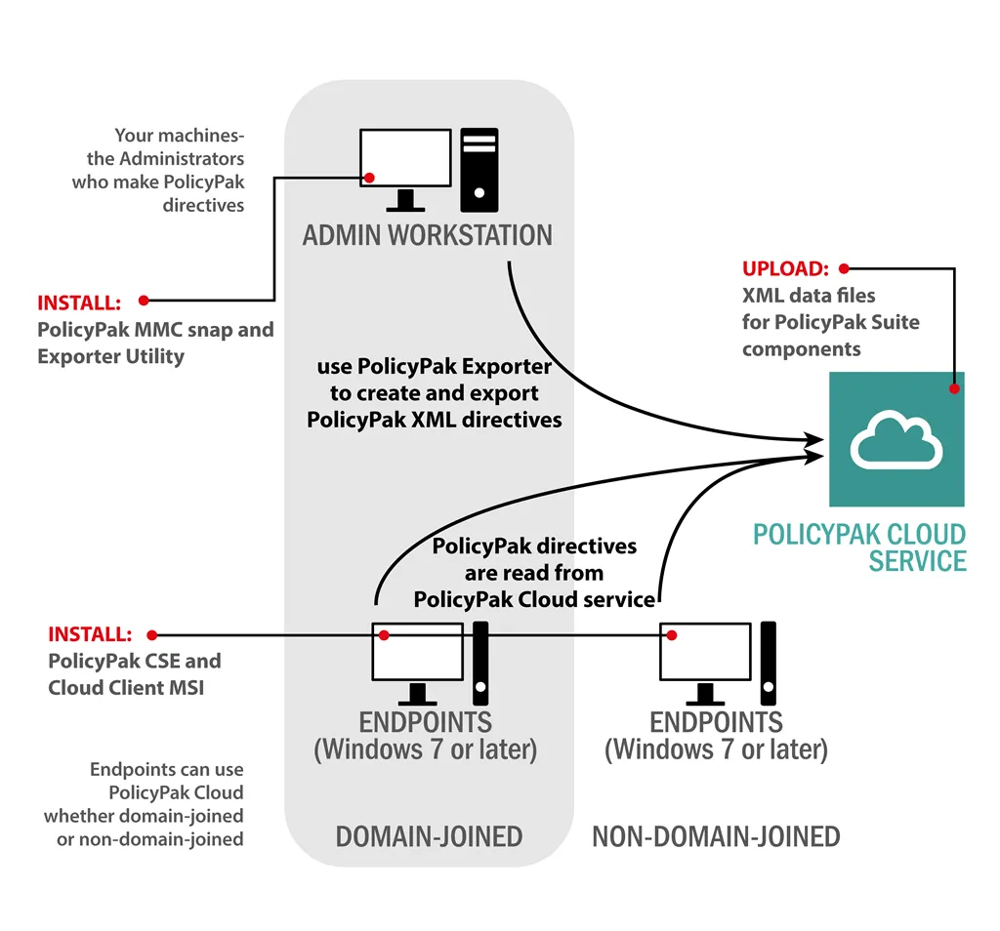
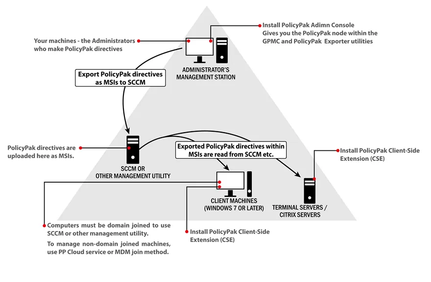
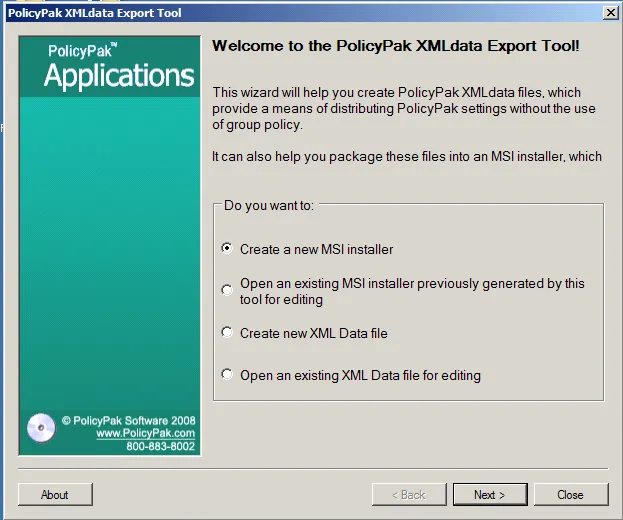

# Solution Methods

Based on the edition you purchase, you are entitled to use one or more solution methods. The usual solutions are the following:

- Active Directory/GPO Method - Create GPOs and make Endpoint Policy Manager directives using the Group Policy infrastructure you already have.
- MDM Method - Create Endpoint Policy Manager directives and export them for use with your own MDM system.
- Cloud Method - Create Endpoint Policy Manager directives in the Endpoint Policy Manager Cloud service.
- Cloud Hybrid Method - Use your MDM or RMM solution to pre-install the required Endpoint Policy Manager Cloud client to get bootstrapped into Endpoint Policy Manager Cloud.
- Unified Endpoint Management Method - Create Endpoint Policy Manager directives andexport them for use with your own endpoint management system, like SCCM.
- Virtualization - Use Endpoint Policy Manager alongside your VDI and other virtualized infrastructure.

The following sections explain the advantages and disadvantages of the methods listed above and the details of where Endpoint Policy Manager data is stored.

## Active Directory/GPO Method

The most popular method of using Endpoint Policy Manager is via Group Policy.

__Note__: For more information on this topic, please see this video:[Knowledge Base](../grouppolicy/overview/knowledgebase.md) > Group Policy

When you use the Group Policy method, you are 100% in control of your data because it is all contained within your Active Directory.The image below shows what Endpoint Policy Manager looks like whenusing Group Policy.

Group Policy is automatically stored in Active Directory on all domain controllers (DCs), so you don't have to install anything on any DCs or extend the Active Directory schema. Because GPOs are stored on DCs of any type, you do not need to install any server components, upgrade any servers or domain controllers to any specific version of Windows Server, or buy any server-side infrastructure. Additionally, Endpoint Policy Manager works in any domain mode.

To be clear, every client computer or Terminal Services (RDS)/Citrix machine that you want to manage with Endpoint Policy Manager must have the Endpoint Policy Manager client-side extension (CSE) installed. Moreover, every management machine that you wish to use to create Endpoint Policy Manager directives must have the Endpoint Policy Manager admin console on it, enabling you to create Endpoint Policy Manager policies within GPOs. Below you can see how Endpoint Policy Manager works with Group Policy.

When using Group Policy to deploy Endpoint Policy Manager directives, Endpoint Policy Manager will leverage Group Policy to the fullest extent possible. That is, Endpoint Policy Manager honors (at a minimum) the following normal Group Policy/GPMC constructs:

- Inheritance and Group Policy precedence (site, domain, and OU)
- Block inheritance
- Enforced (no override)
- Link/unlink
- Disable
- Deleted links and deleted OUs
- Loopback policy processing
- Backup and restore
- Terminal Services (RDS)/Citrix/Xenapp environments
- RSOP reporting and GPMC settings reports

Additionally, Endpoint Policy Manager is tested on, and compatible with, several popular Group Policy change management products. These third-party utilities help administrators create a change management process around Group Policy creation and perform offline editing of live GPOs. Below is a table of utilities and the corresponding URLs to Endpoint Policy Manager videos of compatible Group Policy management products.

URLs to Group Policy management videos.

| Product Name | Video link to Endpoint Policy Manager and the Group Policy Management Product |
| --- | --- |
| Microsoft AGPM (Advanced Group Policy Management) | [Endpoint Policy Manager and AGPM](../video/changemanagementutilities/advancedgrouppolicymanagement.md) |
| Quest GPO Administrator | [Endpoint Policy Manager and Quest's GPOADmin Tool](../video/changemanagementutilities/gpoadmintool.md) |
| Quest Active Administrator | [Endpoint Policy Manager and Quest (ScriptLogic) ActiveAdministrator](../video/changemanagementutilities/scriptlogicactiveadministrator.md) |
| NetIQ Group Policy Administrator | [Endpoint Policy Manager Integrates with NetIQ GPA](../video/changemanagementutilities/netiq.md) |

## MDM Method

You can use Endpoint Policy Manager with your mobile device management (MDM) service of choice, such as Microsoft Endpoint Manager (SCCM and Intune), MobileIron, or VMware Workspace ONE.

__Note__: For more information on this topic, please see this video:[Video Learning Center](../mdm/overview/videolearningcenter.md) > Started with MDM.

To get started, create directives using the Endpoint Policy Manager MMC, follow these steps:

__Step 1 –__  Snap-in inside the Group Policy editor (or our included Endpoint Policy Manager exporter).

__Step 2 –__ Wrap up the directives into one or more MSI files.

__Step 3 –__ Upload your finished MSI files into your MDM service. Below is a diagram of the process.

Below is an example of an uploaded Endpoint Policy Manager MSI file containing XML directives along with the MDM service deploying the Endpoint Policy Manager CSE and license files.

If you plan to use Endpoint Policy Manager with your MDM service, you can find more information about the Endpoint Policy Manager exporter in this topic: [Using Endpoint Policy Manager with MDM and UEM Tools](../mdm/uemtools.md)Using with MDM and UEM Tools.

## Cloud Method

You can use the Endpoint Policy Manager Cloud service to create Microsoft Group Policy and Endpoint Policy Manager directives and deliver them through the Internet.

__NOTE:__  For a video overview of Endpoint Policy Manager Cloud, see [Endpoint Policy Manager Cloud: QuickStart](../video/cloud/quickstart.md).

The diagram below shows how Endpoint Policy Manager Cloud works to deliver directives. Computers can be domain-joined or non-domain-joined. When you are a Endpoint Policy Manager SaaS customer, the Cloud method is the only method available to you.

For a more detailed coverage of Endpoint Policy Manager Cloud see the quick start topic:  Endpoint Policy Manager [Setup, Download, Install, and Verify](../cloud/quickstart.md).

## Cloud Hybrid Method

The Endpoint Policy Manager Cloud service requires that the Endpoint Policy Manager Cloud client get installed on the endpoint. Once this is done, it claims a license. Then, Endpoint Policy Manager performs the work. Some customers may want to bootstrap the installation of the Endpoint Policy Manager Cloud client using an RMM or MDM tool they already have hooked into the client. More details on how to do this can be found in the quick start topic: [Setup, Download, Install, and Verify](../cloud/quickstart.md)

__NOTE:__  For a video overview of using Endpoint Policy Manager with an MDM or RMM tool to bootstrap the Endpoint Policy Manager Cloud installer, see: [Endpoint Policy Manager Cloud + MDM Services: Install Cloud Client + automatically join PPC Groups and get policy.](../video/cloud/mdm.md).

## Unified Endpoint Management Method

Endpoint Policy Manager can use SCCM, or any other management system that deploys MSI files, instead of using Group Policy.

__NOTE:__  For a video overview of using Endpoint Policy Manager with SCCM and similar tools (such as KACE) visit: [http://www.policypak.com/video/deploying-policypak-directives-without-group-policy-policypak-exporter-utility.html](http://www.policypak.com/video/deploying-policypak-directives-without-group-policy-policypak-exporter-utility.html)

Below we can see what Endpoint Policy Manager would look like using a tool like SCCM.

We provide the Endpoint Policy Manager Exporter Tool. This topic is not discussed in this section but you can get more information here: [Using Endpoint Policy Manager with MDM and UEM Tools](../mdm/uemtools.md).

The job of Endpoint Policy Manager Exporter Tool is to enable you to make Endpoint Policy Manager directives and wrap them in an MSI file that you can then deploy using whatever technique you wish.

## Virtualization

Endpoint Policy Manager can be used with many virtualization tools like Citrix, Windows Virtual Dekstop, Cameyo, and others. Endpoint Policy Manager Enterprise and Professional customers can use Endpoint Policy Manager with nearly any virtualized technology, like VDI or session-based computing systems. However, each session needs to be accounted for.

__NOTE:__  To learn more about Citrix and WVD multi-session Windows licensing scenarios, [https://www.policypak.com/purchasing/vdi-licensing-scenarios/](https://www.policypak.com/purchasing/vdi-licensing-scenarios/).

Endpoint Policy Manager SaaS customers can use Endpoint Policy Manager with full VDI solutions where the whole machine is shared, like VMware Horizon, but not shared solutions, like Windows Virtual Desktop or Windows RDSH, because the total number of sessions cannot be accounted for. Full VDI single-session desktops are licensed in the same manner as physical desktops. From a licensing perspective, there is no difference between the two. If there's a computer account in Active Directory and it's active, it counts your Endpoint Policy Manager licensing. In this case, you may use it with Endpoint Policy Manager SaaS/Cloud.

For more answers about licensing Endpoint Policy Manager with virtualized systems, see: [Knowledge Base](../license/overview/knowledgebase.md) > All Things Licensing.
