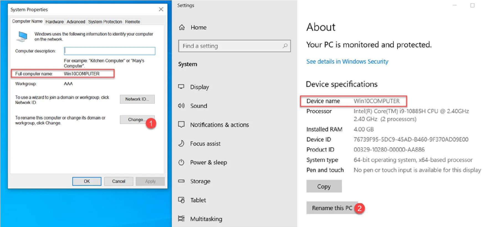
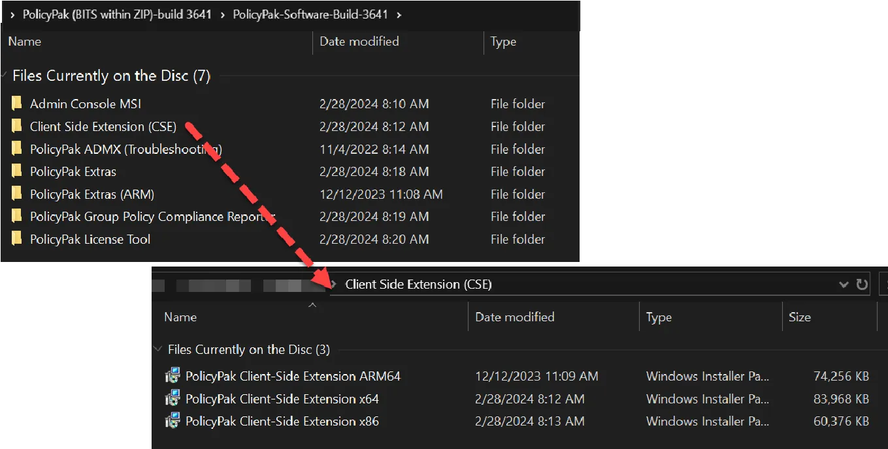

# Step 2: Prepare an endpoint machine to receive Endpoint Policy Manager policies

During your trial period you will want to experience the power of Endpoint Policy Manager performing operations upon an example endpoint or two. It is recommended you use machines which are not critical and/or ones you can rollback. A best practice in this situation is to use virtual machies.

__NOTE:__ Endpoint Policy Manager endpoints require that the Endpoint Policy Manager Client Side Extension must be installed in order to receive Endpoint Policy Manager policies. You will perform that step in a moment.

After you have identified a machine or two that you wish to perform Endpoint Policy Manager operations upon, you need to get them licensed:

- You DON’T need a license file from us to get started on a few example endpoints.
- You ONLY need a license file from us to get started if you wish to enable groups of endpoint computers at a time (whole domain, multiple OUs, all computers in an MDM service.).

Therefore, if you wish to trial your whole domain, multiple domains, one or multiple OUS and/or all computers within an MDM environment, you will need to contact Netwrix Sales to help you with a broader trial.

To get an endpoint computer to act licensed, simply rename a computer to have COMPUTER in the name. When the computer has the word COMPUTER in the name, Endpoint Policy Manager will act fully licensed on this computer.

Here are the two methods of how to rename a computer in Windows to have Computer in the name.

After the example computer is renamed and rebooted, you are ready to install the Endpoint Policy Manager CSE (Client Side Extension.)

Locate the Endpoint Policy Manager Build folder and the Client Side Extension (CSE) folder.

Next, install the Endpoint Policy Manager CSE on the endpoint. Use x64 for 64 bit and x86 for 32 bit machines.

__NOTE:__ See the [Endpoint Policy Manager ARM Support Supportability Statement](../../requirements/support/arm.md) topic about Endpoint Policy Manager Support on Arm processors.

After the Endpoint Policy Manager CSE is installed, you can test verify that the license is valid because you renamed the computer to have COMPUTER in the name. Open a new command prompt and type the command ppupdate. You should see something similar to the output shown here.

The important points to look for are:

- Verify you see the words “The trial license is valid.”
- Verify you see the Expiry date is in the future.
- Verify you see all the Components of Endpoint Policy Manager listed.

__NOTE:__ The trial expires 90 days after the build of Endpoint Policy Manager was created - NOT 90 days after you perform the installation. Therefore, be aware of your Expiration date since it could be sooner than expected.

See the [How can I tell how a machine is licensed (by GPO, MDM, or XML file), and also know for what components it is licensed?](../../troubleshooting/license/components.md) topic for further details on validating licensing. See also the [Testing and Troubleshooting By Renaming an endpoint Computer](../../video/troubleshooting/mdm.md) topic for further details showing what happens when you rename a computer and how Endpoint Policy Manager reacts.
