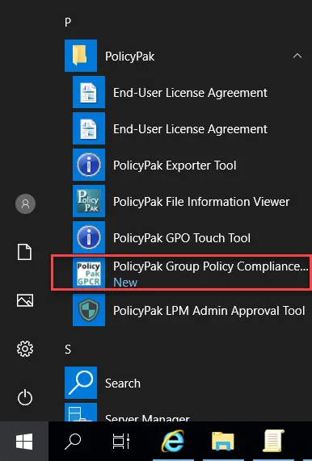

# Client (Admin Console) Installation

Installation of the Endpoint Policy Manager GPCR client (admin console) should occur on each Group
Policy administrator's machine. There are no usage or licensing restrictions on the number of
installations of the Endpoint Policy Manager GPCR client (admin console) or on the number of
administrators using it. The Endpoint Policy Manager GPCR client (admin console) itself is not
licensed, but the endpoints you want to report on are. Installation of the GPCR client (admin
console) may be on any Windows 10 machine, 2012 Server machine or higher. It must have .NETFramework
3.5, and the Microsoft GPMC must be installed on the machine where you run the Endpoint Policy
Manager GPCR.

To get started, run the Endpoint Policy Manager GPCR client (admin console) installation MSI and go
through the wizard, as shown in Figure 5.

Figure 5. Using the wizard to install the Endpoint Policy Manager GPCR admin console.

Beginning with version 21.1.2693.656, you cannot connect to an older version of the server. To
progress to the next step in the wizard you must accept this condition, as shown in Figure 6.

Figure 6. The confirmation window.

When you do this, the Endpoint Policy Manager GPCR client will appear on the Windows 10 or Windows
Server Start menu, as shown in Figure 7.

Figure 7. Endpoint Policy Manager GPCR in the Start menu.
