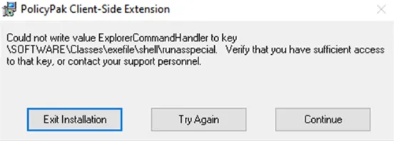
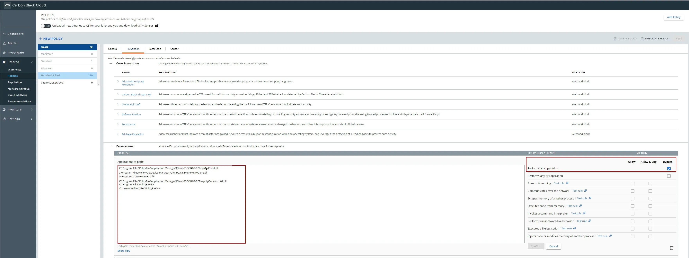
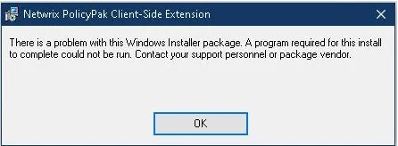
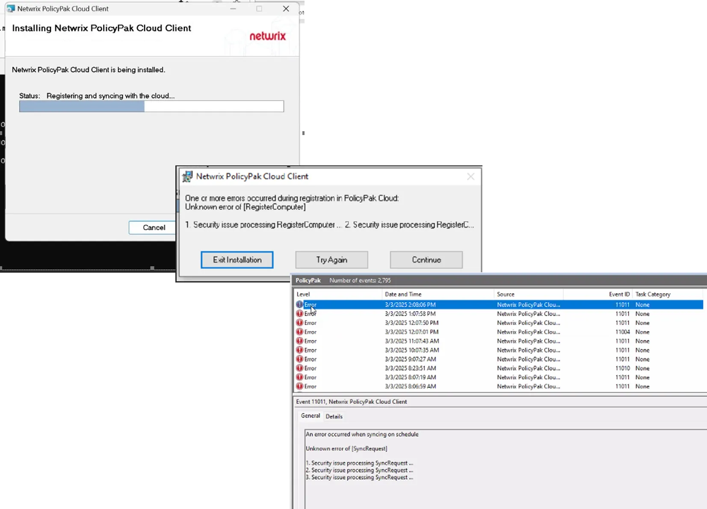

# How must I configure my Anti-virus or system-level software to work with Endpoint Policy Manager CSE?

With some Antivirus and other security engines it is necessary to exclude some Netwrix Endpoint
Policy Manager (formerly PolicyPak) items.

Endpoint Policy Manager acts as part of the operating system, and, as such, can occasionally
conflict with some Antivirus programs. (McAfee, Sophos, etc.)

Additionally, you can tell Endpoint Policy Manager to avoid conflict with Antivirus and security
engines if you know what processes are getting entangled. If you wish to do that, please see
[PolicyPak: Exclude Processes via ADMX](https://helpcenter.netwrix.com/bundle/PolicyPak/page/Content/PolicyPak/Video/GettingStarted/ADMX.htm)
for general how-to directions.

We suggest proactively excluding the two processes below which could be blocked and prevented from
performing their jobs.

- `PPWatcherSvc*.exe` (with \* being either the 32- or 64-bit version)
- `PPExtensionService.exe` (with \* being either the 32- or 64-bit version)

You might need to also exclude these:

- `%Programdata%\PolicyPak.`
- `%localappdata%\PolicyPak`

For 32-bit machines:

- `C:\Program Files\PolicyPak`
- `C:\ProgramData\PolicyPak`
- `C:\Program Files (x86)\PolicyPak\Application Manager\Client\*\PPReapplyOnLaunch32.dll `
    (\* should be replaced with your installed CSE version, i.e. 21.10.2943)
- `C:\Program Files (x86)\PolicyPak\Application Manager\Client\*\PPAppMgrClient.dll `
    (\* should be replaced with your installed CSE version, i.e. 21.10.2943)

For 64-bit machines:

- `C:\program files (x86)\PolicyPak`
- `C:\Program Files\PolicyPak`
- `C:\ProgramData\PolicyPak`
- `C:\Program Files\PolicyPak\Application Manager\Client\*\PPReapplyOnLaunch64.dll`
    (\* should be replaced with your installed CSE version, i.e. 21.10.2943)
- `C:\Program Files\PolicyPak\Application Manager\Client\*\PPAppMgrClient.dll`
    (\* should be replaced with your installed CSE version, i.e. 21.10.2943)
- `C:\Program Files\PolicyPak\Device Manager\Client\*\PPDMClient.dll`
    (\* should be replaced with your installed CSE version, i.e. 21.10.2943)

**CAUTION:** The above location paths must be matched to your installed CSE version.

To cover all the bases please also exclude PPWatchersvc64.exe and PPWatchersvc32.exe from the
Exploit Mitigation feature.

For SOPHOS users who receive: APCViolation exploit prevented in Endpoint Policy Manager Watcher
Service:

- Check the Event details and then make an exception in the Exploit Protection setting
- The typical workaround is to add PPWatersvc64.exe as an exclusion to the Exploit Mitigation

## IVANTI Heat Customers

There are a couple of issues to keep in mind:

First, please read
[ivanti forms Troubleshooting Application Conflicts for additional information.](https://forums.ivanti.com/s/article/Troubleshooting-application-conflicts-with-LES?language=en_US)

The basic approach is to rename these files and then reboot to see if conflicts still occur.

- `C:\Windows\System32\sxwmon64.dll`
- `32-bit: C:\Windows\System32\sxwmon32.dll`
- `64-bit: C:\Windows\SysWow64\sxwmon32.dll`

## FORTINET Customers

FortiNet / FortiClient version 6.0.8.0261 will not install the latest CSE and displays the following
error message during installation:

Symptom: Error message when installing CSE: Could not write value `ExplorerCommandHandler` to key
`\SOFTWARE\Classes\exefile\shell\runasspecial`

- The workaround is to update FortiClient to version 6.0.9.0277 or higher.

## More Information / Micorosft A/V Products

For more details on Windows Defender exclusions in general, please see
[The Hitchhiker's Guide to Microsoft Defender for Endpoint exclusions](https://cloudbrothers.info/en/guide-to-defender-exclusions/).

## CARBON BLACK Customers

During the installation of the Endpoint Policy Manager  CSE, you may encounter the following error
message:

To work around this issue please add the following BYPASS policies for Endpoint Policy Manager as
shown below.

## DEFENDER Customers

During installation or removal of the Endpoint Policy Manager CSE you may run into this error:

The Windows Application log will also show the following Error:

Product: Netwrix Endpoint Policy Manager (formerly PolicyPak) Client-Side Extension -- Error 1721.
There is a problem with this Windows Installer package. A program required for this install to
complete could not be run.

To work around this issue you need to add the following folder exclusions under **Attack Surface
Reduction** > **Attack Surface Rules**:

- `C:\Program Files\PolicyPak\`
- `C:\ProgramData\PolicyPak\`

See the Cloudbrothers article
[The Hitchhiker's Guide to Microsoft Defender for Endpoint exclusions](https://cloudbrothers.info/en/guide-to-defender-exclusions/)
for additional information on Windows Defender exclusions.

## Netskope Customers

For Netskope customers, this workaround was provided by another customer and may or may not work in
your circumstance.

If when installing the Endpoint Policy Manager Cloud client, you get the experience below:

Follow the steps to resolve Netskope errors.

**Step 1 –** Create a `certpinned` app bypass including the 3 processes` ppcloudsvc.exe`,
`ppcloud.exe`, `rundll32.exe`. See Netskope's article
[Creating a Custom Certificate Pinned Application](https://docs.netskope.com/en/creating-a-custom-certificate-pinned-application/#creating-a-custom-certificate-pinned-application)
for additional information.

**Step 2 –** Create a local domain bypass for `cloud-agent.policypak.com`.

Explanation of Root Cause

Many installed applications use embedded certificates for TLS communication. Netskope grabs all
https traffic for SSL decryption. This is not an issue when it comes to browsers because Netskope
swaps the certificate to something else that machines trust. However, with application certificates
(cert pinned apps), Netskope is unable to make the switch since the cert is embedded in the
application.

These steps above provide a workaround for Netskope + Endpoint Policy Manager Cloud installation
issues.
