# How to use Netwrix Auditor to Report on Endpoint Policy Manager events

This topic shows you how to generate reports for interesting events from the Endpoint Policy Manager event logs, that you can then use to create LPM policies as needed.

## Report

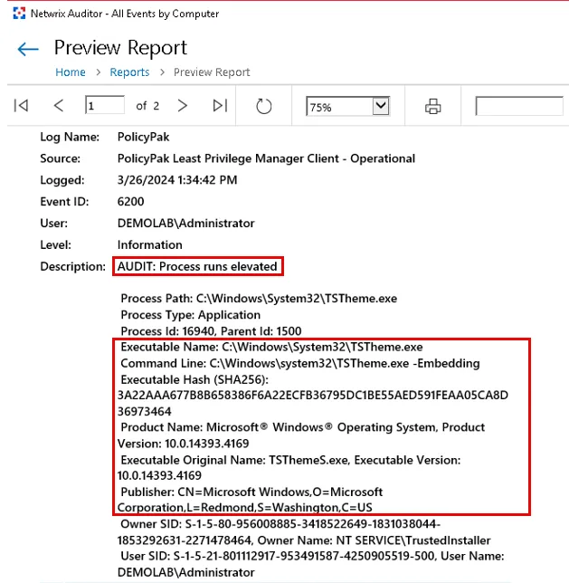

Policy created in LPM using the report details above.

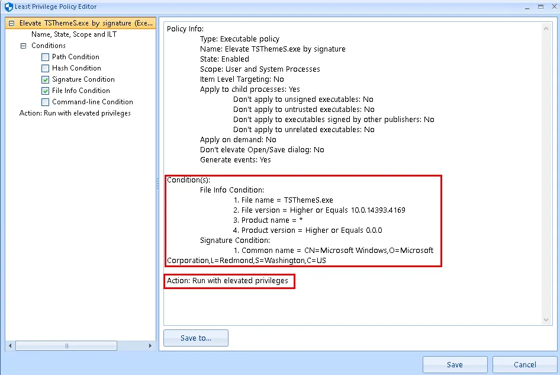

## Getting Started

In order to receive Endpoint Policy Manager reports for events via Netwrix Auditor, you need to complete the following steps.

__Step 1 –__ Creating a monitoring plan for Endpoint Policy Manager events.

__Step 2 –__ Configuring sources, filters, events, database settings.

__Step 3 –__ Optional: configure alerts.

## Creating a monitoring plan for Endpoint Policy Manager events

Navigate to __Start__ > Netwrix Auditor > Netwrix Auditor __Event Log Manager__.

On the main page, you are prompted to select a monitoring plan. Click __Add__ to add new plan.

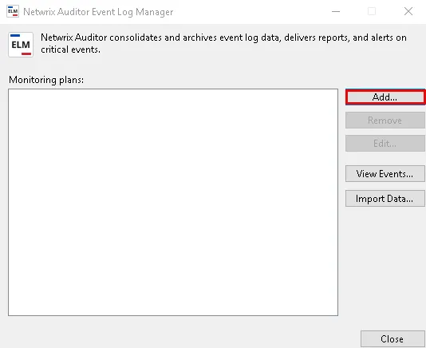

__Step 1 –__ Give the new plan a descriptive name and select __Enable event log collection__. Then add a __Notification recipient__ email address. You can specify one or more email addresses for users to receive daily Event Log collection status notifications. Use a semicolon to separate addresses.

__Step 2 –__ In the __General__ tab enter credentials for the account that will be used to collect data from the endpoints. Use an account that has local admin rights on the endpoints, and one that can also read Active directory. Then click the __Add__ button next to the Monitored computers section.

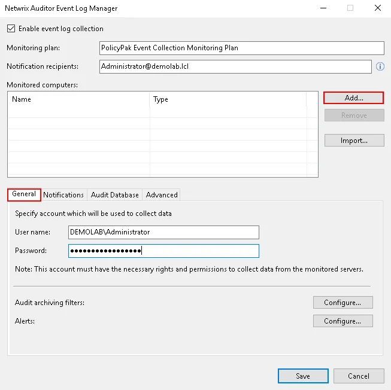

__Step 3 –__ Choose how you would like to add monitored computers, either by Computer name, by Active Directory container, or via IP Range.

__NOTE:__ You can add multiple types of computer items to your monitoring plan.

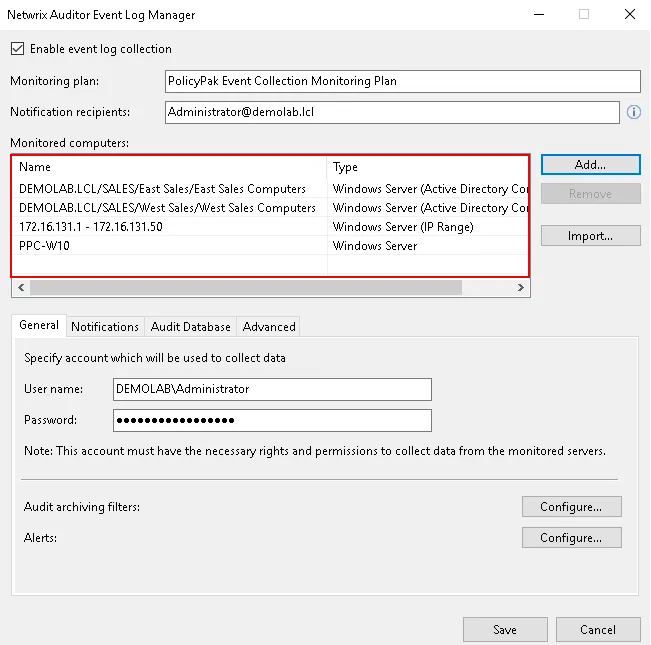

__Step 4 –__ In the __Notifications__ tab you can configure SMTP settings.

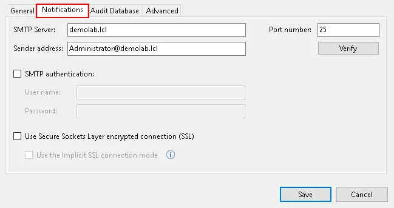

__Step 5 –__ Under the __Audit Database__ tab you can review and verify your database settings. Netwrix Auditor Event Log Manager synchronizes Audit Database and reports settings with the default Audit Database configuration from Netwrix Auditor Server. If this option is disabled, contact your Netwrix Auditor Global administrator and make sure that these settings are properly configured in Netwrix Auditor Server. See the Audit Database topic in the [Netwrix Auditor > Configuration Documentation](https://helpcenter.netwrix.com/category/auditor_configuration) for additional information.

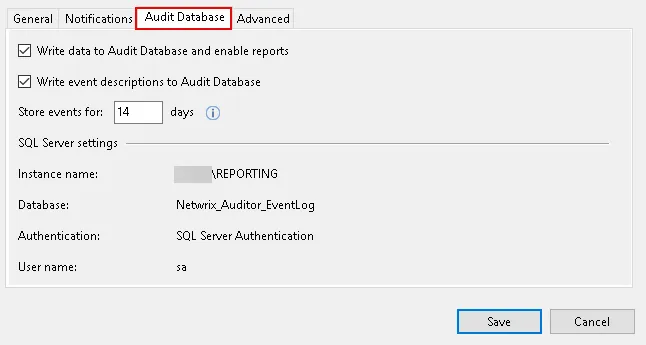

__Step 6 –__ In the __Advanced__ tab you can check if Network traffic compression is enabled (recommended). Also, you can specify the notification delivery time.

__Step 7 –__ Filter out the desired events and get them into the Netwrix Auditor Reports. To do so, get back to the __General__ tab and configure the __Audit archiving filters__.

__Step 8 –__ Once there, you can add the filtering in the Inclusive filters section. Click __Add__ to proceed.

In the next window, we need to specify the following parameters:

- Filter name
- Description for the filter
- Event log – here we need to type in Endpoint Policy Manager manually, as it is not available in the drop down list.
- Write to – here you can select the location to store filtered events, either a long-term archive or a database. It is recommended to use both locations.

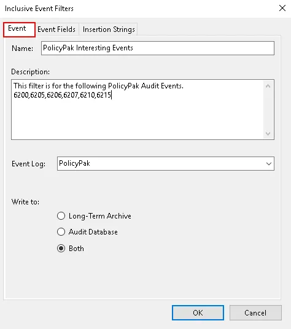

__Step 9 –__ Depending on targeted events, in the __Event Fields__ tab you may enlist the event IDs to capture. See the [List of Endpoint Policy Manager Event Categories and IDs](../../tips/eventcategories.md) topic for additional information on event IDs.

For example, here is the list of event IDs related to Endpoint Policy Manager Least Privilege Manager Global Audit events:

You may adjust the settings in the__Events Fields filtering__ section according to your needs.

Once the configuration is done, you may click __OK__ and save all your progress so far.

__Step 10 –__ Go back to the main monitoring plan configuration window for Netwrix Auditor Event Log Manager, and click __Configure__ under alerts filtering:

Then click __Add__ to add a new alert.

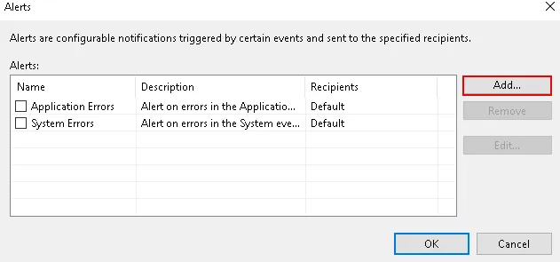

__Step 11 –__ In the next window add alerts for any event IDs as needed using the screenshots below as a guide.

__NOTE:__ There is no need to configure anything under the __Insertion Strings__ tab at this time.

Single Event Alert Example:

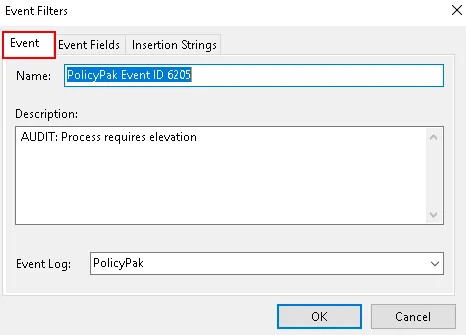

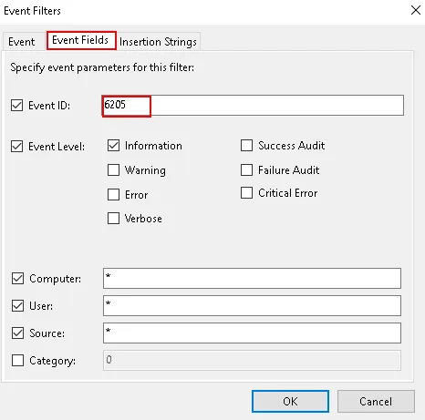

Group of Specific Events Alert Example:

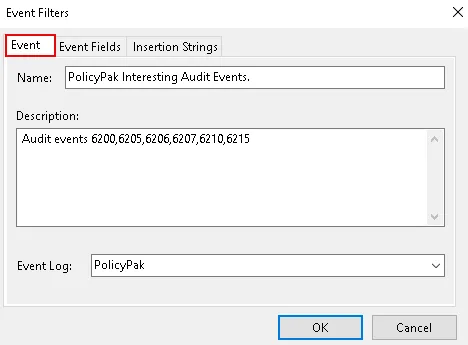

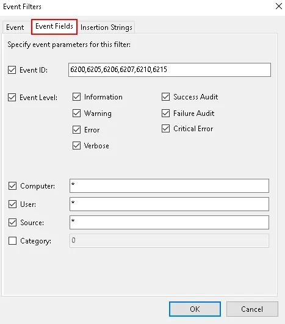

This is all the configuration required for Netwrix Auditor Event Log Manager to report on Endpoint Policy Manager Events.

__Step 12 –__ Now, if you would like to review the event log reports, start the Netwrix Auditor software and go to the __Reports__ section. There, navigate to the following report path: __Predefined__ > __Windows Server__> __Event Log__ > __All events by Computer__ and click __View__.

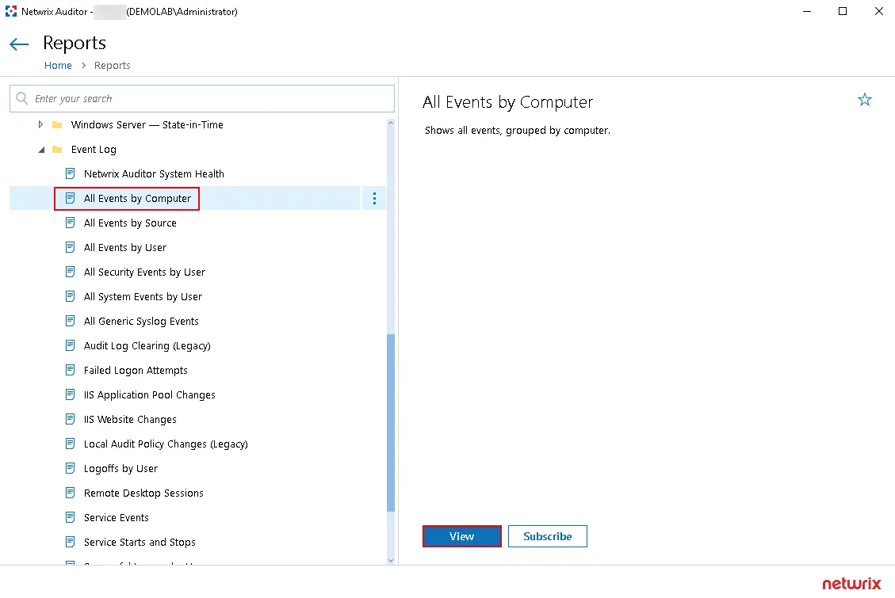

Here you can specify the conditions and filters to represent in the report, such as date range, Event level etc.

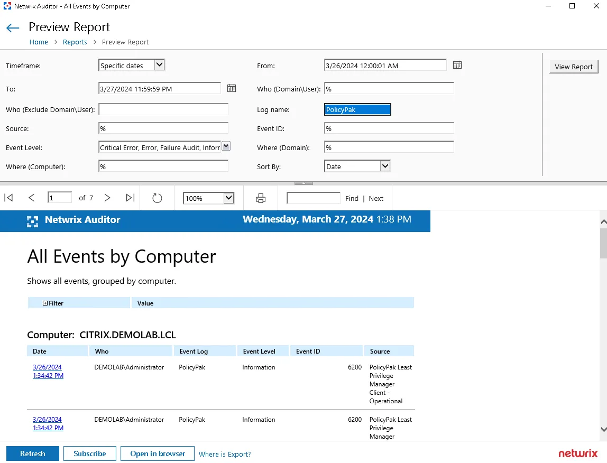

__NOTE:__ You can click on the interactive link in the __Date__ column to see event details:

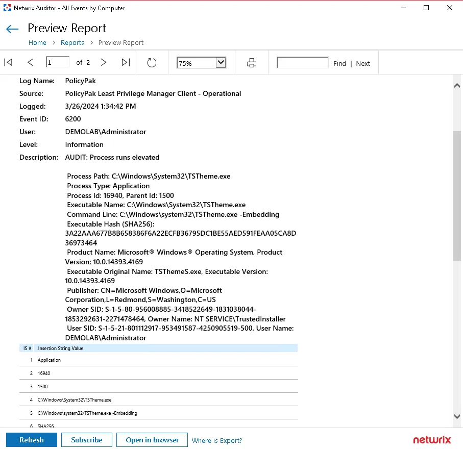
