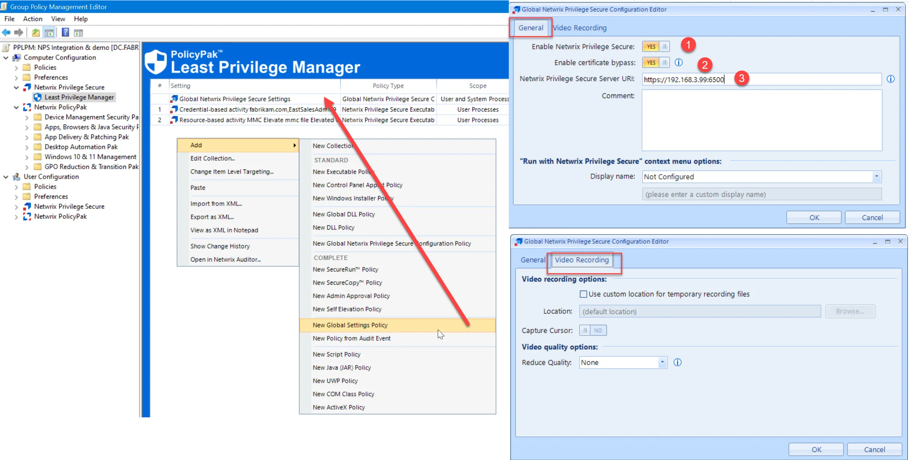
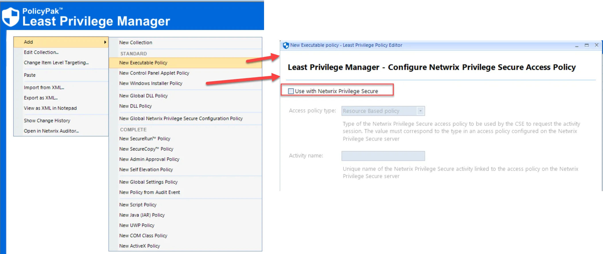

# Getting Started: Netwrix Privilege Secure + Endpoint Policy Manager

**NOTE:** See the
[Netwrix Privilege Secure and the NPS/Endpoint Policy Manager Client](../../../video/leastprivilege/integration/privilegesecureclient.md)
video for an overview of Netwrix Privilege Secure + Endpoint Policy Manager better together.

The first policy type to enable theNetwrix Privilege Secure server and Endpoint Policy Manager
client integration is a new Least Privilege Manager Global Policy. The three steps below cover a
basic configuration.

**Step 1 –** Enable Netwrix Privilege Secure.

**Step 2 –** Enable certificate bypass. This is required if you have not yet set up certificates
between the client and the server. This setting is recommended for testing but not for production.
See the
[Netwrix Privilege Secure for Access Management Documentation](https://helpcenter.netwrix.com/category/privilegesecure_accessmanagement)
for additional information on Netwrix Privilege Secure certificates and how to deploy them.

**Step 3 –** Specify the Netwrix Privilege Secure server URL and port. See the
[Netwrix Privilege Secure for Access Management Documentation](https://helpcenter.netwrix.com/category/privilegesecure_accessmanagement)
for additional information on which port is used. 6500 is the default port.

Other settings in the Global Netwrix Privilege Secure pane are optional and self explanatory.

Next, you’ll create a Endpoint Policy Manager rule like you did earlier to perform an operation.

Remember:

- The Endpoint Policy Manager part is about matching on an application or process.
- The Netwrix Privilege Secure part is about matching on the Activity type (and name.)

With Endpoint Policy Manager performing the work, you can Elevate an application (if needed), or
simply perform the brokering back to the Netwrix Privilege Secure server.

On the **Least Privilege Manager – Configure Netwrix Privilege Secure Access Policy** page you can
check the checkbox and configure the setting for **Resource Based Policy** or **Credential Based
Policy**.

