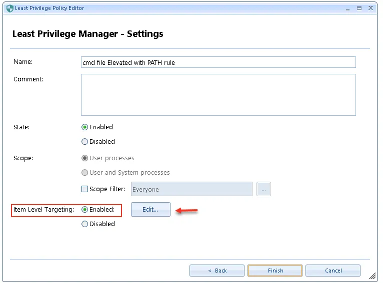
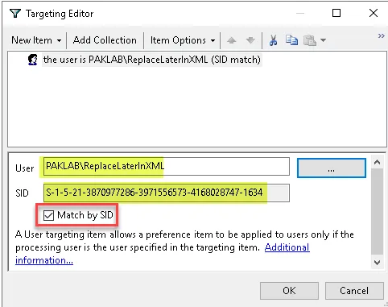
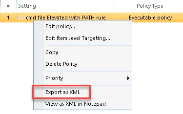
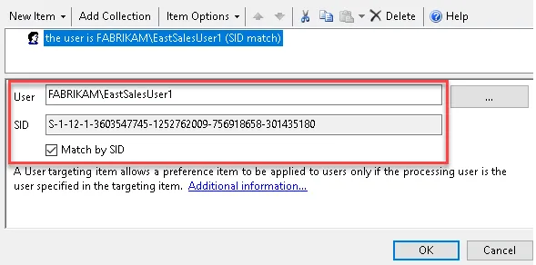
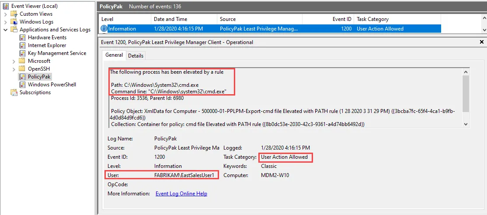

# How do I get Azure AD SIDs and use them with Item Level Targeting?

**Step 1 –** Before you can use Azure Accounts under Item Level Targeting (ITM), you first need to
know the Azure AD SIDs for any of the Azure Accounts you wish to target. To find an Azure Account's
SID you can:

1. Look in the Windows Registry of a computer where that Azure User has successfully logged on to at
   least once. The registry path to look under is:

    ```
       Computer\HKEY_LOCAL_MACHINE\SOFTWARE\Microsoft\Windows NT\CurrentVersion\ProfileList
    ```

    Once at that path you can select each folder until you find the AAD SID that matches the Azure
    User account you wish to target. In the example below that would be:

    SID: S-1-12-1-3603547745-1252762009-756918658-301435180

    AAD User: [EastSalesUser1@Fabrikam1000.com](mailto:EastSalesUser1@Fabrikam1000.com)

    

2. Have the Azure user run "WHOAMI /User" from a CMD prompt once logged in to the computer, then
   copy the SID text and send itto you.

    

3. Use PowerShell to connect to Azure, then use a function to convert Object IDs to SIDs:

    ```
       #Run PowerShell As Administrator        Set-ExecutionPolicy Bypass -scope Process -Force         
       Install-Module -Name AzureAD -Force        Import-Module -Name AzureAD        #Answer YES if prompted to install NuGet
               #Once modules above are installed you can use the command below to connect to Azure        
               # Use an account without MFA enabled        Connect-AzureAD 
       function Convert-ObjectIdToSid        
       {            param([String] $ObjectId)
           $d=[UInt32[]]::new(4);[Buffer]::BlockCopy([Guid]::Parse($ObjectId).
       ToByteArray(),0,$d,0,16);"S-1-12-1-$d".Replace(' ','-')        }
       # Examples of conversion commands to run:        
       # Get and convert all Azure Users:        Get-AzureADUser | ForEach 
       { [pscustomobject] @{ Name= $_.DisplayName; Sid=Convert-ObjectIdToSid($_.ObjectId)}}
       #Get and convert Azure Users whose names begin with "EastSalesUser"        
       Get-AzureADUser -SearchString "EastSalesUser" | ForEach { [pscustomobject] @{ Name= $_.DisplayName; Sid=Convert-ObjectIdToSid($_.ObjectId)}}

    ```

**Step 2 –** Once you have the SID, you should be all set. Edit your Netwrix Endpoint Policy Manager
(formerly PolicyPak) Policy rule and enable Item Level Targeting, then click **Edit…**.



**Step 3 –** Expand the drop-down list under New Item ,select **User** then put in any onprem user
and select **Match by SID**, then save the policy.



**Step 4 –** Right click the policy and then export it as XML.



**Step 5 –** Open the XML in notepad, notepad++, etc. Then carefully replace the SID in the XML with
what you got in step 1 (optionally replace name as well).

Before:


After:


**Step 6 –** Now save the edited XML with a descriptive name. The new XML file can now be used
normally l within Endpoint Policy Manager for the module the policy was created for. In the example
above the policy was created for Least Privilege Manager so this XML can be used for LPM in Cloud,
MDM, or the GPO version of Endpoint Policy Manager.

After importing the new XML into Endpoint Policy Manager the ILT will show the correct values for
the Azure account.



**NOTE:** Azure Groups don't have SID translations at all, so you would need to add multiple user
SIDS if you want multiple people to be able to do the activity.

Other Considerations:

For MDM, when using an XML created this way in the Exporter Tool, you must change the Install For
option to **Computer**.


Once the policy is applied you can launch the application, run task manager, and add the Elevated
column to verify that the policy applied.


Alternatively, check the Endpoint Policy Manager event log:


