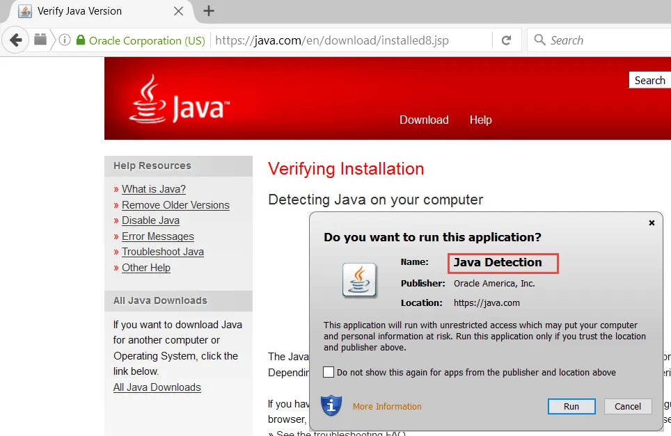
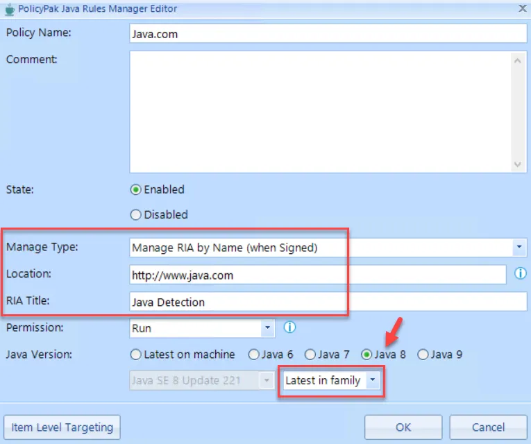
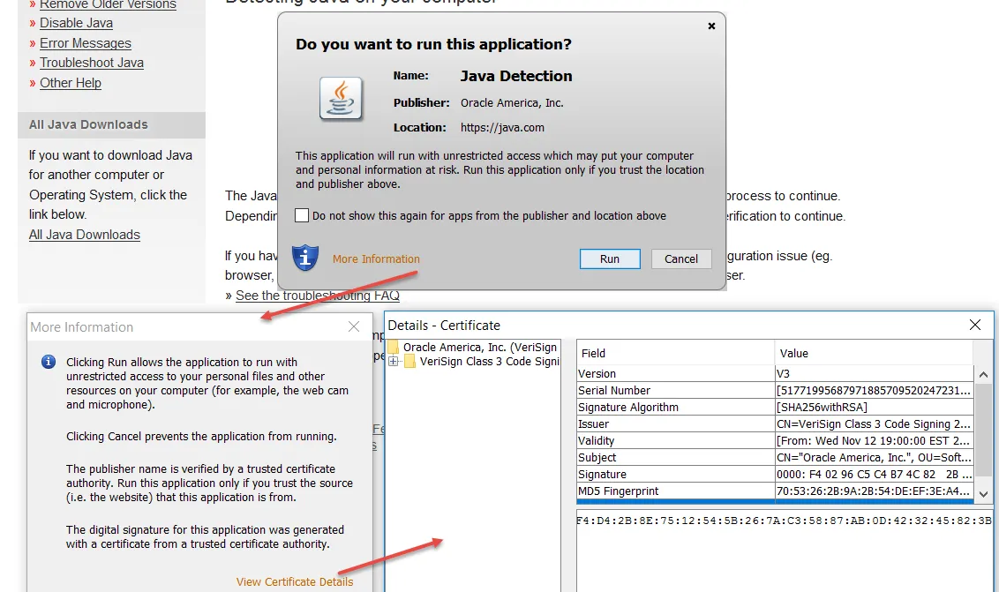
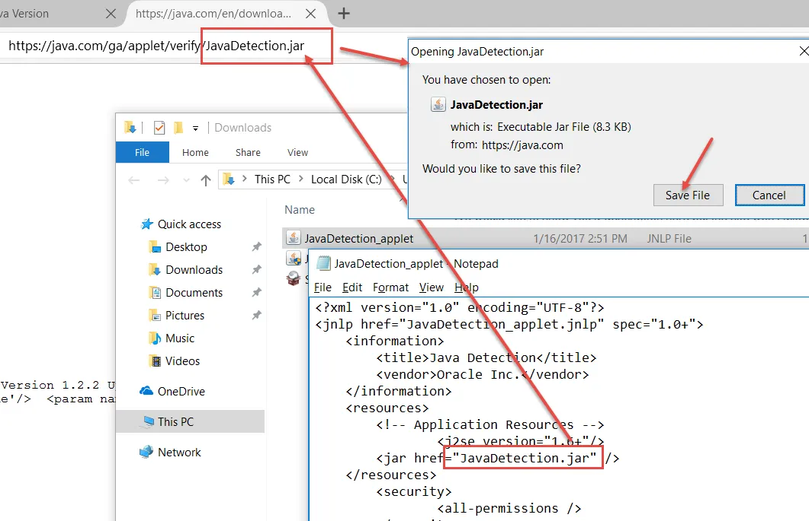
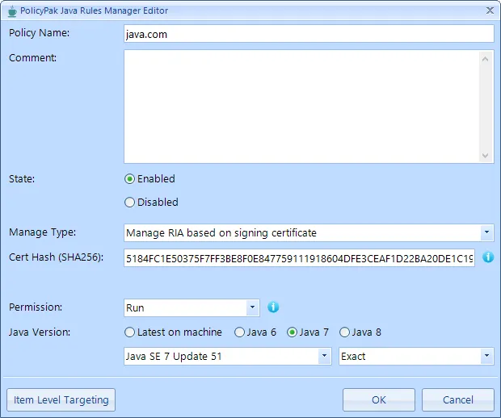

# Managing Java Rules

Rich Internet Application (RIA) is a way to describe a Java applet used on a website. There are
three ways to manage a RIA:

- Location
- Specific RIA (by name when signed)
- By signing certificate

**NOTE:** Endpoint Policy Manager Java Rules manager only works for websites and not when a user
runs a Java applet locally.

## Managing RIAs by Location

The simplest way to manage a RIA is by where it is located. We demostrated this in the Quickstart.
For instance, you can specify a specific URL such as https://java.com, you can specify anything on
java.com with java.com, or you can specify specific servers, including wildcards, as in
\*.abc.java.com, which would affect all applets on the ABC server of java.com.

**NOTE:** For more examples of how to use location to manage RIAs, hover over the information button
next to the Location field in the Java Enterprise Deployment Policy Editor.

## Managing RIAs by Name

You might have a website and Java applet you want to allow (and run with a specific version of Java)
or block entirely. You can use Manage RIA by Name (when Signed) under these circumstances. Enter the
location, such as [https://java.com](https://java.com), and then enter the name of the Java applet
for specificity. You can find the Java applet's name by running it without any rules first. It is
important that only signed Java applets have a name.



Once you know this, your rule will display the properties shown below.

**NOTE:** In this instance, the **Latest in family** option has been chosen for Java 8.



## Managing RIAs Based on Certificate

You can also specify to whether you want to run or block a RIA based on the certificate. This is
useful if you have many signed applets with the same name, but you only want to utilize one. This
method works exclusively for digitally signed Java applets. To determine whether an applet is
digitally signed, or if it contains the SHA256 of the certificate for the applet, see the example
below.



To get the certificate information using Firefox:

**Step 1 –** Go to the website with the Java applet.

**Step 2 –** Open FireFox, press F12, search for "applet," and then find the .jar file (or .jnlp).

**Step 3 –** Copy the path to the .jar file and insert it in the web path.

**Step 4 –** Save the JAR file. For this example, we'll assume it is called myjar.jar.

**Step 5 –** Open Administrator command prompt, and then go to the Java folder
`cd ``````C:\Program Files\Java\jre1.8.0_111\bin` (or whatever is on your machine).

**Step 6 –** Type `keytool -printcert -jarfile myjar.jar` | `more`.

For example, to receive the certificate for the applet on java.com, proceed with the following
steps:

**Step 1 –** Open FireFox, press F12, search for "applet," and then find .jnlp.

**Step 2 –** Find and copy the path `/ga/applet/verify/JavaDetection_applet.jnlp`.

**Step 3 –** Insert this path to `https://java.com/ga/applet/verify/JavaDetection_applet.jnlp`.

**Step 4 –** Save the file.

The first three steps areseen here.


After you've saved the file, continue with the following steps, which are shown below.

**Step 1 –** Open this file with Notepad.

**Step 2 –** Find the JAR file name.

**Step 3 –** Within Firefox, insert the `.jar` name to
`https://java.com/ga/applet/verify/JavaDetection.jar`.

**Step 4 –** Save the file.

**Step 5 –** Run command prompt (as admin), and go to java folder
`cd C:\Program Files\Java\jre1.8.0_111\bin`.

**Step 6 –** Type `keytool -printcert -jarfile pathtojar\javadetection.jar | more`.



At this point, the SHA256 Hash appears, which you can copy and paste into the MMC. It is valid only
with 32 pairs of hexadecimal numbers, with colons for separation.


Be sure to use only the first SHA256 displayed and not the others listed in the output. Note that
when you paste it into the Endpoint Policy Manager Java Rules Manager MMC snap in, the colons are
automatically stripped.


