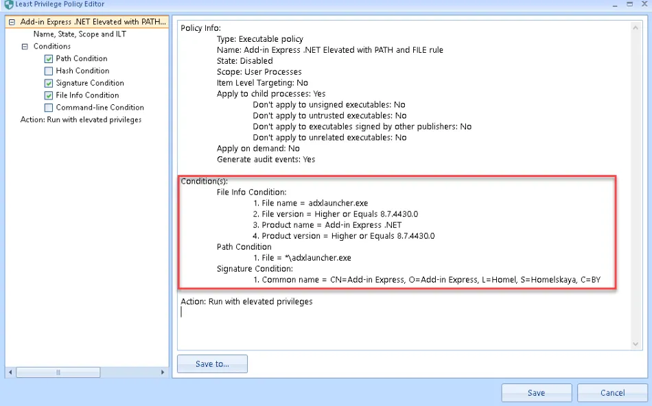
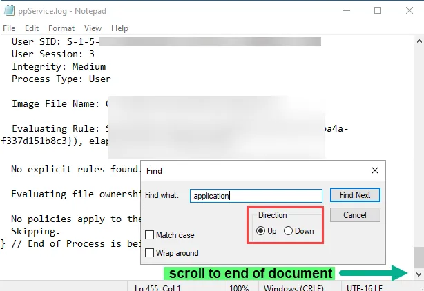
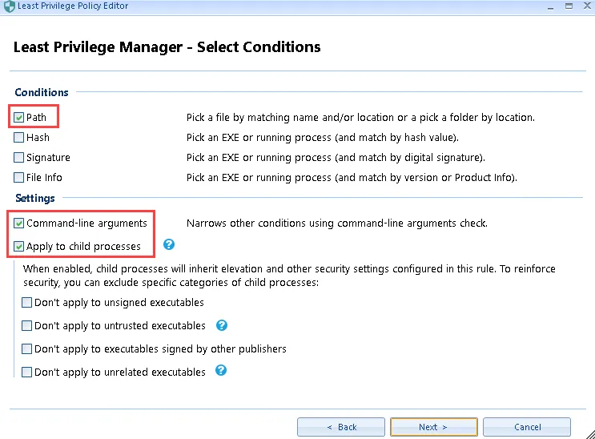
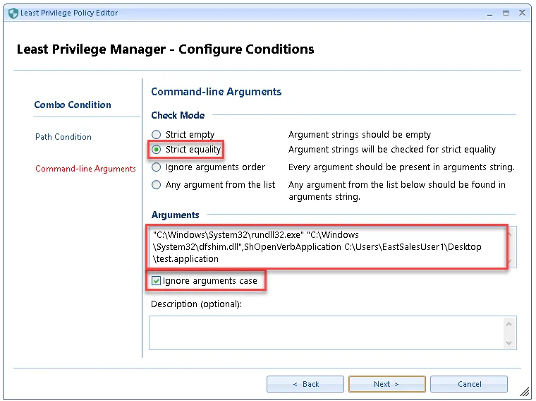

# How to Elevate applications with a .application extension using Least Privilege Manager

__Method 1 (Recommended): Elevating the underlying .EXE__

__Step 1 –__ Look in the Netwrix Endpoint Policy Manager (formerly PolicyPak) Event log for the blocked event to findthe name of the EXE being blocked.


__Step 2 –__ Create an EXE elevation combo rule in Least Privilege Manager for the EXE being blocked.



__NOTE:__  The more conditions evaluated, the more secure the rule will be. See this video for more details: [Best Practices for Elevating User-Based Installs](../../video/leastprivilege/bestpractices/elevatinguserbasedinstalls.md)

__Step 3 –__ Apply the policy and then verify using the Endpoint Policy Manager event log of the application being Elevated.


Method 2: Elevating RUNDLL32.exe and the .APPLICATION exactly

__Step 1 –__ Immediately after receiving the BLOCKED message (launch the application again if needed), look in the Least Privilege Manager Log ```PPService.log```, which can be found here by default:

```%programdata%\PolicyPak\PolicyPak Least Privilege Manager\ppService.log``` (i.e. ```C:\ProgramData\PolicyPak\PolicyPak Least Privilege Manager\ppService.log```)


__NOTE:__  The reason to look immediately in the log is so that we know which ppservice().log file to look in, ppservice.log is the latest log, and ppservice(n).log files are the rolled over logs.

__Step 2 –__ Open the ppservice.log in notepad (or any text editor) and scroll all the way to the bottom. Start searching from the bottom upwards for the text ".application".



__Step 3 –__ What we are looking for is the entire command-line used to launch the .application. See below for example:


Using the example above our entire command-line would be:

```
"C:\Windows\System32\rundll32.exe" "C:\Windows\System32\dfshim.dll",ShOpenVerbApplication C:\Users\EastSalesUser1\Desktop\test.application
```

__Step 4 –__ Now we are going to create an EXE combo elevation rule using __Path__, and also check the two settings for __Command-line arguments__ and __Apply to child processes__ before clicking __Next__.



__Step 5 –__ Enter "\*\EXE" for the PATH, replace EXE with the name of the executable mentioned in the command-line from the ppservice.log relevant to your environment, then click __Next__.

In this example, the EXE name is __Rundll32.exe__.


__Step 6 –__ At the next screen, copy and paste the entire command-line from the ppservice.log file into the __Command-line Arguments__ section. Ensure that __Strict Equality__ and __Ignore Arguments case__ are both selected.

__NOTE:__ The command-line arguments cannot be empty.

__Step 7 –__ Click __Next__ then __Finish__ to save the rule.



__Step 8 –__ Apply the policy and then verify using the Endpoint Policy Manager event log for the application being Elevated.


