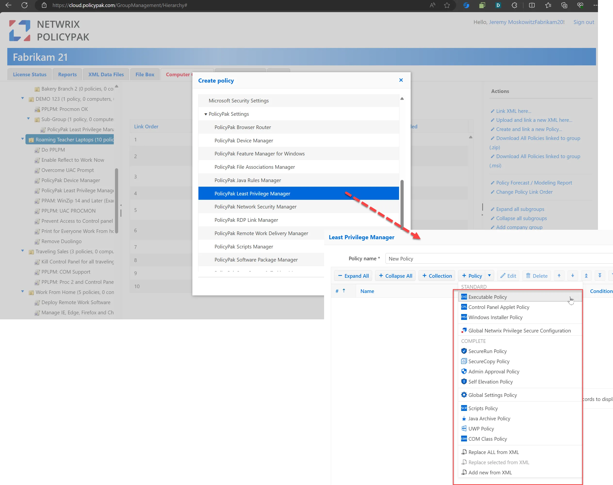

# Least Privilege Manager (Windows)

About Netwrix Endpoint Policy Manager (formerly PolicyPak) Least Privilege Manager

Before reading this section, please ensure you have read the
[Installation Quick Start](../gettingstarted/quickstart/overviewinstall.md) topics, which will help
you learn to do the following:

- Install the Admin MSI on your GPMC machine
- Install the CSE on a test Windows machine
- Set up a computer in Trial or Licensed mode
- Set up a common OU structure

Optionally, this manual demonstrates how to use on-prem Active Directory and Group Policy to deploy
Endpoint Policy Manager Least Privilege Manager directives. If you don't want to use Group Policy,
read the [MDM & UEM Tools](../mdm/overview.md) topics for additional information on how to deploy
your directives.

Endpoint Policy Manager Least Privilege Manager enables you to do the following:

- Get out of the risky business of giving users local admin rights.
- Shut the door on malware, crypto-malware, and zero-day exploits.
- Let non-admins safely install software they need, on-demand.
- Elevate specific scripts to run as needed (without insecurely embedding the script password inside
  the script file).
- Elevate specific Java JAR files to run in this way, as needed.

For instance, you don’t want to block your Standard Users from running applications that throw a UAC
prompt. A Standard User doesn’t have the right permissions, and that’s where Endpoint Policy Manager
Least Privilege Manager can come in.

**NOTE:** For more information on this issue, watch the
[Kill Local Admin Rights (Run applications with Least Privilege)](../video/leastprivilege/localadminrights.md)
video.

The basic way to use Endpoint Policy Manager Least Privilege Manager is as follows:

- Remove local admin rights from all users.
- Create a rule to specify which applications, Control Panel applets, or other areas a user would
  need admin rights to.
- Create a Endpoint Policy Manager SecureRun™ rule to prevent all unknown applications from running
  (optional, but recommended).
- Use On-Prem Group Policy to accept the Endpoint Policy Manager Least Privilege Manager policies
  created. (This is what this guide will demonstrate.)
- Alternatively, export the Endpoint Policy Manager Least Privilege Manager rules and deliver them
  in one of these ways:

    - Microsoft SCCM (See theDeploy Endpoint Policy Manager Settings Using SCCM or Other Management
      System! video overview for additional information.)
    - Microsoft Intune (See the
      [Using Least Privilege Manager with your MDM service](../video/leastprivilege/mdm.md) video
      overview for additional information.)
    - Your own systems management software (PDQ Deploy or similar) (See the
      [Deploying Apps that Require Admin Rights Using Endpoint Policy Manager and PDQ Deploy](../video/leastprivilege/integration/pdqdeploy.md)
      video overview for additional information.)
    - Endpoint Policy Manager Cloud service (See the
      [Use Endpoint Policy Manager Cloud to deploy PP Least Privilege Manager rules](../video/leastprivilege/cloudrules.md)
      video overview for additional information.)

Then allow the client machine with the Endpoint Policy Manager client-side extension (CSE) to
receive the directives and perform the work.

**NOTE:** If you use an MDM service or Endpoint Policy Manager cloud service, you can deliver
Endpoint Policy Manager Least Privilege Manager settings even to non-domain-joined machines over the
Internet.

## Endpoint Privilege Manager Moving Parts

First thing is to understand the moving parts.

- A management station. The Endpoint Policy Manager Admin Console MSI must be installed on the
  management station where you create GPOs. Once it’s installed, you’ll see the Endpoint Policy
  Manager | Endpoint Policy Manager Least Privilege Manager node, as shown below.
- The Endpoint Policy Manager CSE. This runs on the client (target) machine and is the same CSE for
  all Endpoint Policy Manager components (such as Endpoint Policy Manager Least Privilege Manager,
  Endpoint Policy Manager Device Manager, Endpoint Policy Manager Application Settings Manager,
  etc.).
- Windows Endpoints. In order to use these, they must be licensed for Endpoint Policy Manager Least
  Privilege Manager using one of the licensing methods.
- Mac Endpoints (optional). Mac endpoints must use Endpoint Policy Manager Cloud to get Endpoint
  Policy Manager Least Privilege Manager directives. See more in the Endpoint Policy Manager Cloud
  for MacOS Client manual.

Also available is Endpoint Policy Manager Cloud when you purchase Endpoint Policy Manager Enterprise
or Endpoint Policy Manager SaaS.

Endpoint Policy Manager Cloud enables you to create Endpoint Policy ManagerLeast Privilege Manager
directives using the in-cloud editors and connect endpoints (Windows and Mac) to get Endpoint Policy
Manager Least Privilege Manager directives.

While this manual mostly demonstrates concepts using the Group Policy editor, nearly everything can
be done using the in-Endpoint Policy Manager-Cloud editors. Additionally, you can take on-prem MMC
directives and upload them to Endpoint Policy Manager Cloud, and take in-cloud directives and
download them back as MMC directives.

Additionally, you may use Endpoint Policy Manager Least Privilege Manager with any management system
you like such as SCCM, Intune, PDQ deploy or anything else. This is because Endpoint Policy Manager
Least Privilege Manager directives may be exported as XML and wrapped up using the Endpoint Policy
Manager Exporter tool. This is a free utility that lets you take Endpoint Policy Manager Admin
Templates Manager and our other products’ XML files and wrap them into a portable MSI file for
deployment using Microsoft Endpoint Manager (SCCM and Intune), or your own systems management
software.

The [MDM & UEM Tools](../mdm/overview.md) topics explain how to use the Endpoint Policy Manager
Exporter to wrap up any Endpoint Policy Manager directives and deliver them using Microsoft Endpoint
Manager (SCCM and Intune), KACE, your own MDM service, or Endpoint Policy Manager Cloud.

In other words, you are free to use any delivery methodof your choice with Endpoint Policy Manager
Least Privilege Manager.

This manual is designed to give you the basic concepts and operational scenarios you may encounter,
but once you get those down, you are free to use whatever delivery method is best for your
organization.
