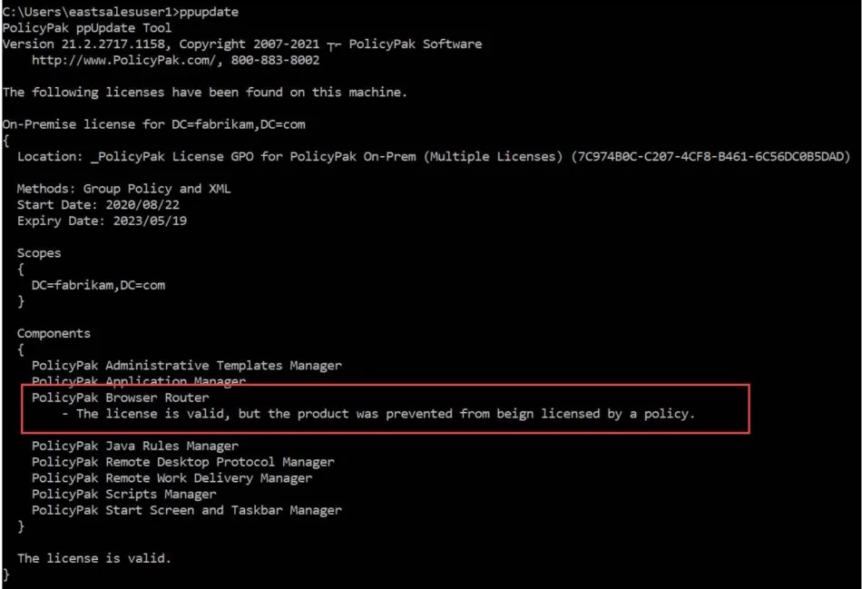

# What if I want to unlicense specific components via ADMX or Endpoint Policy Manager Cloud?

There are three ways to unlicense an individual component.

## 1 — When using Group Policy Objects to license Endpoint Policy Manager

See
[How to Un-License any Endpoint Policy ManagerComponent via ADMX or Endpoint Policy Manager Cloud](../../video/license/unlicense.md)
for additional information on this topic.

**NOTE:** You need to first install the Endpoint Policy Manager ADMX files as seen in
[Troubleshooting with ADMX files](../../video/troubleshooting/admxfiles.md).

The basic gist is that you'll be using Group Policy to deliver a setting which un-licenses a
specific component like this.

## 2 — When using Endpoint Policy Manager Cloud

You can deliver the same setting via Endpoint Policy Manager Cloud as an Admin Template entry. Find
the Endpoint Policy Manager Admin Templates, then find the setting.

Once enabled, the component will be de-activated.

When you unlicense via ADMX you can test your results with the `PPUPDATE` command. The expected
result should be similar to this example, where you can see the license is valid, but the component
(in this case Browser Router) is prevented from being licensed by a policy.

