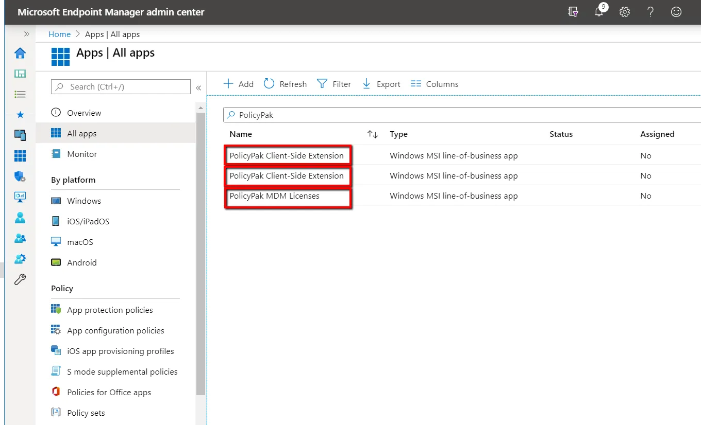

# Endpoint Policy Manager and Microsoft Intune MDM

__NOTE:__ See [Endpoint Policy Manager and Microsoft Intune](../../video/mdm/microsoftintune.md) for an overview video of Endpoint Policy Manager and Microsoft Intune MDM.

To start, log onto your Microsoft Intune instance and select Apps. Add the Endpoint Policy Manager CSE, the Endpoint Policy Manager license file, and the Endpoint Policy Manager settings MSI files, and deploy them to your machine.



Next, make assignments to computers. For each application you have to target, you can specify All Devices (which will automatically address only Windows 10 machines), or you can pick a specific group of machines. For command-line arguments, you can enter ```ARPSYSTEMCOMPONENT=1``` to hide each item from the Add/Remove Programs options to prevent uninstallation. Using the flag ```ARPSYSTEMCOMPONENT=1``` is optional.

Once you select the group, you can change the Deployment Action to Required Install. Be sure the computer is MDM-joined and in the correct group. If the MSIs do not download as expected, see the [Troubleshooting](../../troubleshooting/mdm/overview.md) section.
