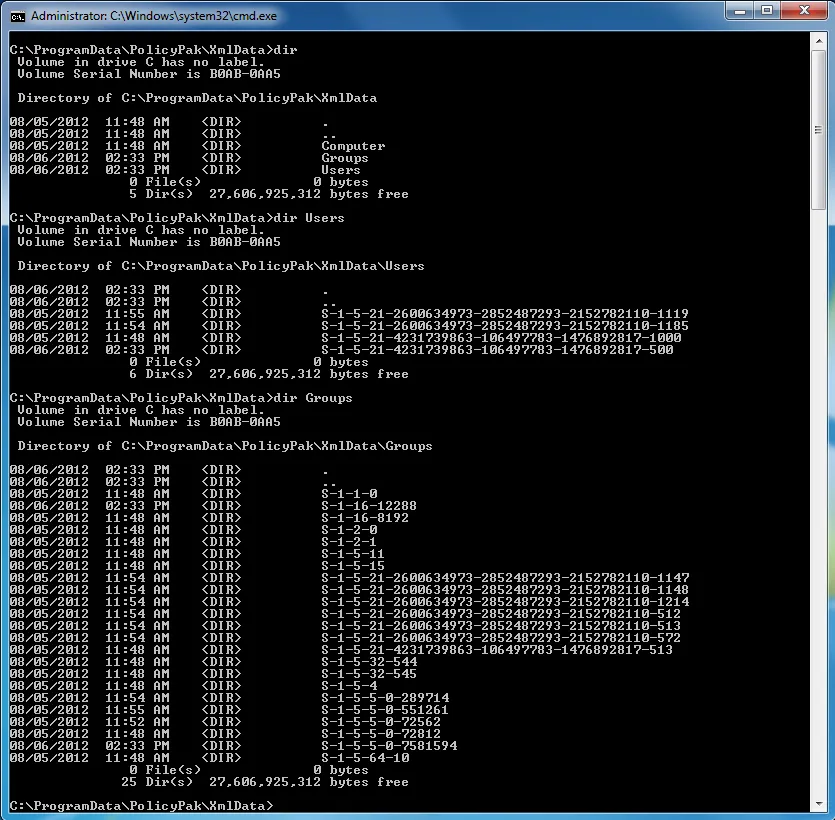
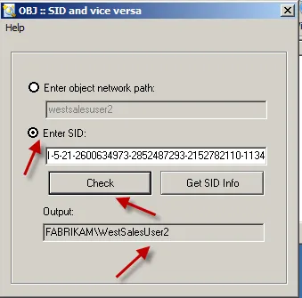
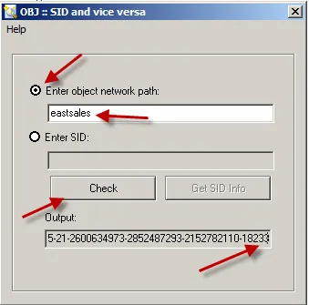

# Manually Placing XML Data and Licensing Files on Target Computers

You might want to manually place XML data files or Endpoint Policy Manager licensing files on your
computers by including them within your system build, or using a script to copy them. Or you might
be curious about what the Endpoint Policy Manager Exporter utility is doing and what it is
delivering.

Endpoint Policy Manager licenses and Endpoint Policy Manager XML data files need to be included in
the `%programdata%\PolicyPak\XMLdata` directory of the target machine (on Windows 7 and later). This
is typically `c:\ProgramData\PolicyPak\XMLdata`. In the directory, you'll see three subdirectories:
Users, Groups, and Computer.

**NOTE:** There is also a Cloud directory that may or may not be present. It is used in conjunction
with Endpoint Policy Manager Cloud delivery and is not shown in this example.

Within the Users subdirectory, you will see a subdirectory with the name SID for every domain user
who has logged on to that machine. Within Groups, you will see a subdirectory with the name SID for
every group of every user who has logged on to that machine (both local and Active Directory
groups).

To license (or extend the license) of an existing machine that is domain-joined, place the license
file you received from Endpoint Policy Manager in the computer folder. To make the client computer
use the XML data file, place the file you created in the previous step in one of these folders: the
Computer folder (which affects all users on the machine), the `Groups\<sid> folder`, or the
`Users\<sid> folder`.

If you are unsure which SID is meant for which user (or which group your users belong to), you can
use a variety of tools to perform a SID-to-user lookup. A very easy way to look up a user is to
use` OBJ::SID`, which can be downloaded for free at
[https://petri.com/obj_sid](https://petri.com/obj_sid). Once you've downloaded the `OBJ::SID` file,
copy and paste the SID folder name into the OBJ::SID tool, which is automatically generated. The
output will reveal the name:

Alternatively, you can type in the user or group name to receive the SID name:

The reason Endpoint Policy Manager uses the SID and not the actual user or group name is because
SIDs are permanent, whereas the underlying name in Active Directory can be changed. Once the
exported XML data files are in the directory, the Endpoint Policy Manager engine will pick up the
change within 10 seconds and perform the function.
