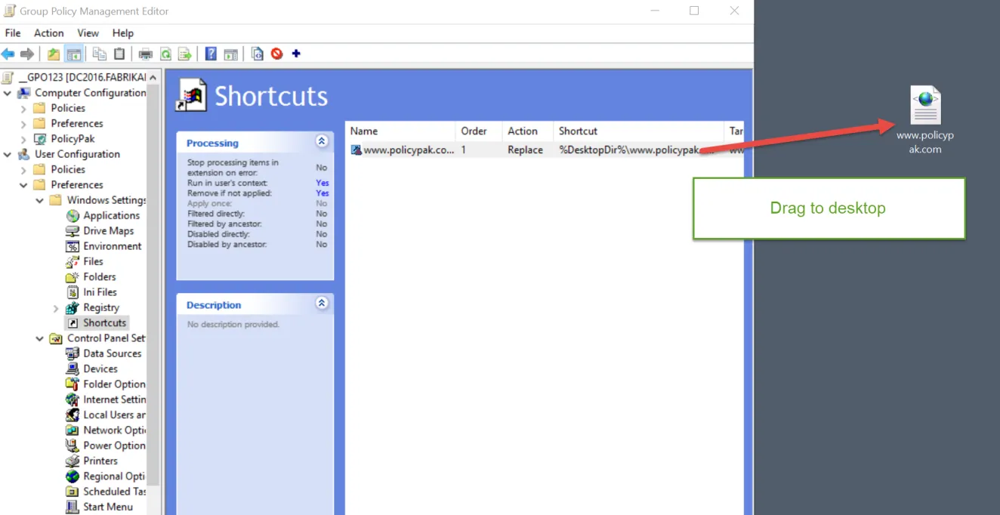
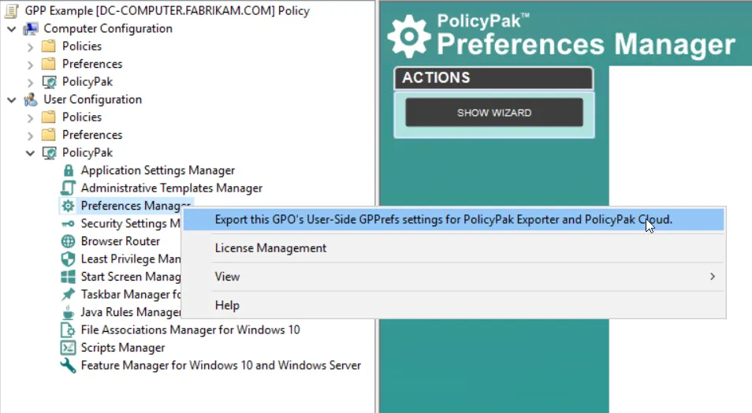

# XML Data Files from Endpoint Policy Preferences Manager

To make an XML file from a Group Policy Preference item, first create the item. Be sure to embed any
Group Policy Preference Item-Level Targeting within your item to limit when the item will apply. For
instance, you may want to limit by operating system, IP address range, the presence of a file, and
so on. Refer to Book 9: [Preferences Manager](../../preferences/overview.md), for more details.
Then, drag the Group Policy Preference item from the MMC console to create the XML data file. You
can drag this file to a folder or your desktop, as shown in Figure 19.

Figure 19. Dragging the the Group Policy Preference item from the MMC console to the desktop in
order to create a XML data file.

Alternatively, the Endpoint Policy Manager management console can also export existing Group Policy
Preference items from within an existing GPO (without you needing to drag and drop items one by
one). You can see an example of this in Figure 20.

Figure 20. The user can export an existing GPO through the Endpoint Policy Manager management
console.
