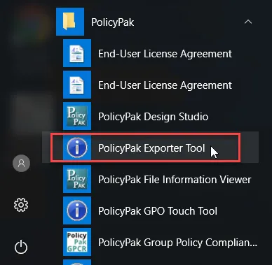
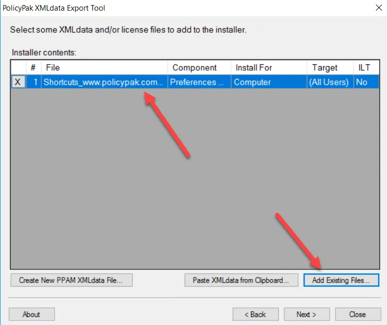
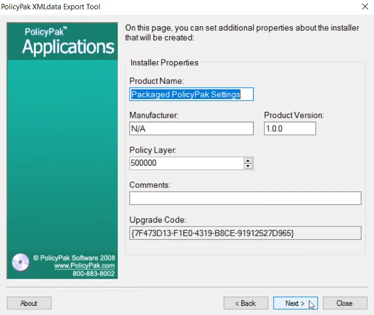

# Using the Endpoint Policy Manager Exporter to Make MSIs

__NOTE:__ For an overview of the Endpoint Policy Manager Exporter utility, please watch this video: [Endpoint Policy ManagerPreferences with Endpoint Policy Manager Exporter](../archive/preferencesexporter.md)l.

Endpoint Policy Manager Exporter's job is to take Microsoft or Endpoint Policy Manager items and wrap them up into an MSI. This MSI can then be deployed using whatever technique you want: Microsoft Endpoint Manager (SCCM and Intune), LANDesk, KACE, PDQ Deploy, etc. You can also manually install it if you like.

There are a variety of reasons why you might not want to use Group Policy to deliver Group Policy Preference settings. For instance, you might want to avoid using Group Policy to deliver Microsoft Group Policy Preference settings if you find yourself in the following situations:

- You are using Microsoft Endpoint Manager (SCCM), LANDesk, KACE, or similar software for software deployment, and your team doesn't want to use Group Policy to deliver Group Policy Preference items, but still wants similar power and flexibility.
- You are using Microsoft Endpoint Manager (Intune) or another remote desktop management utility, and want to use its Software Deployment feature to deliver Microsoft Group Policy Preferences settings.
- You have clients that have a domain-joined account but haven't been to the office to get the latest Group Policy Preferences settings.
- You have a special machine that is domain-joined, but you don't want it to have Group Policy; instead, you simply want it to get some Group Policy Preferences directives.

__NOTE:__ Non-domain-joined machines are never supported via the Endpoint Policy Manager Preferences Manager product. That is, the machine must have previously been domain-joined and be in an organizational unit that has been licensed (or will be licensed from a licensing file). If you wish to get Group Policy Preference items to non-domain-joined machines, you will need to license Endpoint Policy Manager Cloud or Endpoint Policy Manager MDM.

__Step 1 –__ Run the Endpoint Policy Manager Exporter utility on your management station. You can find it on the Start Menu (for pre-Windows 8 systems).

__Step 2 –__ In the Endpoint Policy Manager Exporter tool, select __Create a new MSI installer__ and click __Next__.

__Step 3 –__ Click __Add Existing Files__. Then select the Group Policy Preferences XML file from the downloadable example, or the one you created. It will look similar to what is seen below.

__Step 4 –__ At this point, leave all other options and settings the same as shown in Figure 10 and then click __Next__. Once you've done this, look for the informational screen about the Windows Installer package that was just created, and click __Next__.

__Step 5 –__ Click __Next__ and save the MSI file to a location of your choosing. In this example we've saved it to the desktop as Deploy GPP MSI.msi.

See Appendix A: [Using Endpoint Policy Manager with MDM and UEM Tools](../mdm/uemtools.md) for additional information on the Endpoint Policy Manager Exporter utility
