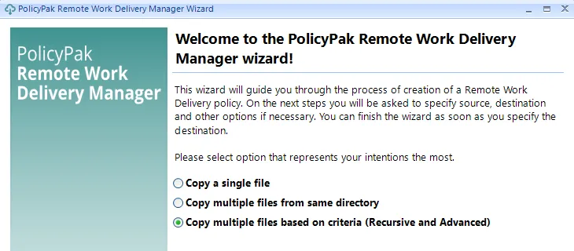
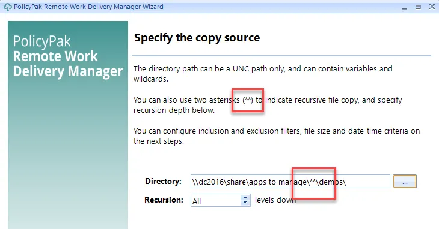
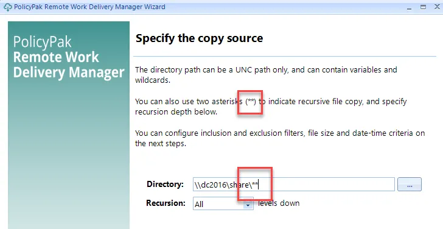
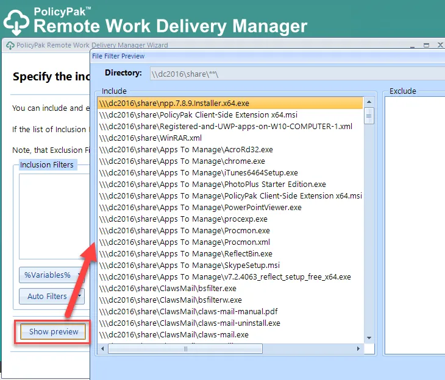
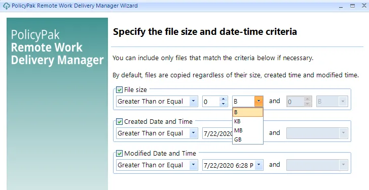

# Advanced Standard Policies: Copying Multiple Files with Recursion and Advanced Criteria

The final standard policy type is Copy multiple files based on criteria (Recursive and Advanced).

__NOTE:__ See [Mass copy folders and files (with filters and recursion)](../../../video/remoteworkdelivery/masscopy.md) a video overview of Endpoint Policy Manager Remote Work Delivery Manager with Advanced and Recursive options.



This wizard has many of the same screens as the previous wizards. With that being said, there are two screens that are different. The first is the Specify the copy source screen. On this screen, you can specify paths where you want to copy a whole share, or you can specify that you want to start in the middle of a share and then work recursively forward. Below you can see an example of a valid syntax for copying a single folder and all of its contents.



Using \*\* will turn recursion on. Next, you can specify the number of levels down in the Recursion field. Using the same information as shown previously take all files from all folders with Demos in the name. For example:

```
\\dc2016\share\folder1\Demos  
\\dc2016\share\folder2\Demos  
\\dc\share\ABC\DEF\RRT\Demos\abc\abd\Demos 
```

You can also specify \*\* at the end of a path, and all subfolders will be delivered, as well.



On the next screen you can use the Show Preview button, which will show you which folders and files are going to be copied. You can see an example of this below.



__NOTE:__ There are other Wildcards available beyond \*\*. See the section on Wildcards and Variables later in the manual.

The other unique screen in this wizard is the one that provides the ability to specify the file size, creation date and time, and modified date and time. When you change these settings, it reduces the number of files copied during an operation.



You can also require that files be only copied when an attribute is set or not set.


